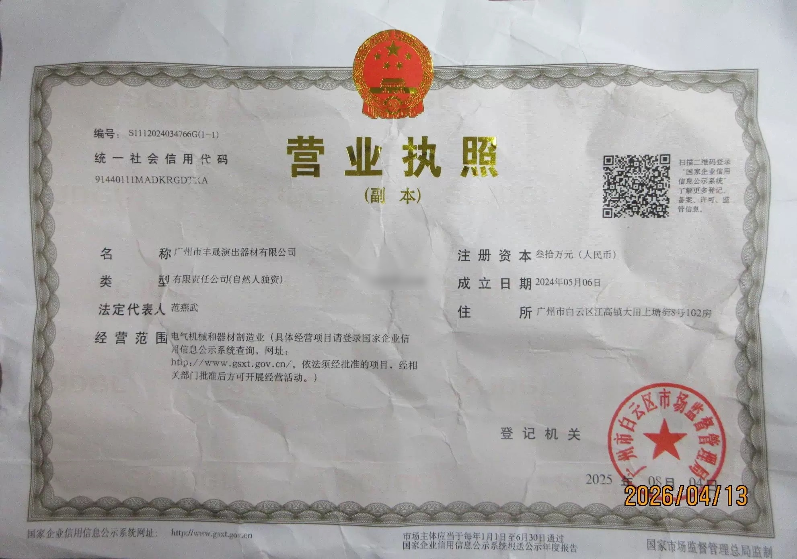
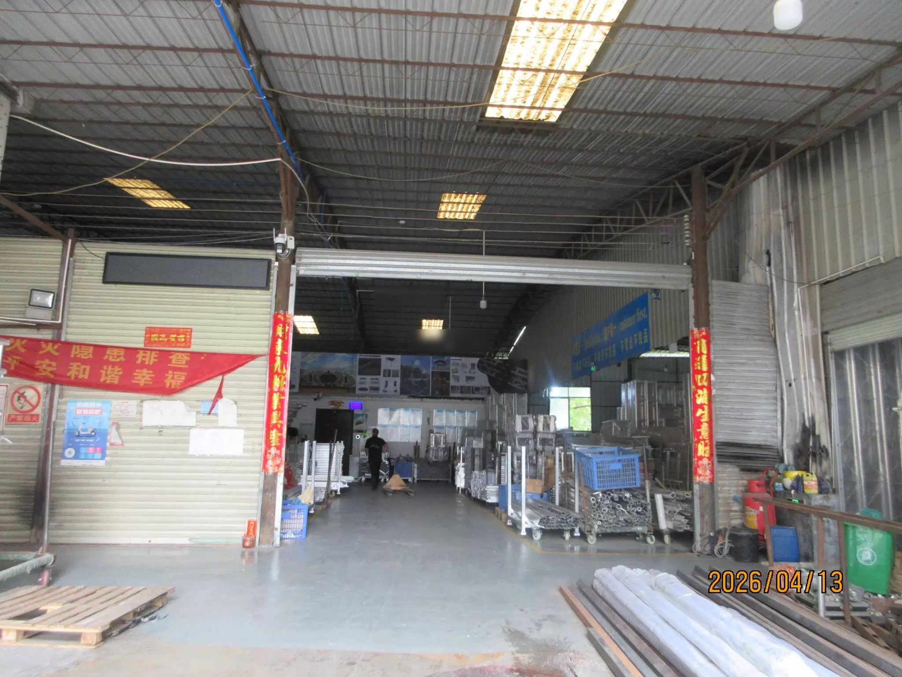
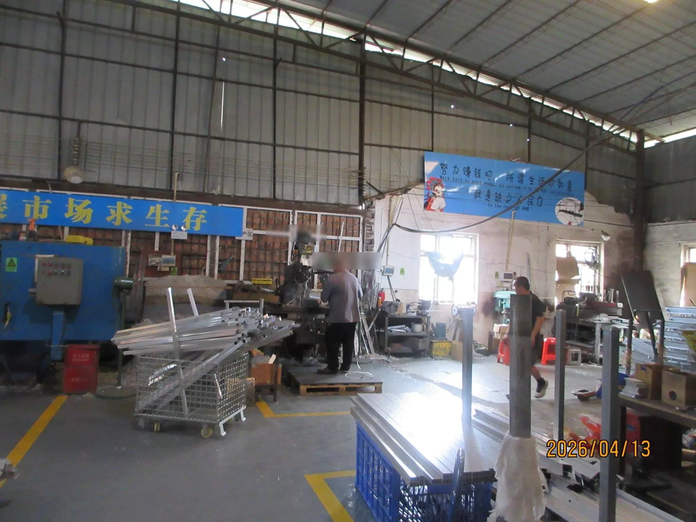
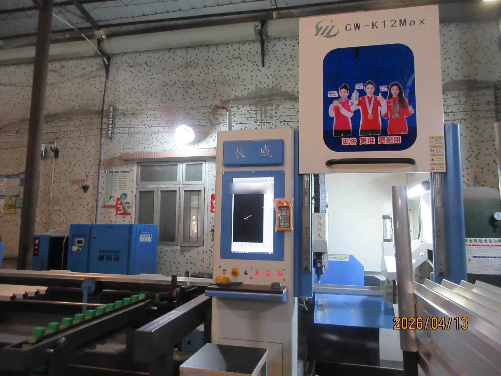
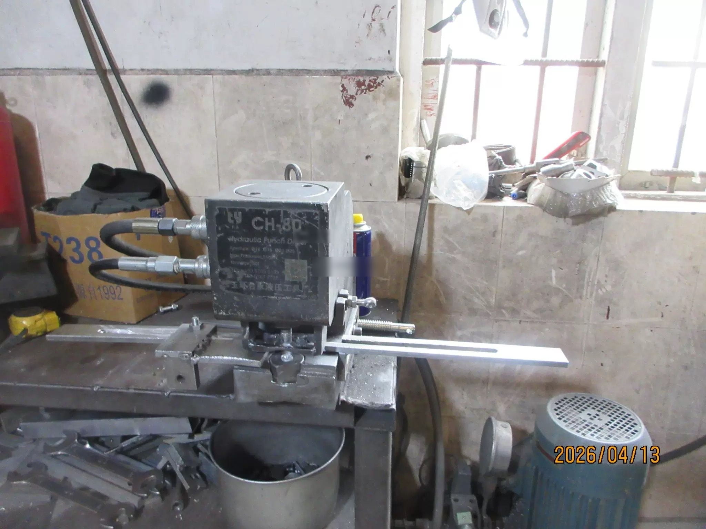
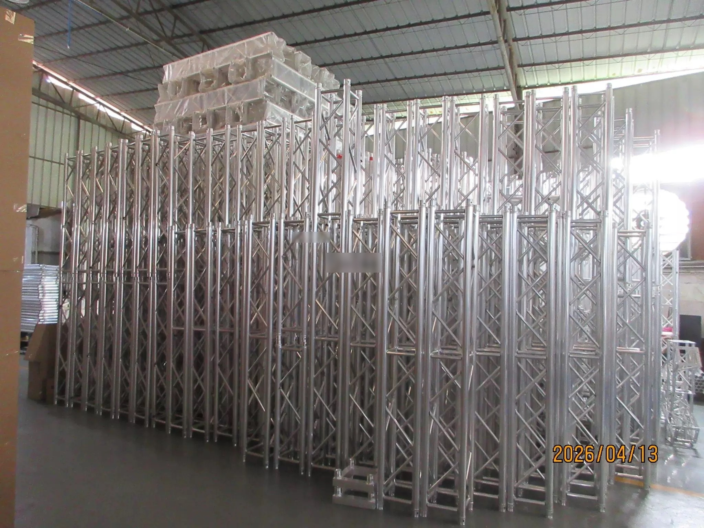

> **Winning Adventure Global (WAG). All rights reserved. Unauthorised reproduction, distribution, or commercial use of this report is strictly prohibited.**

## 1. Executive Summary

Guangzhou Fengsheng Performance Equipment Co., Ltd. (brand: FS / FENGSHENG) is a specialised manufacturer of aluminium alloy stage truss systems, portable stage platforms, and rigging equipment headquartered in Guangzhou's Baiyun District. The company was formally registered in May 2024, with operational experience in the stage equipment sector traceable through its founding team's industry background.

Fengsheng holds CE certification and operates a 1,600 sqm factory with 36 employees and three production lines (cutting, welding, polishing, packaging), equipped with CNC bending and CNC cutting machinery. Annual production capacity is approximately 64,900 units. Export accounts for 90-100% of production output, with primary markets in the Middle East (25%), Southeast Asia (20%), and Africa (20%).

**Key Strengths:** Strong export orientation with multi-market coverage, in-house CNC precision machining capability, 2-day standard sample turnaround.
**Areas of Note:** Recently incorporated entity (2024), limited workforce (36 employees), single certification (CE only), small registered capital of RMB 300,000.

---

## 2. Business Registration & Corporate Information

| Item | Detail | Verification Status |
|------|--------|---------------------|
| Company Full Name | Guangzhou Fengsheng Performance Equipment Co., Ltd. | Verified |
| Unified Social Credit Code[^1] | 91440111MADKRGDTXA | Verified through public corporate registry records and cross-referenced with commercial business intelligence records |
| Legal Representative[^2] | Fan Yanwu | Verified |
| Registered Capital[^3] | RMB 300,000 | Verified |
| Date of Establishment | 6 May 2024 | Verified |
| Registered Address | No. 102, Datian Shangtang Street, Jianggao Town, Baiyun District, Guangzhou | Supplier-disclosed |
| Operating Status | Active | Verified |
| Registration Authority | Guangzhou Baiyun Administration for Market Regulation[^4] | Verified |

**Operational Context:**
- The company is located in Guangzhou's Baiyun District, part of the Pearl River Delta stage equipment manufacturing cluster that produces approximately 85% of the world's stage lighting and truss equipment.

**Figure 1.** *Fengsheng Performance Equipment business licence (copy).*

---

## 3. Certifications & Qualifications

### 3.1 Management System Certifications

| Certification | Status | Notes |
|---------------|--------|-------|
| ISO 9001 Quality Management | Not identified | No ISO 9001 certification identified in public records or supplier-disclosed materials. For small-to-medium Chinese manufacturers in the stage equipment sector, ISO certification adoption is less common than in precision engineering or electronics industries. |
| ISO 14001 Environmental Management | Not identified | Not identified through public certification records or supplier disclosures. |
| ISO 45001 Occupational Health & Safety | Not identified | Not identified through public certification records or supplier disclosures. |

**Assessment:** The company does not currently hold management system certifications (ISO 9001, ISO 14001, ISO 45001). Buyers requiring ISO-compliant quality management systems should discuss certification timeline and implementation plan with the supplier during commercial engagement.

### 3.2 Product Certifications

| Certification | Status | Compliance Relevance |
|---------------|--------|----------------------|
| CE (European Conformity)[^5] | Confirmed | Mandatory conformity marking for products sold within the European Economic Area. For stage equipment, CE certification verifies structural load ratings and material specifications. Supplier-disclosed. |
| SGS Facility Assessment | Pending | Supplier-disclosed SGS facility assessment noted in the 1688 Factory Capability Assessment (FCA) report. Certification scope and validity period have not been independently confirmed. Buyers should request current SGS certificate documentation. |

**Industry Context:** CE certification is the baseline requirement for stage equipment exported to European and Middle Eastern markets. The presence of an SGS facility assessment reference in the supplier's 1688 FCA report (audited by a third-party inspection body) provides an additional quality reference point, though direct certificate verification is recommended.

### 3.3 Enterprise Qualifications

| Qualification | Status | Notes |
|---------------|--------|-------|
| National High-Tech Enterprise | Not identified | No high-tech enterprise designation identified. This certification is typically held by enterprises with significant R&D investment and patent portfolios, which are less common among small-scale stage equipment manufacturers. |
| Annual Report Filing | Confirmed | Latest annual report (2025) filed with Guangzhou Baiyun Administration for Market Regulation, normal status. |
| Registered Capital | RMB 300,000 | Modest registered capital, not uncommon for small Chinese private manufacturers. Under China's post-2014 company law, this is a subscribed figure rather than fully paid capital. |

### 3.4 Industry Honors & Recognition

- Ranked No. 1 in the 1688 Stage Services category (舞台服务榜第1名), indicating strong platform presence and customer engagement on China's largest B2B marketplace
- Active commercial presence on 1688 with verified Factory Card and Factory Capability Assessment (FCA) report (Report ID: CANWT00479656, dated April 2026)
- Multi-market export presence across 8+ international regions documented through supplier disclosures and trade records

---

## 4. Production & Technical Capability

### 4.1 Manufacturing Infrastructure

| Production Line | Processes |
|-----------------|-----------|
| Cutting | CNC precision cutting of 6061-T6 / 6082-T6 aluminium tubing |
| Welding | TIG/MIG welding, main tubes Φ50mm×2mm, braces Φ30mm×2mm |
| Polishing & Finishing | Surface treatment, anodising preparation |
| Packaging | Protective wrapping, container loading optimisation |

| Metric | Data |
|--------|------|
| Factory Area | 1,600 m² |
| Production Equipment | 33 units (CNC bending, CNC cutting, welding, precision machining) |
| Production Lines | 3 |
| Annual Capacity | 64,900 units |

**Special Processes (1688 FCA verified):** Electrophoretic coating, die processing, spray painting, heat treatment, metal stamping.

**Processing Methods:** Drawing-based customisation, sample-based customisation, full contract manufacturing, turnkey supply. The factory supports both OEM (50%) and ODM (50%) production models.

**Figure 2.** *Factory workshop interior showing metal fabrication setup with structural roofing, lighting, aluminium profiles, material handling carts, and processing workstations.*

**Figure 3.** *Production area with processing equipment, aluminium profiles, work benches, and material handling bins.*

**Figure 4.** *CNC laser cutting equipment with control console and feed rail for precision aluminium profile processing.*

**Figure 5.** *Hydraulic punching machine with metal fabrication workstations and auxiliary electric motors.*

### 4.2 Quality Control Infrastructure

**Inspection Policy:** 100% inspection of all products through full production stages. The factory maintains dedicated quality checkpoints at each production line stage (cutting, welding, polishing, packaging).

**QA/QC Personnel:** 1 dedicated quality assurance staff member. For a 36-employee operation, this represents approximately 3% of the workforce allocated to quality control functions.

**Testing & Measurement Equipment (1688 FCA Verified):**
The following equipment was documented in the third-party Factory Capability Assessment (Report CANWT00479656, April 2026):

| Equipment | Quantity | Function |
|-----------|----------|----------|
| Welding Robot Arm | 1 | Automated precision welding, consistent joint quality |
| Welding Jigs & Fixtures | 8 | Weld alignment and dimensional accuracy |
| Laser Cutting Machine | 1 | Precision aluminium profile cutting |
| Sawing Machines | 4 | Bar and tube sectioning |
| Milling Machine | 1 | Surface finishing and profile machining |
| Groove Milling Machine | 1 | Connection slot precision machining |
| Hydraulic Punching Machine | 1 | Hole punching for connector interfaces |
| Countersinking Machine | 1 | Recessed fastener preparation |

Total verified equipment: 18 units through third-party audit. The supplier reports 33 total production equipment units inclusive of auxiliary machinery.

**Quality Control Observations:**
- 100% inspection policy is a positive indicator for a small-scale manufacturer, though the single QA/QC staff member constrains throughput during high-volume production
- Welding robot arm provides consistency in critical structural joints, reducing reliance on manual weld quality variation
- No CNAS-accredited or ISO 17025 laboratory testing capability identified
- Buyers with critical structural load requirements should consider third-party batch testing of received goods

### 4.3 R&D Capability

| Metric | Data |
|--------|------|
| R&D Engineers | 2 (postgraduate qualifications) |
| OEM / ODM Split | 50% OEM / 50% ODM |
| New Products (2025, supplier-disclosed) | 360 models |
| New Designs per Year (1688 FCA) | 10 |
| Sample Turnaround | 2 days (standard specifications) |

**R&D Assessment:**

The company maintains a compact 2-person R&D team with postgraduate-level qualifications, representing approximately 6% of the total workforce. The supplier reports 360 new product models in 2025, while the third-party 1688 FCA audit records 10 new designs per year. This discrepancy suggests the 360 figure likely includes product variants, dimensional configurations, and finish options rather than wholly new engineered designs.

**Design Capability Context:**
- In-house CNC machining enables rapid prototype iteration and design verification
- OEM/ODM split at 50/50 indicates balanced capability between client-specified manufacturing and in-house design contribution
- Drawing-based and sample-based customisation both supported
- The Baiyun District location provides proximity to ancillary engineering suppliers for specialised design components
- No patents, utility models, or design registrations identified through public intellectual property records

**R&D Limitations:** With a 2-person team, the factory is best suited for configuration-level customisation (dimensions, load ratings, finish specifications) rather than novel structural engineering projects. For projects requiring significant custom engineering, buyers should assess whether the supplier's R&D bandwidth aligns with project timelines.

### 4.4 Material Specifications

| Material | Grade | Application |
|----------|-------|-------------|
| Aluminium Alloy | 6061-T6 / 6082-T6 | Primary structural material for truss systems |
| Main Tube | Φ50mm × 2mm wall | Load-bearing members |
| Brace Tube | Φ30mm × 2mm wall | Cross-bracing |
| Diagonal Tube | Φ25mm × 2mm wall | Diagonal reinforcement |

Maximum stage platform load rating: 750 kg/m². Truss single-point load capacity: 500-2,000 kg depending on configuration.

### 4.5 Supply Chain

Raw material procurement time: 7 days. The Baiyun District location provides access to the Pearl River Delta's aluminium extrusion supply chain within a 10 km radius, enabling same-day material sourcing for standard specifications.

---

## 5. Product Portfolio

### 5.1 Core Product Lines (191 products, 17 categories)

| Category | Products | Applications |
|----------|----------|-------------|
| Aluminium Truss Systems | Spigot truss, bolt truss, square truss, triangular truss, circular truss, heavy-duty truss | Stage roof structures, lighting rigs, exhibition stands |
| Stage Platforms | Portable aluminium stage 1.22×1.22m / 1.22×2.44m, glass stage, modular stage | Performance stages, fashion shows, event flooring |
| Roof Truss Systems | Layer truss, roof support structures | Outdoor event roofing, temporary structures |
| LED Screen Support | Ground support frames, hanging systems, curved/flat configurations | LED video wall mounting |
| Lifting Towers | 300×300mm line array speaker lifting towers | Concert sound system deployment |
| Flight Cases | Custom transport cases | Equipment protection and logistics |
| Layher Scaffolding | Steel scaffolding systems | Temporary structures, viewing platforms |
| Barricades | Crowd control barriers | Event perimeter management |
| Accessories | Hex connectors, base plates, hammer pins, diagonal braces, adaptors | System assembly and connection |

**Figure 6.** *Finished goods warehouse with aluminium alloy stage truss products in storage.*

---

### 5.2 Product Gallery

<ProductShowcase>
  <ProductCard src="/reports/aaron-sansoni/images/1688-products/fengsheng/fengsheng-001.jpg" title="Stage Runway Stage Folding Stage Aluminum" />
  <ProductCard src="/reports/aaron-sansoni/images/1688-products/fengsheng/fengsheng-002.jpg" title="Stage Truss Lighting Truss Truss Stage Aluminum" />
  <ProductCard src="/reports/aaron-sansoni/images/1688-products/fengsheng/fengsheng-003.jpg" title="Stage Light Hook Claw Hook Hook" />
  <ProductCard src="/reports/aaron-sansoni/images/1688-products/fengsheng/fengsheng-004.jpg" title="Stage Aluminum Outdoor" />
  <ProductCard src="/reports/aaron-sansoni/images/1688-products/fengsheng/fengsheng-005.jpg" title="Aluminum Truss Truss Backdrop Stand" />
  <ProductCard src="/reports/aaron-sansoni/images/1688-products/fengsheng/fengsheng-006.jpg" title="Stage Aluminum" />
  <ProductCard src="/reports/aaron-sansoni/images/1688-products/fengsheng/fengsheng-007.jpg" title="Stage Cable Ramp Cable Protector Cable Cover" />
  <ProductCard src="/reports/aaron-sansoni/images/1688-products/fengsheng/fengsheng-008.jpg" title="Aluminum Truss Gantry Frame Truss Stage Wedding Stage" />
  <ProductCard src="/reports/aaron-sansoni/images/1688-products/fengsheng/fengsheng-009.jpg" title="Truss Stage Truss Hardware Aluminum" />
  <ProductCard src="/reports/aaron-sansoni/images/1688-products/fengsheng/fengsheng-010.jpg" title="Stage Gauze Drape Support Frame Bracket Aluminum" />
  <ProductCard src="/reports/aaron-sansoni/images/1688-products/fengsheng/fengsheng-011.jpg" title="Scaffold Aluminum" />
  <ProductCard src="/reports/aaron-sansoni/images/1688-products/fengsheng/fengsheng-012.jpg" title="Aluminum Truss Truss" />
  <ProductCard src="/reports/aaron-sansoni/images/1688-products/fengsheng/fengsheng-013.jpg" title="Stage Truss Truss Stage Aluminum" />
  <ProductCard src="/reports/aaron-sansoni/images/1688-products/fengsheng/fengsheng-014.jpg" title="Stage Truss Truss Stage Aluminum" />
  <ProductCard src="/reports/aaron-sansoni/images/1688-products/fengsheng/fengsheng-015.jpg" title="Aluminum Truss Truss Stage Runway Stage" />
  <ProductCard src="/reports/aaron-sansoni/images/1688-products/fengsheng/fengsheng-016.jpg" title="Aluminum Truss Lighting Truss Truss Stage" />
  <ProductCard src="/reports/aaron-sansoni/images/1688-products/fengsheng/fengsheng-017.jpg" title="Stage Lighting Stand Manual Lift Stand Aluminum" />
  <ProductCard src="/reports/aaron-sansoni/images/1688-products/fengsheng/fengsheng-018.jpg" title="Bracket Aluminum Workstation" />
  <ProductCard src="/reports/aaron-sansoni/images/1688-products/fengsheng/fengsheng-019.jpg" title="Truss" />
  <ProductCard src="/reports/aaron-sansoni/images/1688-products/fengsheng/fengsheng-020.jpg" title="Truss Truss Hardware Aluminum" />
  <ProductCard src="/reports/aaron-sansoni/images/1688-products/fengsheng/fengsheng-021.jpg" title="Truss Stage Aluminum" />
  <ProductCard src="/reports/aaron-sansoni/images/1688-products/fengsheng/fengsheng-022.jpg" title="Lighting Truss Gantry Frame Stage Aluminum" />
  <ProductCard src="/reports/aaron-sansoni/images/1688-products/fengsheng/fengsheng-023.jpg" title="Aluminum Truss Lighting Truss Truss Stage" />
  <ProductCard src="/reports/aaron-sansoni/images/1688-products/fengsheng/fengsheng-024.jpg" title="Stage Light Hook Aluminum" />
  <ProductCard src="/reports/aaron-sansoni/images/1688-products/fengsheng/fengsheng-025.jpg" title="Stage Scaffold Aluminum" />
  <ProductCard src="/reports/aaron-sansoni/images/1688-products/fengsheng/fengsheng-026.jpg" title="Aluminum Truss Stage Truss Truss Stage" />
  <ProductCard src="/reports/aaron-sansoni/images/1688-products/fengsheng/fengsheng-027.jpg" title="Aluminum Truss Truss Stage" />
  <ProductCard src="/reports/aaron-sansoni/images/1688-products/fengsheng/fengsheng-028.jpg" title="Lighting Truss Truss Aluminum Outdoor" />
  <ProductCard src="/reports/aaron-sansoni/images/1688-products/fengsheng/fengsheng-029.jpg" title="Aluminum Truss Truss Stage" />
  <ProductCard src="/reports/aaron-sansoni/images/1688-products/fengsheng/fengsheng-030.jpg" title="Stage Aluminum" />
  <ProductCard src="/reports/aaron-sansoni/images/1688-products/fengsheng/fengsheng-031.jpg" title="Aluminum" />
  <ProductCard src="/reports/aaron-sansoni/images/1688-products/fengsheng/fengsheng-032.jpg" title="Stage Runway Stage Aluminum" />
  <ProductCard src="/reports/aaron-sansoni/images/1688-products/fengsheng/fengsheng-033.jpg" title="Aluminum Truss Lighting Truss Gantry Frame Truss Stage" />
  <ProductCard src="/reports/aaron-sansoni/images/1688-products/fengsheng/fengsheng-034.jpg" title="Gantry Frame Stage Aluminum" />
  <ProductCard src="/reports/aaron-sansoni/images/1688-products/fengsheng/fengsheng-035.jpg" title="Flight Case" />
  <ProductCard src="/reports/aaron-sansoni/images/1688-products/fengsheng/fengsheng-036.jpg" title="Stage Aluminum Outdoor" />
  <ProductCard src="/reports/aaron-sansoni/images/1688-products/fengsheng/fengsheng-037.jpg" title="Lighting Stand LED" />
  <ProductCard src="/reports/aaron-sansoni/images/1688-products/fengsheng/fengsheng-038.jpg" title="Aluminum Truss Lighting Truss Truss Stage" />
  <ProductCard src="/reports/aaron-sansoni/images/1688-products/fengsheng/fengsheng-039.jpg" title="Aluminum Truss Lighting Truss Truss" />
  <ProductCard src="/reports/aaron-sansoni/images/1688-products/fengsheng/fengsheng-040.jpg" title="Stage Aluminum" />
  <ProductCard src="/reports/aaron-sansoni/images/1688-products/fengsheng/fengsheng-041.jpg" title="Lighting Truss Truss Stage" />
  <ProductCard src="/reports/aaron-sansoni/images/1688-products/fengsheng/fengsheng-042.jpg" title="Aluminum" />
  <ProductCard src="/reports/aaron-sansoni/images/1688-products/fengsheng/fengsheng-043.jpg" title="Stage Runway Stage Outdoor" />
  <ProductCard src="/reports/aaron-sansoni/images/1688-products/fengsheng/fengsheng-044.jpg" title="Stage Flight Case Outdoor" />
  <ProductCard src="/reports/aaron-sansoni/images/1688-products/fengsheng/fengsheng-045.jpg" title="Aluminum Truss Stage Truss Lighting Truss Truss Stage" />
  <ProductCard src="/reports/aaron-sansoni/images/1688-products/fengsheng/fengsheng-046.jpg" title="Aluminum Truss Lighting Truss Truss Stage" />
  <ProductCard src="/reports/aaron-sansoni/images/1688-products/fengsheng/fengsheng-047.jpg" title="Lighting Truss Truss Stage Aluminum" />
  <ProductCard src="/reports/aaron-sansoni/images/1688-products/fengsheng/fengsheng-048.jpg" title="Stage Truss Lighting Truss Truss Stage" />
  <ProductCard src="/reports/aaron-sansoni/images/1688-products/fengsheng/fengsheng-049.jpg" title="Flight Case Outdoor Server Rack Network Cabinet" />
  <ProductCard src="/reports/aaron-sansoni/images/1688-products/fengsheng/fengsheng-050.jpg" title="Stage Truss Truss Stage Aluminum" />
  <ProductCard src="/reports/aaron-sansoni/images/1688-products/fengsheng/fengsheng-051.jpg" title="HD Outdoor Rental P3mm LED Display" />
  <ProductCard src="/reports/aaron-sansoni/images/1688-products/fengsheng/fengsheng-052.jpg" title="Stage Aluminum Outdoor Indoor Heavy-Duty" />
  <ProductCard src="/reports/aaron-sansoni/images/1688-products/fengsheng/fengsheng-053.jpg" title="Stage Round Stage Aluminum Outdoor" />
  <ProductCard src="/reports/aaron-sansoni/images/1688-products/fengsheng/fengsheng-054.jpg" title="Stage Aluminum Outdoor" />
  <ProductCard src="/reports/aaron-sansoni/images/1688-products/fengsheng/fengsheng-055.jpg" title="Aluminum" />
  <ProductCard src="/reports/aaron-sansoni/images/1688-products/fengsheng/fengsheng-056.jpg" title="Stage Bracket Aluminum LED" />
  <ProductCard src="/reports/aaron-sansoni/images/1688-products/fengsheng/fengsheng-057.jpg" title="Lift Stand" />
  <ProductCard src="/reports/aaron-sansoni/images/1688-products/fengsheng/fengsheng-058.jpg" title="Aluminum Truss Lighting Truss Gantry Frame Truss Stage" />
  <ProductCard src="/reports/aaron-sansoni/images/1688-products/fengsheng/fengsheng-059.jpg" title="Stage Bracket Backdrop Stand Aluminum Outdoor" />
  <ProductCard src="/reports/aaron-sansoni/images/1688-products/fengsheng/fengsheng-060.jpg" title="Truss Stage Lighting Stand Manual Lift Stand Bracket" />
  <ProductCard src="/reports/aaron-sansoni/images/1688-products/fengsheng/fengsheng-061.jpg" title="Aluminum Truss Truss Background Cloth Creative Shape Indoor" />
  <ProductCard src="/reports/aaron-sansoni/images/1688-products/fengsheng/fengsheng-062.jpg" title="Aluminum Truss Truss Stage" />
  <ProductCard src="/reports/aaron-sansoni/images/1688-products/fengsheng/fengsheng-063.jpg" title="Aluminum Truss Lighting Truss Truss" />
  <ProductCard src="/reports/aaron-sansoni/images/1688-products/fengsheng/fengsheng-064.jpg" title="Truss Flight Case Aluminum" />
  <ProductCard src="/reports/aaron-sansoni/images/1688-products/fengsheng/fengsheng-065.jpg" title="Truss Stage Light Hook Aluminum Heavy-Duty" />
  <ProductCard src="/reports/aaron-sansoni/images/1688-products/fengsheng/fengsheng-066.jpg" title="Aluminum Truss Lighting Truss Truss" />
  <ProductCard src="/reports/aaron-sansoni/images/1688-products/fengsheng/fengsheng-067.jpg" title="Stage Flight Case" />
  <ProductCard src="/reports/aaron-sansoni/images/1688-products/fengsheng/fengsheng-068.jpg" title="Stage Aluminum" />
  <ProductCard src="/reports/aaron-sansoni/images/1688-products/fengsheng/fengsheng-069.jpg" title="Aluminum Truss Truss Lift Stand Bracket Outdoor" />
  <ProductCard src="/reports/aaron-sansoni/images/1688-products/fengsheng/fengsheng-070.jpg" title="Stage Light Hook Aluminum LED" />
  <ProductCard src="/reports/aaron-sansoni/images/1688-products/fengsheng/fengsheng-071.jpg" title="Stage" />
  <ProductCard src="/reports/aaron-sansoni/images/1688-products/fengsheng/fengsheng-072.jpg" title="Aluminum Truss Truss LED Screen" />
  <ProductCard src="/reports/aaron-sansoni/images/1688-products/fengsheng/fengsheng-073.jpg" title="Full Color Rental P3mm LED Display" />
  <ProductCard src="/reports/aaron-sansoni/images/1688-products/fengsheng/fengsheng-074.jpg" title="Lighting Truss Stage Folding Stage Lift Stand Bracket" />
  <ProductCard src="/reports/aaron-sansoni/images/1688-products/fengsheng/fengsheng-075.jpg" title="Backdrop Stand Aluminum" />
  <ProductCard src="/reports/aaron-sansoni/images/1688-products/fengsheng/fengsheng-076.jpg" title="Aluminum Truss Lighting Truss Truss Stage" />
  <ProductCard src="/reports/aaron-sansoni/images/1688-products/fengsheng/fengsheng-077.jpg" title="Lighting Truss Truss Bracket Backdrop Stand Aluminum" />
  <ProductCard src="/reports/aaron-sansoni/images/1688-products/fengsheng/fengsheng-078.jpg" title="Stage Truss Truss Stage Runway Stage Wedding Stage" />
  <ProductCard src="/reports/aaron-sansoni/images/1688-products/fengsheng/fengsheng-079.jpg" title="Truss Stage Runway Stage Aluminum Outdoor" />
  <ProductCard src="/reports/aaron-sansoni/images/1688-products/fengsheng/fengsheng-080.jpg" title="Stage Flight Case Server Rack" />
  <ProductCard src="/reports/aaron-sansoni/images/1688-products/fengsheng/fengsheng-081.jpg" title="Truss Stage Backdrop Stand Outdoor" />
  <ProductCard src="/reports/aaron-sansoni/images/1688-products/fengsheng/fengsheng-082.jpg" title="Truss Aluminum LED Display" />
  <ProductCard src="/reports/aaron-sansoni/images/1688-products/fengsheng/fengsheng-083.jpg" title="Aluminum Truss Truss" />
  <ProductCard src="/reports/aaron-sansoni/images/1688-products/fengsheng/fengsheng-084.jpg" title="Truss Bracket Backdrop Stand Outdoor LED" />
  <ProductCard src="/reports/aaron-sansoni/images/1688-products/fengsheng/fengsheng-085.jpg" title="Gantry Frame Aluminum" />
  <ProductCard src="/reports/aaron-sansoni/images/1688-products/fengsheng/fengsheng-086.jpg" title="Aluminum" />
  <ProductCard src="/reports/aaron-sansoni/images/1688-products/fengsheng/fengsheng-087.jpg" title="Aluminum Truss Lighting Truss Truss Stage Outdoor" />
  <ProductCard src="/reports/aaron-sansoni/images/1688-products/fengsheng/fengsheng-088.jpg" title="Stage Truss Truss Stage Runway Stage Wedding Stage" />
  <ProductCard src="/reports/aaron-sansoni/images/1688-products/fengsheng/fengsheng-089.jpg" title="Lighting Truss Truss Stage Bracket" />
  <ProductCard src="/reports/aaron-sansoni/images/1688-products/fengsheng/fengsheng-090.jpg" title="Lighting Truss Gantry Frame Truss Aluminum Indoor" />
  <ProductCard src="/reports/aaron-sansoni/images/1688-products/fengsheng/fengsheng-091.jpg" title="Stage Aluminum" />
  <ProductCard src="/reports/aaron-sansoni/images/1688-products/fengsheng/fengsheng-092.jpg" title="Aluminum Truss Truss Stage" />
  <ProductCard src="/reports/aaron-sansoni/images/1688-products/fengsheng/fengsheng-093.jpg" title="Flight Case Aluminum Heavy-Duty" />
  <ProductCard src="/reports/aaron-sansoni/images/1688-products/fengsheng/fengsheng-094.jpg" title="Stage Aluminum" />
  <ProductCard src="/reports/aaron-sansoni/images/1688-products/fengsheng/fengsheng-095.jpg" title="Stage Truss Truss Stage Aluminum" />
  <ProductCard src="/reports/aaron-sansoni/images/1688-products/fengsheng/fengsheng-096.jpg" title="Truss Aluminum" />
  <ProductCard src="/reports/aaron-sansoni/images/1688-products/fengsheng/fengsheng-097.jpg" title="Stage Truss Lighting Truss Truss Stage Scaffold" />
  <ProductCard src="/reports/aaron-sansoni/images/1688-products/fengsheng/fengsheng-098.jpg" title="Lighting Truss Gantry Frame Truss Stage Aluminum" />
  <ProductCard src="/reports/aaron-sansoni/images/1688-products/fengsheng/fengsheng-099.jpg" title="Stage Aluminum" />
  <ProductCard src="/reports/aaron-sansoni/images/1688-products/fengsheng/fengsheng-100.jpg" title="Stage Runway Stage Aluminum" />
  <ProductCard src="/reports/aaron-sansoni/images/1688-products/fengsheng/fengsheng-101.jpg" title="Stage Light Hook" />
  <ProductCard src="/reports/aaron-sansoni/images/1688-products/fengsheng/fengsheng-102.jpg" title="Stage Bracket" />
  <ProductCard src="/reports/aaron-sansoni/images/1688-products/fengsheng/fengsheng-103.jpg" title="Stage Light Hook LED" />
  <ProductCard src="/reports/aaron-sansoni/images/1688-products/fengsheng/fengsheng-104.jpg" title="Stage Truss Truss Stage Light Hook" />
  <ProductCard src="/reports/aaron-sansoni/images/1688-products/fengsheng/fengsheng-105.jpg" title="Stage Aluminum Outdoor" />
  <ProductCard src="/reports/aaron-sansoni/images/1688-products/fengsheng/fengsheng-106.jpg" title="Aluminum Truss Stage Truss Truss Stage Outdoor" />
  <ProductCard src="/reports/aaron-sansoni/images/1688-products/fengsheng/fengsheng-107.jpg" title="Stage Truss Truss Stage Scaffold Bracket" />
  <ProductCard src="/reports/aaron-sansoni/images/1688-products/fengsheng/fengsheng-108.jpg" title="Stage Lift Stand Bracket" />
  <ProductCard src="/reports/aaron-sansoni/images/1688-products/fengsheng/fengsheng-109.jpg" title="Stage Aluminum" />
  <ProductCard src="/reports/aaron-sansoni/images/1688-products/fengsheng/fengsheng-110.jpg" title="Truss Stage Aluminum" />
  <ProductCard src="/reports/aaron-sansoni/images/1688-products/fengsheng/fengsheng-111.jpg" title="Aluminum Truss Truss Stage" />
  <ProductCard src="/reports/aaron-sansoni/images/1688-products/fengsheng/fengsheng-112.jpg" title="Stage Aluminum" />
  <ProductCard src="/reports/aaron-sansoni/images/1688-products/fengsheng/fengsheng-113.jpg" title="Stage Truss Lighting Truss Truss Stage Aluminum" />
  <ProductCard src="/reports/aaron-sansoni/images/1688-products/fengsheng/fengsheng-114.jpg" title="Truss Stage Aluminum" />
  <ProductCard src="/reports/aaron-sansoni/images/1688-products/fengsheng/fengsheng-115.jpg" title="Aluminum Truss Lighting Truss Truss" />
  <ProductCard src="/reports/aaron-sansoni/images/1688-products/fengsheng/fengsheng-116.jpg" title="Stage" />
  <ProductCard src="/reports/aaron-sansoni/images/1688-products/fengsheng/fengsheng-117.jpg" title="Lighting Truss Gantry Frame Truss Aluminum Indoor" />
  <ProductCard src="/reports/aaron-sansoni/images/1688-products/fengsheng/fengsheng-118.jpg" title="Stage Outdoor" />
  <ProductCard src="/reports/aaron-sansoni/images/1688-products/fengsheng/fengsheng-119.jpg" title="Stage Aluminum Outdoor" />
  <ProductCard src="/reports/aaron-sansoni/images/1688-products/fengsheng/fengsheng-120.jpg" title="Aluminum Truss Lighting Truss Truss" />
  <ProductCard src="/reports/aaron-sansoni/images/1688-products/fengsheng/fengsheng-121.jpg" title="Stage Truss Lighting Truss Truss Stage Backdrop Stand" />
  <ProductCard src="/reports/aaron-sansoni/images/1688-products/fengsheng/fengsheng-122.jpg" title="Aluminum Truss Truss LED Screen" />
  <ProductCard src="/reports/aaron-sansoni/images/1688-products/fengsheng/fengsheng-123.jpg" title="Truss Stage Aluminum Outdoor" />
  <ProductCard src="/reports/aaron-sansoni/images/1688-products/fengsheng/fengsheng-124.jpg" title="Stage Aluminum" />
  <ProductCard src="/reports/aaron-sansoni/images/1688-products/fengsheng/fengsheng-125.jpg" title="Lighting Truss Gantry Frame Truss Stage Aluminum" />
  <ProductCard src="/reports/aaron-sansoni/images/1688-products/fengsheng/fengsheng-126.jpg" title="Stage Truss Truss Stage Lift Stand Aluminum" />
  <ProductCard src="/reports/aaron-sansoni/images/1688-products/fengsheng/fengsheng-127.jpg" title="Stage" />
  <ProductCard src="/reports/aaron-sansoni/images/1688-products/fengsheng/fengsheng-128.jpg" title="Truss Stage Aluminum" />
  <ProductCard src="/reports/aaron-sansoni/images/1688-products/fengsheng/fengsheng-129.jpg" title="Truss Bracket Aluminum" />
  <ProductCard src="/reports/aaron-sansoni/images/1688-products/fengsheng/fengsheng-130.jpg" title="Bracket Outdoor LED Screen" />
  <ProductCard src="/reports/aaron-sansoni/images/1688-products/fengsheng/fengsheng-131.jpg" title="Stage Truss Truss Stage Aluminum" />
  <ProductCard src="/reports/aaron-sansoni/images/1688-products/fengsheng/fengsheng-132.jpg" title="Lighting Truss Truss Stage Aluminum" />
  <ProductCard src="/reports/aaron-sansoni/images/1688-products/fengsheng/fengsheng-133.jpg" title="Lighting Truss Truss Stage Backdrop Stand Aluminum" />
  <ProductCard src="/reports/aaron-sansoni/images/1688-products/fengsheng/fengsheng-134.jpg" title="Lighting Truss Gantry Frame Stage Backdrop Stand Aluminum" />
  <ProductCard src="/reports/aaron-sansoni/images/1688-products/fengsheng/fengsheng-135.jpg" title="多功能活动扳手短柄卫浴搬手龙头水暖管道安装维修工具大开口扳子" />
  <ProductCard src="/reports/aaron-sansoni/images/1688-products/fengsheng/fengsheng-136.jpg" title="Bracket Rental LED Display" />
  <ProductCard src="/reports/aaron-sansoni/images/1688-products/fengsheng/fengsheng-137.jpg" title="Stage Aluminum" />
  <ProductCard src="/reports/aaron-sansoni/images/1688-products/fengsheng/fengsheng-138.jpg" title="Stage Truss Gantry Frame Truss Stage Aluminum" />
  <ProductCard src="/reports/aaron-sansoni/images/1688-products/fengsheng/fengsheng-139.jpg" title="Aluminum Outdoor" />
  <ProductCard src="/reports/aaron-sansoni/images/1688-products/fengsheng/fengsheng-140.jpg" title="Aluminum Truss Lighting Truss Truss Stage" />
  <ProductCard src="/reports/aaron-sansoni/images/1688-products/fengsheng/fengsheng-141.jpg" title="Stage Truss Truss Stage Metal" />
  <ProductCard src="/reports/aaron-sansoni/images/1688-products/fengsheng/fengsheng-142.jpg" title="Aluminum Truss Truss Stage" />
  <ProductCard src="/reports/aaron-sansoni/images/1688-products/fengsheng/fengsheng-143.jpg" title="Stage Runway Stage Aluminum" />
  <ProductCard src="/reports/aaron-sansoni/images/1688-products/fengsheng/fengsheng-144.jpg" title="Aluminum Truss Lighting Truss Truss Backdrop Stand" />
  <ProductCard src="/reports/aaron-sansoni/images/1688-products/fengsheng/fengsheng-145.jpg" title="Lighting Truss Truss Stage Aluminum" />
  <ProductCard src="/reports/aaron-sansoni/images/1688-products/fengsheng/fengsheng-146.jpg" title="Stage Truss Lighting Truss Truss Stage Aluminum" />
  <ProductCard src="/reports/aaron-sansoni/images/1688-products/fengsheng/fengsheng-147.jpg" title="Lighting Truss Truss Stage Aluminum" />
  <ProductCard src="/reports/aaron-sansoni/images/1688-products/fengsheng/fengsheng-148.jpg" title="Aluminum" />
  <ProductCard src="/reports/aaron-sansoni/images/1688-products/fengsheng/fengsheng-149.jpg" title="Cable Protector Cable Cover Indoor Outdoor" />
  <ProductCard src="/reports/aaron-sansoni/images/1688-products/fengsheng/fengsheng-150.jpg" title="Aluminum Truss Truss Stage" />
  <ProductCard src="/reports/aaron-sansoni/images/1688-products/fengsheng/fengsheng-151.jpg" title="Truss Stage Aluminum" />
  <ProductCard src="/reports/aaron-sansoni/images/1688-products/fengsheng/fengsheng-152.jpg" title="Aluminum" />
  <ProductCard src="/reports/aaron-sansoni/images/1688-products/fengsheng/fengsheng-153.jpg" title="Aluminum Truss Truss Outdoor" />
  <ProductCard src="/reports/aaron-sansoni/images/1688-products/fengsheng/fengsheng-154.jpg" title="Aluminum Truss Truss Stage Outdoor" />
  <ProductCard src="/reports/aaron-sansoni/images/1688-products/fengsheng/fengsheng-155.jpg" title="Stage Truss Truss Stage Aluminum" />
  <ProductCard src="/reports/aaron-sansoni/images/1688-products/fengsheng/fengsheng-156.jpg" title="Stage Aluminum Indoor" />
  <ProductCard src="/reports/aaron-sansoni/images/1688-products/fengsheng/fengsheng-157.jpg" title="Stage Truss Truss Stage Aluminum Outdoor" />
  <ProductCard src="/reports/aaron-sansoni/images/1688-products/fengsheng/fengsheng-158.jpg" title="Stage Truss Truss Stage Aluminum Outdoor" />
  <ProductCard src="/reports/aaron-sansoni/images/1688-products/fengsheng/fengsheng-159.jpg" title="Truss Stage Aluminum" />
  <ProductCard src="/reports/aaron-sansoni/images/1688-products/fengsheng/fengsheng-160.jpg" title="Aluminum Truss Truss LED" />
  <ProductCard src="/reports/aaron-sansoni/images/1688-products/fengsheng/fengsheng-161.jpg" title="Stage Aluminum Outdoor" />
  <ProductCard src="/reports/aaron-sansoni/images/1688-products/fengsheng/fengsheng-162.jpg" title="Gantry Frame Truss Backdrop Stand Aluminum" />
  <ProductCard src="/reports/aaron-sansoni/images/1688-products/fengsheng/fengsheng-163.jpg" title="Stage Aluminum" />
  <ProductCard src="/reports/aaron-sansoni/images/1688-products/fengsheng/fengsheng-164.jpg" title="Stage Truss Truss Stage Aluminum" />
  <ProductCard src="/reports/aaron-sansoni/images/1688-products/fengsheng/fengsheng-165.jpg" title="Stage Truss Lighting Truss Truss Stage Aluminum" />
  <ProductCard src="/reports/aaron-sansoni/images/1688-products/fengsheng/fengsheng-166.jpg" title="Aluminum Truss Lighting Truss Truss Stage" />
  <ProductCard src="/reports/aaron-sansoni/images/1688-products/fengsheng/fengsheng-167.jpg" title="Truss" />
  <ProductCard src="/reports/aaron-sansoni/images/1688-products/fengsheng/fengsheng-168.jpg" title="Aluminum Truss Truss Stage" />
  <ProductCard src="/reports/aaron-sansoni/images/1688-products/fengsheng/fengsheng-169.jpg" title="Outdoor" />
  <ProductCard src="/reports/aaron-sansoni/images/1688-products/fengsheng/fengsheng-170.jpg" title="Aluminum Truss Truss Stage" />
  <ProductCard src="/reports/aaron-sansoni/images/1688-products/fengsheng/fengsheng-171.jpg" title="Stage Truss Truss Stage Round Stage Aluminum" />
  <ProductCard src="/reports/aaron-sansoni/images/1688-products/fengsheng/fengsheng-172.jpg" title="Stage Aluminum" />
  <ProductCard src="/reports/aaron-sansoni/images/1688-products/fengsheng/fengsheng-173.jpg" title="Lighting Truss Stage Aluminum" />
  <ProductCard src="/reports/aaron-sansoni/images/1688-products/fengsheng/fengsheng-174.jpg" title="摇头光束灯500w三合一图案灯婚庆酒吧宴会厅射灯电脑灯切割灯IP20晚会演出" />
  <ProductCard src="/reports/aaron-sansoni/images/1688-products/fengsheng/fengsheng-175.jpg" title="Aluminum LED Screen" />
  <ProductCard src="/reports/aaron-sansoni/images/1688-products/fengsheng/fengsheng-176.jpg" title="Aluminum Truss Truss" />
  <ProductCard src="/reports/aaron-sansoni/images/1688-products/fengsheng/fengsheng-177.jpg" title="Truss Stage Runway Stage Bracket" />
  <ProductCard src="/reports/aaron-sansoni/images/1688-products/fengsheng/fengsheng-178.jpg" title="Aluminum Indoor Operator Desk" />
  <ProductCard src="/reports/aaron-sansoni/images/1688-products/fengsheng/fengsheng-179.jpg" title="现货260W光束灯DMX512摇头演出酒吧效果七彩旋转灯光设备光圈IP20摇头光束灯质量认证" />
  <ProductCard src="/reports/aaron-sansoni/images/1688-products/fengsheng/fengsheng-180.jpg" title="Stage Aluminum Indoor" />
  <ProductCard src="/reports/aaron-sansoni/images/1688-products/fengsheng/fengsheng-181.jpg" title="托马斯铝架 305娱乐展示架铝板架 音乐会照明展示架批发" />
  <ProductCard src="/reports/aaron-sansoni/images/1688-products/fengsheng/fengsheng-182.jpg" title="Tool Case" />
  <ProductCard src="/reports/aaron-sansoni/images/1688-products/fengsheng/fengsheng-183.jpg" title="Truss Aluminum" />
  <ProductCard src="/reports/aaron-sansoni/images/1688-products/fengsheng/fengsheng-184.jpg" title="Aluminum Truss Lighting Truss Truss" />
  <ProductCard src="/reports/aaron-sansoni/images/1688-products/fengsheng/fengsheng-185.jpg" title="Aluminum Truss Lighting Truss Truss Stage Scaffold" />
  <ProductCard src="/reports/aaron-sansoni/images/1688-products/fengsheng/fengsheng-186.jpg" title="Stage Truss Truss Stage" />
  <ProductCard src="/reports/aaron-sansoni/images/1688-products/fengsheng/fengsheng-187.jpg" title="Stage Aluminum Outdoor" />
</ProductShowcase>

*Product images sourced from the supplier's online store and public-facing materials, provided by the factory to Winning Adventure Global for due diligence purposes.*

## 6. Market Position & Export Profile

### 6.1 Export Distribution

| Market | Share |
|--------|-------|
| Middle East | 25% |
| Southeast Asia | 20% |
| Africa | 20% |
| South Asia | 10% |
| Domestic (China) | 10% |
| South America | 5% |
| East Asia | 5% |
| Oceania | 3% |
| Southern Europe | 2% |

### 6.2 Trade Presence

- The company maintains a commercial presence across multiple international markets, with documented engagement in the Middle East, Southeast Asia, and Africa.

### 6.3 Industry Reputation

- **1688 Stage Services Ranking:** Ranked No. 1 in the 1688 Stage Services category (舞台服务榜第1名), reflecting strong platform performance and customer engagement on China's largest B2B marketplace. This ranking is based on transaction volume, buyer reviews, and platform activity metrics.
- **1688 Factory Verification:** Maintains a verified Factory Card and has completed the 1688 Factory Capability Assessment (FCA) with third-party audit (Report CANWT00479656, dated April 2026), which involves on-site inspection of production facilities, equipment, and quality processes.
- **Export Track Record:** Documented export presence across 8+ international regions with 90-100% of production output directed to export markets, indicating established international trade capabilities and customer relationships.
- **Industry Cluster Location:** Situated in Guangzhou's Baiyun District, within the Pearl River Delta stage equipment manufacturing cluster that produces an estimated 85% of the world's stage lighting and truss equipment — providing access to specialised supply chains, skilled labour, and industry knowledge networks.

---

## 7. Risk & Compliance Review

### 7.1 Identified Risk Factors

| Risk Item | Severity | Assessment |
|-----------|----------|------------|
| Recently Incorporated Entity | Moderate | The legal entity was registered in May 2024. Company materials reference longer industry experience, which may reflect the founding team's background rather than the current legal entity's history. Contractual protections should address continuity risk. |
| Limited Workforce | Moderate | 36 employees with 1 QA/QC staff member. Quality consistency under high-volume orders may require additional oversight. The 2-person R&D team constrains custom development capacity. |
| Certification Scope | Moderate | CE certification is confirmed; SGS/TUV claims on marketing materials were not independently verifiable. Buyers should request current certificate copies. |
| Registered Capital | Low | RMB 300,000 is modest for a manufacturing entity. This is not uncommon for small Chinese private manufacturers and does not directly indicate operational or product-quality issues. |

### 7.2 Issues NOT Found

- No litigation records identified in reviewed public sources
- No administrative penalties identified in reviewed public credit records
- No material adverse media identified during the review period

### 7.3 Contextual Notes

**Industry Experience vs. Entity Age:** The formal legal entity was registered in 2024. In Chinese private manufacturing, a company's founding team may have prior operational history under a different corporate structure. Buyers should verify the continuity of operational experience and customer relationships through direct engagement with the supplier.

**Baiyun District Manufacturing Context:** The company is located in Guangzhou's Baiyun District, part of the Pearl River Delta cluster that produces an estimated 85% of the world's stage lighting and truss equipment. Proximity to aluminium extrusion suppliers and ancillary manufacturers supports production efficiency and cost competitiveness.

---

## 8. Supplier Engagement Considerations

| Dimension | Rating | Assessment |
|-----------|--------|-------------|
| Product Breadth | Strong | 17 product categories covering the full stage structural equipment spectrum |
| Customisation | Strong | OEM/ODM with 1-unit MOQ; CNC in-house enables rapid design iteration |
| Export Readiness | Strong | 90%+ export ratio, CE certified, multi-market coverage |
| Quality Assurance | Moderate | 100% inspection but 1 QA/QC staff member; SGS/TUV certification scope pending verification |
| Production Scale | Moderate | 36 employees, 1,600 m²; suitable for small-to-medium orders; large-volume projects may require lead time assessment |
| Sample Speed | Strong | 2-day standard sample turnaround is competitive for standard specifications |
| Financial Substance | Low | RMB 300,000 registered capital; contractual safeguards recommended |
| English Capability | Moderate | English-language commercial presence; direct technical communication may require translation support |

---

## Report Basis & Limitations

This report has been prepared by Winning Adventure Global as a supplier due diligence and capability assessment for client review. It is based on publicly available corporate records, supplier disclosures, industry information, and other available sources at the time of review. The report is intended to support commercial understanding of the supplier's background, qualifications, operational capabilities, and observable risk factors. It does not constitute legal, financial, engineering, or compliance certification advice.

## Appendix: Terms Glossary

[^1]: **Unified Social Credit Code (统一社会信用代码):** An 18-digit identifier assigned to every legal entity registered in China, consolidating the business licence, organisation code, and tax registration into a single number.

[^2]: **Legal Representative (法定代表人):** The individual designated under Chinese company law who exercises the powers of the company and assumes corresponding legal responsibilities.

[^3]: **Registered Capital (注册资本):** The total capital amount declared at company incorporation. Under China's post-2014 company law, this is a subscribed figure rather than fully paid capital.

[^4]: **Administration for Market Regulation (市场监督管理局):** The local government body responsible for business registration, market supervision, and consumer protection. Each city/district has its own AMR office with jurisdiction over companies registered at that address.

[^5]: **CE (European Conformity):** A mandatory conformity marking for products sold within the European Economic Area, indicating compliance with EU health, safety, and environmental protection standards. For stage equipment, CE certification verifies structural load ratings and material specifications.
