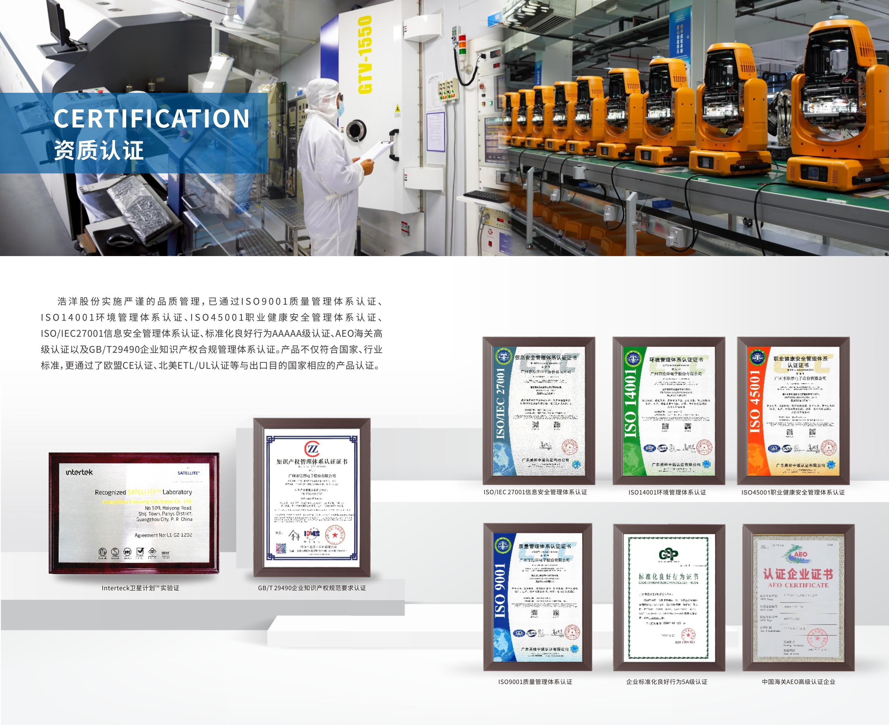
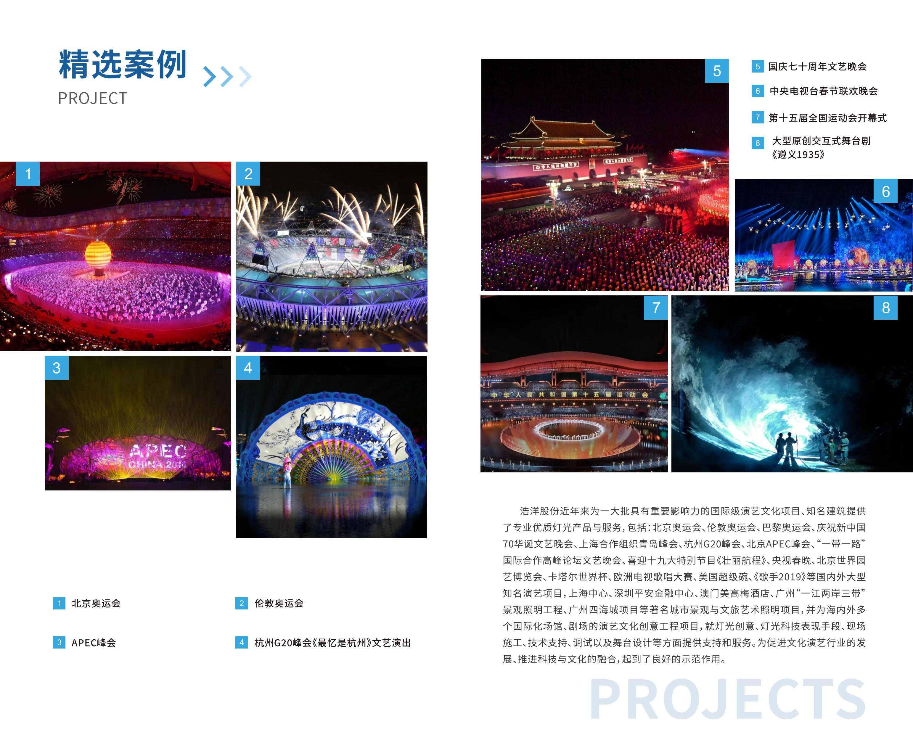
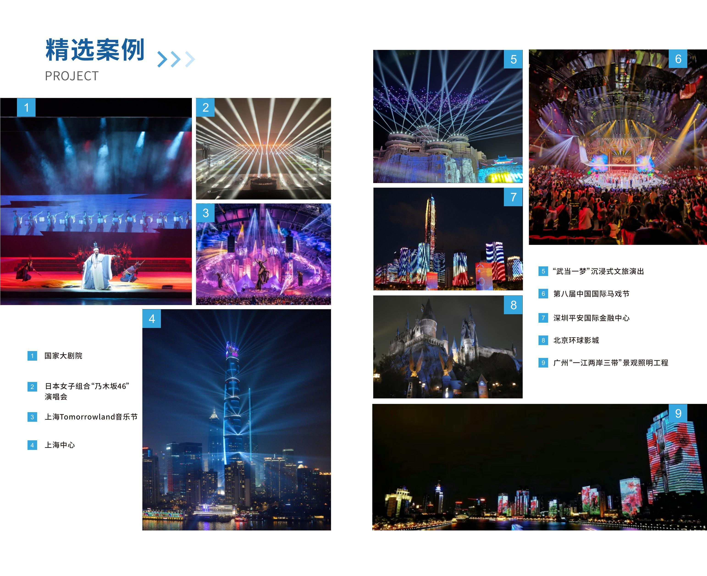

> **Winning Adventure Global. All rights reserved. Unauthorised reproduction, distribution, or commercial use of this report is strictly prohibited.**

## 1. Executive Summary

Guangzhou Haoyang Electronic Co., Ltd. (trading name: **Golden Sea**) is one of China's leading professional entertainment-lighting manufacturers, headquartered in Panyu District, Guangzhou. By the company's own definition it serves the professional **stage, television, theatre and architectural lighting** markets — that is, it manufactures lighting **fixtures (luminaires)**, **not LED video walls or display screens** (its former HD-display product line is discontinued). Established in March 2005, it is publicly listed on the Shenzhen Stock Exchange's ChiNext board[^1] (code 300833) — a scale and governance standing uncommon among private manufacturers.

Golden Sea operates a tiered, multi-brand portfolio. Its **own core brand** is **TERBLY** (professional stage lighting, LED and HID; the **SMART** series sits within it). It also controls two international brands — **Ayrton**, a wholly-owned French subsidiary (founded 2001, near Paris) producing high-end performing-arts fixtures, and **SGM**, an *architainment* (architecture + entertainment) brand founded in Italy in 1975 and based in Aarhus, Denmark, acquired in September 2024 — plus specialist brands **GSARC** (architectural / landscape lighting), **GoldenSea UV** (UV disinfection), and **WTC** (aluminium truss and staging). Its fixtures have been deployed at the highest tier of live events worldwide, including the Eurovision Song Contest, the Super Bowl, the Beijing and London Olympic Games, and the Qatar World Cup.

**Key Strengths:** Internationally recognised brand portfolio (Ayrton, SGM); publicly listed corporate-governance standing; vertically integrated manufacturing across three factories with European R&D centres in France and Denmark; 1,000+ items of intellectual property and recognised technology leadership in laser-phosphor and IP65 all-weather fixtures; an established Australian distribution and support presence; national-champion industry designations.

**Areas of Note:** Premium price positioning for the Ayrton brand; Ayrton is sold exclusively through appointed country distributors rather than factory-direct (see Section 9); the company's core competence is lighting fixtures and truss — it is not a turnkey studio-build contractor and does not manufacture LED video walls.

### 1.1 Relevance to This Project

Golden Sea explicitly serves the **television-lighting** market, which puts it directly on-point for a broadcast studio. Its product range maps to the **lighting scope** of the South Melbourne build — moving heads, effect fixtures, wash/par fixtures, pixel/linear bars, and aluminium truss. The Ayrton and SGM ranges are credible candidates for the project's requirement for a single, consistent family of professional moving heads and linear bars. The company does **not** supply the project's LED video wall, audio, or staging joinery; those remain with other suppliers. An important practical point for an Australia-based client is that Ayrton already has appointed Australian distributors (Show Technology Australia and Red Globe Productions), which supports local warranty, spares, and technical service.

---

## 2. Business Registration & Corporate Information

| Item | Detail | Verification Status |
|------|--------|---------------------|
| Company Full Name | Guangzhou Haoyang Electronic Co., Ltd. | Verified |
| Trading / Brand Name | Golden Sea | Verified |
| Stock Listing | Shenzhen Stock Exchange, ChiNext board[^1] (code 300833) | Verified via public listing records |
| Legal Representative[^2] | Jiang Weikai (founder) | Verified |
| Date of Establishment | 17 March 2005 | Verified |
| Company Type | Joint-stock limited company (publicly listed) | Verified |
| Registered Address | Shiqiao Town, Panyu District, Guangzhou, Guangdong | Verified |
| Operating Status | Active | Verified |
| Unified Social Credit Code[^3] | Not specified in reviewed public sources — to be confirmed against the business licence at contracting | Pending |
| Group Workforce | 1,800+ across three manufacturing bases | Supplier-disclosed materials |

---

## 3. Brand Portfolio

Golden Sea's portfolio is best read as **three layers**: an own/core brand (**TERBLY**), two international brands (**Ayrton**, **SGM**), and specialist brands (**GSARC**, **GoldenSea UV**, **WTC**). For this studio project, TERBLY, Ayrton and SGM are the relevant lighting brands.

| Brand | Role / Origin | Positioning | Relevance to Studio |
|-------|---------------|-------------|---------------------|
| **TERBLY** (incl. SMART) | Golden Sea's **own core brand** (China) | Professional stage lighting — LED and HID; profiles/cutters, wash & effect, 3-in-1 & beam, conventional | Cost-competitive, factory-direct family for movers, pars and stage fixtures |
| **Ayrton** | Wholly-owned **French subsidiary** (founded 2001, near Paris) | International high-end performing-arts lighting; LED and laser-phosphor[^4] sources; IP65[^5] range | Moving heads, profiles, wash & effect — strongest candidate for the "single consistent model" moving-head requirement |
| **SGM** | *Architainment* brand; founded Italy 1975, based Aarhus (Denmark); acquired Sept 2024 | All-weather (IP65) architecture + entertainment lighting; pioneer of weatherproof moving heads; wash / flood / strobe, effect, media architecture | IP65 moving heads, LED pixel/linear bars, floodlights |
| **GSARC** | Golden Sea own brand | Architectural / landscape / cultural-tourism lighting (floodlight, wall-wash, matrix, pixel, in-ground, gobo) | Lobby / venue architectural lighting |
| **GoldenSea UV** | Golden Sea own brand | UV disinfection | Not applicable to this project |
| **WTC** | Group truss brand | Aluminium truss & staging; TÜV, CE, EN 1090 | Truss and rigging hardware |

**Industry Context.** Ayrton competes at the top tier of the global market alongside Martin Professional, Claypaky, Robe and Vari-Lite, and is widely specified by the world's largest rental houses; SGM pioneered the all-weather IP65 moving head. Both Ayrton and SGM are wholly owned by Golden Sea. Combining in-house Chinese manufacturing (TERBLY) with two owned European brands is an unusual structure that gives the group both premium credibility and manufacturing scale.

---

## 4. Certifications & Qualifications

### 4.1 Management System Certifications

| Certification | Status | Verification |
|---------------|--------|--------------|
| ISO 9001 Quality Management[^6] | Confirmed | Supplier-disclosed materials and public records |
| ISO 14001 Environmental Management | Confirmed | Supplier-disclosed materials |
| ISO 45001 Occupational Health & Safety | Confirmed | Supplier-disclosed materials |
| ISO/IEC 27001 Information Security Management | Confirmed | Supplier-disclosed materials |
| ISO 10012 Measurement Management | Confirmed | Supplier-disclosed materials |
| GB/T 29490 Intellectual Property Management | Confirmed | Supplier-disclosed materials |
| AEO Advanced Customs Certification[^7] | Confirmed | Supplier-disclosed materials |

### 4.2 Product Certifications

| Certification | Coverage | Verification |
|---------------|----------|--------------|
| CE (EU) | Across brands | Supplier-disclosed materials |
| ETL / UL (North America) | Multiple brands | Supplier-disclosed materials |
| FDA CDRH laser safety (US) | Ayrton laser-phosphor fixtures (e.g. Cobra²) | Supplier-disclosed materials / brand documentation |
| TÜV / EN 1090 | WTC aluminium truss | Supplier-disclosed materials |

> For an Australian deployment, the client should confirm **RCM / AS-NZS electrical compliance** for the specific fixture models selected. CE/UL/ETL coverage does not automatically satisfy Australian requirements; the appointed Australian distributor (Section 7) is the most direct route to compliant, locally supported units.

### 4.3 National Designations & Standards Role

| Designation | Verification |
|-------------|--------------|
| Manufacturing Single Champion Demonstration Enterprise[^8] (stage/film lighting) | Public records (national industry authority) |
| SRDI "Little Giant" Enterprise[^9] | Public records |
| National Cultural Industry Demonstration Base[^10] | Public records |
| National Intellectual Property Demonstration Enterprise | Public records |
| Guangzhou Mayor's Quality Award | Public records |
| Secretariat, Guangdong Stage Lighting Standardisation Technical Committee | Supplier-disclosed materials |
| Drafting participant — national, industry, local and group standards | Supplier-disclosed materials |

Participation in standards drafting and the Manufacturing Single Champion designation are meaningful third-party validations of genuine technical depth in this specific industry segment.

*Golden Sea management-system, customs and laboratory certifications.*

---

## 5. Production & Technical Capability

### 5.1 Manufacturing Footprint

| Base | Location | Function | Status |
|------|----------|----------|--------|
| Headquarters plant | Shiqiao, Panyu District, Guangzhou | HQ / R&D / production | Operating |
| Jiangmen plant (Phase 1) | Enping, Jiangmen | Capacity expansion / new product lines | Operational since 2024 |
| New Panyu base | Panyu District, Guangzhou | Performance-equipment industrial base | Planned / under development |
| Ayrton R&D centre | Villebon-sur-Yvette, Paris region, France | Brand R&D | Operating |
| SGM facility | Aarhus, Denmark | R&D / manufacturing / testing | Operating |

A multi-country manufacturing footprint (China, France, Denmark) provides both R&D depth and a degree of geographic resilience. SGM's Danish production means part of the group's output is manufactured outside China.

### 5.2 Business Model

Golden Sea is a **vertically integrated manufacturer**, operating both an own-brand (OBM) model and contract manufacturing (ODM). This contrasts with a systems integrator: the company designs and builds its own fixtures rather than sourcing third-party equipment, which supports consistency, IP control, and after-sales parts availability.

### 5.3 Technical Capability

**Research & Development**
- 200+ R&D personnel (approximately 20% of headquarters staff), with substantial sustained R&D investment
- Dedicated laboratories spanning optics, electronics, software, structural engineering and testing (environmental, waterproof, acoustic, thermal, optical, safety, EMI)
- Four laboratories authorised by ITS as witnessed test laboratories[^11]
- Provincial Performance-Lighting Engineering Technology Research Centre

**Core Technologies**
- Laser-phosphor[^4] light sources (e.g. the Cobra and Mamba families)
- IP65 all-weather protection across the Ayrton and SGM ranges; an early pioneer of all-weather waterproof moving heads
- Colour-rendering-index and colour-temperature control, high-precision positioning, efficient thermal/waterproof management, and IoT-enabled fixtures
- High-power LED and laser modules; "three-in-one" stage fixtures

**Intellectual Property**
- 1,000+ domestic and international IP rights (accumulated and growing year on year)
- Recipient of the China Patent Excellence Award; recognised as a National Intellectual Property Demonstration Enterprise
- IP coverage extending to Europe, North America and other major markets

---

## 6. Product Range & Project Track Record

### 6.1 Representative Fixtures (Ayrton)

Ayrton's range is organised into compact-to-large series (1 / 3 / 6 / 9) plus a Creative effects line. Representative fixtures relevant to a broadcast studio:

| Fixture | Type | Source | Protection | Notes |
|---------|------|--------|-----------|-------|
| Rivale Profile | Profile / spot | 450W LED 6500K | IP65 | 4–52° zoom; versatile all-rounder |
| Veloce Profile | Profile | 850W LED 6500K | IP65 | Theatre / touring / fixed install |
| Stradale Profile | Profile | 330W LED 6500K | IP65 | Cost-effective high-end (introduced to Australia 2025) |
| Khamsin | Profile / spot | LED | IP65 | Mid-size workhorse |
| Huracán Profile | Profile | LED | IP65 | Large-venue |
| MagicDot Neo / MagicBlade Neo | Creative effect | RGBL LED | IP65 | Pixel / linear effect arrays |
| Mamba / Cobra² | Beam (laser) | Laser phosphor | IP65 | High-end touring; Cobra² FDA-compliant for North America |

SGM adds IP65 moving heads, LED pixel/linear bars and architectural floodlights manufactured in Denmark. TERBLY offers LED and HID stage fixtures at a more competitive price point for budget-sensitive positions.

<ProductShowcase>
  <ProductCard src="/reports/aaron-sansoni/images/terbly-pg-009.jpg" title="SL10P IP" />
  <ProductCard src="/reports/aaron-sansoni/images/terbly-pg-010.jpg" title="SL3000P IP" />
  <ProductCard src="/reports/aaron-sansoni/images/terbly-pg-011.jpg" title="SL880P IP" />
  <ProductCard src="/reports/aaron-sansoni/images/terbly-pg-012.jpg" title="SL880P" />
  <ProductCard src="/reports/aaron-sansoni/images/terbly-pg-013.jpg" title="SL750P" />
  <ProductCard src="/reports/aaron-sansoni/images/terbly-pg-014.jpg" title="SL5000PH" />
  <ProductCard src="/reports/aaron-sansoni/images/terbly-pg-015.jpg" title="SL5000P IP" />
  <ProductCard src="/reports/aaron-sansoni/images/terbly-pg-016.jpg" title="SL5000WPH" />
  <ProductCard src="/reports/aaron-sansoni/images/terbly-pg-017.jpg" title="SL5000WP IP" />
  <ProductCard src="/reports/aaron-sansoni/images/terbly-pg-018.jpg" title="SL1000P IP" />
  <ProductCard src="/reports/aaron-sansoni/images/terbly-pg-019.jpg" title="SL1000P" />
  <ProductCard src="/reports/aaron-sansoni/images/terbly-pg-021.jpg" title="S620H IP" />
  <ProductCard src="/reports/aaron-sansoni/images/terbly-pg-022.jpg" title="S620H" />
  <ProductCard src="/reports/aaron-sansoni/images/terbly-pg-023.jpg" title="S620B IP" />
  <ProductCard src="/reports/aaron-sansoni/images/terbly-pg-024.jpg" title="S620B" />
  <ProductCard src="/reports/aaron-sansoni/images/terbly-pg-025.jpg" title="SH9" />
  <ProductCard src="/reports/aaron-sansoni/images/terbly-pg-026.jpg" title="S380H IP" />
  <ProductCard src="/reports/aaron-sansoni/images/terbly-pg-027.jpg" title="S380H" />
  <ProductCard src="/reports/aaron-sansoni/images/terbly-pg-028.jpg" title="S380B IP" />
  <ProductCard src="/reports/aaron-sansoni/images/terbly-pg-029.jpg" title="S380B" />
  <ProductCard src="/reports/aaron-sansoni/images/terbly-pg-030.jpg" title="S550H IP" />
  <ProductCard src="/reports/aaron-sansoni/images/terbly-pg-031.jpg" title="S550H" />
  <ProductCard src="/reports/aaron-sansoni/images/terbly-pg-032.jpg" title="S550B IP" />
  <ProductCard src="/reports/aaron-sansoni/images/terbly-pg-034.jpg" title="GL750P" />
  <ProductCard src="/reports/aaron-sansoni/images/terbly-pg-035.jpg" title="GL12W IP" />
  <ProductCard src="/reports/aaron-sansoni/images/terbly-pg-036.jpg" title="GL8P IP" />
  <ProductCard src="/reports/aaron-sansoni/images/terbly-pg-037.jpg" title="GL8P" />
  <ProductCard src="/reports/aaron-sansoni/images/terbly-pg-038.jpg" title="GL6" />
  <ProductCard src="/reports/aaron-sansoni/images/terbly-pg-039.jpg" title="GL5" />
  <ProductCard src="/reports/aaron-sansoni/images/terbly-pg-040.jpg" title="GL2P" />
  <ProductCard src="/reports/aaron-sansoni/images/terbly-pg-042.jpg" title="GLZ500 IP" />
  <ProductCard src="/reports/aaron-sansoni/images/terbly-pg-043.jpg" title="GLZ300 IP" />
  <ProductCard src="/reports/aaron-sansoni/images/terbly-pg-044.jpg" title="GLZ100 IP" />
  <ProductCard src="/reports/aaron-sansoni/images/terbly-pg-046.jpg" title="G550B IP" />
  <ProductCard src="/reports/aaron-sansoni/images/terbly-pg-047.jpg" title="G25B IP" />
  <ProductCard src="/reports/aaron-sansoni/images/terbly-pg-048.jpg" title="G22H NOVA IP" />
  <ProductCard src="/reports/aaron-sansoni/images/terbly-pg-049.jpg" title="G20 HYBRID IP" />
  <ProductCard src="/reports/aaron-sansoni/images/terbly-pg-050.jpg" title="G22H NOVA" />
  <ProductCard src="/reports/aaron-sansoni/images/terbly-pg-051.jpg" title="G25 HYBRID" />
  <ProductCard src="/reports/aaron-sansoni/images/terbly-pg-052.jpg" title="G12WB" />
  <ProductCard src="/reports/aaron-sansoni/images/terbly-pg-054.jpg" title="SLW1940 IP" />
  <ProductCard src="/reports/aaron-sansoni/images/terbly-pg-055.jpg" title="GLW1960FX IP" />
  <ProductCard src="/reports/aaron-sansoni/images/terbly-pg-056.jpg" title="GLB12FX IP" />
  <ProductCard src="/reports/aaron-sansoni/images/terbly-pg-057.jpg" title="GLB6FX IP" />
  <ProductCard src="/reports/aaron-sansoni/images/terbly-pg-058.jpg" title="GLW3720Z" />
  <ProductCard src="/reports/aaron-sansoni/images/terbly-pg-059.jpg" title="GLW1920Z" />
  <ProductCard src="/reports/aaron-sansoni/images/terbly-pg-060.jpg" title="GLW3740" />
  <ProductCard src="/reports/aaron-sansoni/images/terbly-pg-061.jpg" title="GLW1940" />
  <ProductCard src="/reports/aaron-sansoni/images/terbly-pg-062.jpg" title="GLW760 IP" />
  <ProductCard src="/reports/aaron-sansoni/images/terbly-pg-063.jpg" title="GLW760" />
  <ProductCard src="/reports/aaron-sansoni/images/terbly-pg-064.jpg" title="SparoX MV" />
  <ProductCard src="/reports/aaron-sansoni/images/terbly-pg-065.jpg" title="GS-PAR19" />
  <ProductCard src="/reports/aaron-sansoni/images/terbly-pg-066.jpg" title="OVAL 60D" />
  <ProductCard src="/reports/aaron-sansoni/images/terbly-pg-067.jpg" title="OVAL 48D" />
  <ProductCard src="/reports/aaron-sansoni/images/terbly-pg-069.jpg" title="T400C" />
  <ProductCard src="/reports/aaron-sansoni/images/terbly-pg-070.jpg" title="TP300" />
  <ProductCard src="/reports/aaron-sansoni/images/terbly-pg-071.jpg" title="TP300 FX" />
  <ProductCard src="/reports/aaron-sansoni/images/terbly-pg-072.jpg" title="TP300 TW" />
  <ProductCard src="/reports/aaron-sansoni/images/terbly-pg-073.jpg" title="F90H (CW/WW)" />
  <ProductCard src="/reports/aaron-sansoni/images/terbly-pg-074.jpg" title="T90H IP (CW/WW)" />
  <ProductCard src="/reports/aaron-sansoni/images/terbly-pg-075.jpg" title="T90H (CW/WW)" />
  <ProductCard src="/reports/aaron-sansoni/images/terbly-pg-076.jpg" title="T200C IP" />
  <ProductCard src="/reports/aaron-sansoni/images/terbly-pg-077.jpg" title="T180C" />
  <ProductCard src="/reports/aaron-sansoni/images/terbly-pg-078.jpg" title="TP01 (CW/WW)" />
  <ProductCard src="/reports/aaron-sansoni/images/terbly-pg-079.jpg" title="C5" />
  <ProductCard src="/reports/aaron-sansoni/images/terbly-pg-081.jpg" title="MAX 02" />
</ProductShowcase>

*Selected TERBLY fixtures from the 2026 catalogue — 8 series represented. This is not an exhaustive listing; the full range is available on request. Click any page to enlarge.*

### 6.2 GSARC — Architectural & Landscape Lighting

Golden Sea's **GSARC** brand covers the full spectrum of outdoor and architectural illumination — modular high-output floodlights (GS-X, GS-R), linear wall-washers (GS-W, GS-L, TEX), inground uplights (POT, VIC), building pixel tubes (MAGIC), gobo projectors (MAX-02), and waterproof PAR fixtures (GS-PAR 19). For the studio project, GSARC lines are relevant for lobbies, facade and any architectural or exterior lighting positions.

<ProductShowcase>
  <ProductCard src="/reports/aaron-sansoni/images/gsarc-pg-009.jpg" title="GS-X-1" />
  <ProductCard src="/reports/aaron-sansoni/images/gsarc-pg-010.jpg" title="GS-X-2" />
  <ProductCard src="/reports/aaron-sansoni/images/gsarc-pg-011.jpg" title="GS-X-3" />
  <ProductCard src="/reports/aaron-sansoni/images/gsarc-pg-012.jpg" title="GS-X-4" />
  <ProductCard src="/reports/aaron-sansoni/images/gsarc-pg-013.jpg" title="GS-X-6" />
  <ProductCard src="/reports/aaron-sansoni/images/gsarc-pg-014.jpg" title="GS-X-9" />
  <ProductCard src="/reports/aaron-sansoni/images/gsarc-pg-016.jpg" title="GS-R-1" />
  <ProductCard src="/reports/aaron-sansoni/images/gsarc-pg-017.jpg" title="GS-R-2" />
  <ProductCard src="/reports/aaron-sansoni/images/gsarc-pg-018.jpg" title="GS-R-3" />
  <ProductCard src="/reports/aaron-sansoni/images/gsarc-pg-020.jpg" title="GS-W-1" />
  <ProductCard src="/reports/aaron-sansoni/images/gsarc-pg-021.jpg" title="GS-W-2" />
  <ProductCard src="/reports/aaron-sansoni/images/gsarc-pg-022.jpg" title="GS-W-3" />
  <ProductCard src="/reports/aaron-sansoni/images/gsarc-pg-024.jpg" title="GS-L-1" />
  <ProductCard src="/reports/aaron-sansoni/images/gsarc-pg-025.jpg" title="GS-L-2" />
  <ProductCard src="/reports/aaron-sansoni/images/gsarc-pg-026.jpg" title="GS-L-P50" />
  <ProductCard src="/reports/aaron-sansoni/images/gsarc-pg-027.jpg" title="GS-L-P100" />
  <ProductCard src="/reports/aaron-sansoni/images/gsarc-pg-028.jpg" title="GS-Z19" />
  <ProductCard src="/reports/aaron-sansoni/images/gsarc-pg-030.jpg" title="DOT-XXL" />
  <ProductCard src="/reports/aaron-sansoni/images/gsarc-pg-031.jpg" title="DOT-XL" />
  <ProductCard src="/reports/aaron-sansoni/images/gsarc-pg-032.jpg" title="DOT-L" />
  <ProductCard src="/reports/aaron-sansoni/images/gsarc-pg-033.jpg" title="DOT-M" />
  <ProductCard src="/reports/aaron-sansoni/images/gsarc-pg-034.jpg" title="DOT-S" />
  <ProductCard src="/reports/aaron-sansoni/images/gsarc-pg-036.jpg" title="REC-XL" />
  <ProductCard src="/reports/aaron-sansoni/images/gsarc-pg-037.jpg" title="REC-XL-N3" />
  <ProductCard src="/reports/aaron-sansoni/images/gsarc-pg-038.jpg" title="REC-L" />
  <ProductCard src="/reports/aaron-sansoni/images/gsarc-pg-039.jpg" title="REC-L-N3" />
  <ProductCard src="/reports/aaron-sansoni/images/gsarc-pg-040.jpg" title="REC-L-N5" />
  <ProductCard src="/reports/aaron-sansoni/images/gsarc-pg-041.jpg" title="REC-S" />
  <ProductCard src="/reports/aaron-sansoni/images/gsarc-pg-042.jpg" title="REC-S-N5" />
  <ProductCard src="/reports/aaron-sansoni/images/gsarc-pg-044.jpg" title="TEX-L" />
  <ProductCard src="/reports/aaron-sansoni/images/gsarc-pg-045.jpg" title="TEX-M" />
  <ProductCard src="/reports/aaron-sansoni/images/gsarc-pg-046.jpg" title="TEX-S" />
  <ProductCard src="/reports/aaron-sansoni/images/gsarc-pg-047.jpg" title="TEX-TWIN" />
  <ProductCard src="/reports/aaron-sansoni/images/gsarc-pg-049.jpg" title="PIX-L" />
  <ProductCard src="/reports/aaron-sansoni/images/gsarc-pg-051.jpg" title="POT-L" />
  <ProductCard src="/reports/aaron-sansoni/images/gsarc-pg-052.jpg" title="POT-M" />
  <ProductCard src="/reports/aaron-sansoni/images/gsarc-pg-053.jpg" title="POT-S" />
  <ProductCard src="/reports/aaron-sansoni/images/gsarc-pg-055.jpg" title="VIC-M" />
  <ProductCard src="/reports/aaron-sansoni/images/gsarc-pg-056.jpg" title="VIC-S" />
  <ProductCard src="/reports/aaron-sansoni/images/gsarc-pg-057.jpg" title="MAGIC D" />
  <ProductCard src="/reports/aaron-sansoni/images/gsarc-pg-058.jpg" title="MAGIC P20-60" />
  <ProductCard src="/reports/aaron-sansoni/images/gsarc-pg-059.jpg" title="MAX-02" />
  <ProductCard src="/reports/aaron-sansoni/images/gsarc-pg-060.jpg" title="GS-PAR 19" />
</ProductShowcase>

*Selected GSARC architectural & landscape lighting fixtures from the 2026 catalogue — 9 series represented. This is not an exhaustive listing; the full range is available on request. Click any page to enlarge.*

### 6.3 WTC — Aluminium Truss & Staging

Golden Sea's **WTC** brand (GuangZhou ZhiGou Truss Co.) covers the full aluminium structural range needed for studio rigging — spigot and bolted box/rectangular truss (F-series, HT-series, TT-series), advertising truss, towers, stages, layer grids, chain hoists, and permanent roof structures. For the Aaron Sansoni studio, WTC truss is the backbone for lighting grid, camera rail, and any suspended LED or speaker load.

<ProductShowcase>
  <ProductCard src="/reports/aaron-sansoni/images/wtc-pg-007.jpg" title="Spigot F14 / F21" />
  <ProductCard src="/reports/aaron-sansoni/images/wtc-pg-008.jpg" title="Spigot F22 / F23" />
  <ProductCard src="/reports/aaron-sansoni/images/wtc-pg-009.jpg" title="Spigot F24 / F31" />
  <ProductCard src="/reports/aaron-sansoni/images/wtc-pg-010.jpg" title="Spigot F32 / F33" />
  <ProductCard src="/reports/aaron-sansoni/images/wtc-pg-011.jpg" title="Spigot F34" />
  <ProductCard src="/reports/aaron-sansoni/images/wtc-pg-012.jpg" title="Spigot F42 / F43" />
  <ProductCard src="/reports/aaron-sansoni/images/wtc-pg-013.jpg" title="Spigot F44 / HT32" />
  <ProductCard src="/reports/aaron-sansoni/images/wtc-pg-014.jpg" title="Spigot HT33" />
  <ProductCard src="/reports/aaron-sansoni/images/wtc-pg-015.jpg" title="Spigot HT34" />
  <ProductCard src="/reports/aaron-sansoni/images/wtc-pg-016.jpg" title="Spigot HT42 / HT43" />
  <ProductCard src="/reports/aaron-sansoni/images/wtc-pg-017.jpg" title="Spigot HT44" />
  <ProductCard src="/reports/aaron-sansoni/images/wtc-pg-018.jpg" title="FTR4030 / TT45" />
  <ProductCard src="/reports/aaron-sansoni/images/wtc-pg-019.jpg" title="TT54 / TT74" />
  <ProductCard src="/reports/aaron-sansoni/images/wtc-pg-020.jpg" title="TT64 / TT86" />
  <ProductCard src="/reports/aaron-sansoni/images/wtc-pg-021.jpg" title="TT104 / T104" />
  <ProductCard src="/reports/aaron-sansoni/images/wtc-pg-022.jpg" title="GS350" />
  <ProductCard src="/reports/aaron-sansoni/images/wtc-pg-023.jpg" title="Bolted FTB-L / FTB-M" />
  <ProductCard src="/reports/aaron-sansoni/images/wtc-pg-024.jpg" title="Bolted FTB-H / HT4040" />
  <ProductCard src="/reports/aaron-sansoni/images/wtc-pg-025.jpg" title="Bolted HT6040 / G20" />
  <ProductCard src="/reports/aaron-sansoni/images/wtc-pg-026.jpg" title="G20 / Towers" />
  <ProductCard src="/reports/aaron-sansoni/images/wtc-pg-027.jpg" title="Towers" />
  <ProductCard src="/reports/aaron-sansoni/images/wtc-pg-028.jpg" title="Aluminium Stage" />
  <ProductCard src="/reports/aaron-sansoni/images/wtc-pg-029.jpg" title="Furniture / Accessories" />
  <ProductCard src="/reports/aaron-sansoni/images/wtc-pg-030.jpg" title="Accessories" />
  <ProductCard src="/reports/aaron-sansoni/images/wtc-pg-031.jpg" title="Accessories / Clamps" />
  <ProductCard src="/reports/aaron-sansoni/images/wtc-pg-032.jpg" title="Truss Systems" />
  <ProductCard src="/reports/aaron-sansoni/images/wtc-pg-033.jpg" title="Layer Truss" />
  <ProductCard src="/reports/aaron-sansoni/images/wtc-pg-034.jpg" title="Layer Truss" />
  <ProductCard src="/reports/aaron-sansoni/images/wtc-pg-035.jpg" title="Chain Hoist" />
  <ProductCard src="/reports/aaron-sansoni/images/wtc-pg-036.jpg" title="Chain Hoist" />
  <ProductCard src="/reports/aaron-sansoni/images/wtc-pg-037.jpg" title="Roof Systems" />
  <ProductCard src="/reports/aaron-sansoni/images/wtc-pg-038.jpg" title="Roof Systems" />
</ProductShowcase>

*Selected WTC 2025 aluminium truss spreads — spigot truss, bolted truss, towers, stage, accessories, layer grids, chain hoists, and roof systems represented. This is not an exhaustive listing; the full range is available on request.*

### 6.4 Marquee Deployments

| Event / Venue | Brand | Year |
|---------------|-------|------|
| Eurovision Song Contest (753 Ayrton fixtures, all-LED/laser design) | Ayrton | 2025 / 2026 |
| Super Bowl (USA) | Ayrton / TERBLY | Multiple years |
| Beijing & London Olympic Games | Golden Sea | 2008 / 2012 |
| Qatar World Cup | Golden Sea | 2022 |
| Disney "Hercules", West End (London) | Ayrton | 2025–2026 |
| Adele (Munich); Metallica (Europe tour) | SGM | Recent |
| LIV Las Vegas nightclub | Ayrton | 2024 |

This track record at the highest tier of broadcast, touring and theatre demonstrates fixtures proven under exactly the kind of on-camera conditions relevant to a television studio.

**Figure 1.** *Selected deployments — Beijing and London Olympics, APEC Summit, G20, 70th National Day Gala, CCTV Spring Festival, National Games, and the stage production Zunyi 1935.*

**Figure 2.** *Further selected deployments — National Centre for the Performing Arts, Shanghai Tomorrowland, Shanghai Tower, Wudang Dream immersive show, China International Circus Festival, Shenzhen Ping'an Finance Centre, Beijing Universal Studios, and Guangzhou riverside lighting.*

---

## 7. Global Distribution & Australian Support

Ayrton operates a strict **exclusive-distribution model**[^12] — one appointed distributor per country, selected for technical support and demo capability. For an Australia-based client, this is a practical advantage: locally appointed partners provide warranty, spares and service in-country.

| Region | Partner | Brand | Type |
|--------|---------|-------|------|
| **Australia** | **Show Technology Australia** | Ayrton | Distributor |
| **Australia** | **Red Globe Productions** | Ayrton | Dealer / rental |
| North America | ACT Entertainment | Ayrton | Exclusive distributor |
| United Kingdom | Ambersphere Solutions; Neg Earth Lights (rental) | Ayrton | Exclusive distributor / Tier-1 rental |
| Germany | BT.innotec GmbH | Ayrton | Exclusive distributor |
| Global | PRG (Production Resource Group) | Ayrton | Tier-1 rental partner |

**Channel implication for procurement.** Because Ayrton is sold through exclusive distributors, the most direct route to genuine, locally warranted Ayrton fixtures is via **Show Technology Australia** or **Red Globe Productions**, not factory-direct from Golden Sea. By contrast, Golden Sea's own-brand lines (TERBLY, GSARC) and ODM capability can be engaged more directly through the company's international business operations. Winning Adventure Global can pursue either path depending on whether the client prioritises the Ayrton brand or a more cost-flexible own-brand solution.

---

## 8. Risk & Compliance Review

### 8.1 Issues NOT Found

A review of public sources identified:

- No significant public litigation
- No regulatory penalties
- No product recalls
- No sanctions or export-control findings
- No environmental violations
- No labour disputes
- No corruption allegations

### 8.2 Governance & Compliance Standing

As a publicly listed company, Golden Sea operates under corporate-governance and regulatory-oversight requirements that provide greater transparency and external scrutiny than a typical private manufacturer. The company also holds ISO/IEC 27001 information-security certification and AEO Advanced Customs certification, the latter supporting smoother cross-border trade.

### 8.3 Areas of Note

| Item | Assessment |
|------|------------|
| Trade-policy exposure | The group has publicly signalled mitigation of US-China trade exposure through non-China (Danish) production and planned additional overseas capacity. For an Australia-bound order this is not a direct concern, but it indicates active supply-chain diversification. |
| Premium positioning | Ayrton sits at the premium end of the market. Where budget is constrained, TERBLY or SGM may offer better value for specific positions. |
| Scope boundary | Golden Sea supplies lighting fixtures and truss only — not the LED video wall, audio, or staging joinery in this project. |

**Overall risk level: Low.**

---

## 9. Supplier Engagement Considerations

| Dimension | Rating | Assessment |
|-----------|--------|------------|
| Export Experience | Excellent | Predominantly export-oriented; extensive international sales across Europe, North America and Asia-Pacific through established brand channels. |
| English Capability | Strong | Ayrton (France) and SGM (Denmark) operate with native English-speaking teams; Golden Sea maintains an international business operation. Technical documentation available in English. |
| Australian Support | Strong | Appointed Australian distributors (Show Technology Australia, Red Globe Productions) for Ayrton — local warranty, spares and demo capability. |
| Procurement Route | Note | Ayrton: via exclusive Australian distributor (not factory-direct). TERBLY / own-brand & ODM: direct via Golden Sea international operations. |
| MOQ / Flexibility | Moderate | Catalogue fixtures via distribution for Ayrton; greater flexibility and customisation via TERBLY/ODM for own-brand lines. |
| Lead Time | Order-based | As a manufacturer, lead time is production-driven; distributor stock may shorten Ayrton delivery in-region. |
| After-Sales | Strong | Manufacturer parts availability plus in-country distributor support for Ayrton in Australia. |
| Pricing | Premium (Ayrton) / Competitive (TERBLY) | Brand-tiered; selection can be optimised per budget position. |

---

## Report Basis & Limitations

This report has been prepared by Winning Adventure Global as a supplier due diligence and capability assessment for client review. It is based on publicly available corporate and listing records, certification references, supplier disclosures, brand and industry information, and other available sources at the time of review. The report is intended to support commercial understanding of the supplier's background, brands, qualifications, operational capabilities, and observable risk factors. It does not constitute legal, financial, engineering, or compliance certification advice. Product model availability, certifications for specific models, and Australian (RCM / AS-NZS) compliance should be confirmed with the appointed distributor before ordering.

## Appendix: Terms Glossary

[^1]: **ChiNext (创业板):** A NASDAQ-style board of the Shenzhen Stock Exchange for growth and innovation enterprises. Listing requires meeting stringent admission and governance standards with ongoing regulatory oversight — a meaningful credibility and transparency signal relative to private suppliers.

[^2]: **Legal Representative (法定代表人):** Under Chinese corporate law, a specific individual bearing personal legal responsibility for the company's actions — a heavier responsibility than an Australian company director.

[^3]: **Unified Social Credit Code (统一社会信用代码):** A unique 18-digit identifier assigned to every legally registered entity in China, combining the functions of an ABN, ACN and tax file number. Should be confirmed against the business licence when contracting.

[^4]: **Laser Phosphor source:** A light engine using a laser to excite a phosphor, producing a very bright, highly collimated white source. It enables long-throw beams and high output in a compact, efficient fixture, and is a current high-end technology in performance lighting.

[^5]: **IP65:** An ingress-protection rating indicating the fixture is dust-tight and protected against low-pressure water jets — i.e. suitable for all-weather and demanding indoor environments. Useful where reliability and easy cleaning matter.

[^6]: **ISO 9001:** International standard for quality management systems, requiring third-party auditing of quality processes. It indicates systematic quality control, not that every individual unit is defect-free.

[^7]: **AEO Advanced Customs Certification (海关高级认证):** The highest tier of China Customs' Authorized Economic Operator programme, granting faster clearance and lower inspection rates. It indicates a compliant, well-run import/export operation and can support smoother, more predictable shipping.

[^8]: **Manufacturing Single Champion (制造业单项冠军):** A national designation from China's industry authority for enterprises that lead a specific narrow product segment in market share and technology. It is a strong, segment-specific marker of genuine leadership.

[^9]: **SRDI "Little Giant" (专精特新 "小巨人"):** A national designation for SMEs demonstrating Specialization, Refinement, Differentiation and Innovation — part of China's industrial policy to cultivate niche industry leaders.

[^10]: **National Cultural Industry Demonstration Base (国家文化产业示范基地):** A designation by China's national cultural authority recognising significant enterprises in the cultural industry, here reflecting the company's standing in performance/entertainment technology.

[^11]: **Witnessed Test Laboratory (目击试验室):** A manufacturer laboratory authorised by an accredited certification body (here ITS) to conduct certification testing under the body's supervision. It shortens certification cycles and signals mature, trusted in-house testing capability.

[^12]: **Exclusive Distribution Model:** A channel strategy in which the brand appoints a single authorised distributor per country, responsible for sales, technical support and after-sales. It keeps pricing and brand standards consistent and means genuine, locally warranted product is bought through that distributor rather than factory-direct.
