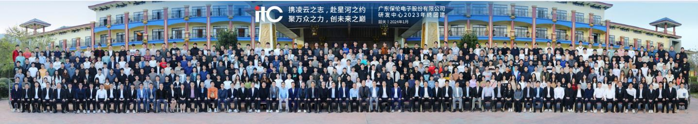
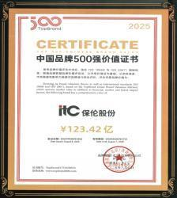

## 1. Executive Summary

Guangdong Baolun Electronics Co., Ltd. (brand: ITC, established 1993) is one of China's largest manufacturers and system integrators in the professional audio, video, lighting, and communications (AVLC) industry. Headquartered in Guangzhou's Panyu District, the company employs over 6,000 staff including 1,300 R&D personnel, operates a 300,000 sqm intelligent manufacturing industrial park, and maintains 240 global service outlets.

ITC is ranked among the Top 500 Enterprises in Guangdong Province and Top 100 Manufacturing Enterprises in Guangdong. The company has served major international events including the Beijing Winter Olympics (2022), Hangzhou Asian Games (2023), and the 15th Chinese National Games (2025). Its public broadcast systems hold the No. 3 global market share position. ITC presents strong alignment in LED display panels, conference systems, and central control systems.

**Key Strengths:** Massive production scale, comprehensive product portfolio across 70+ series, proven track record with national-level projects, genuine "one-stop" design-to-delivery capability.
**Areas of Note:** A 2021 environmental impact assessment (EIA) documentation infraction (administrative demerit, not a production violation); recent revenue decline amid industry headwinds; concentrated ownership structure.

---

## 2. Business Registration & Corporate Information

| Item | Detail | Verification Status |
|------|--------|---------------------|
| Company Full Name | Guangdong Baolun Electronics Co., Ltd. | Verified |
| Unified Social Credit Code[^1] | 91440113677779116F | Verified via Tianyancha[^2] / National Enterprise Credit Information Publicity System[^3] |
| Legal Representative[^4] | Zhao Dingjin | Verified |
| Registered Capital[^5] | RMB 367.2 million (~USD 50.5M) | Verified |
| Paid-in Capital[^6] | Not independently verified | Pending |
| Date of Establishment | 25 July 2008 | Verified |
| Registered Address | No. 56 Nanli East Road, Shiqi Town, Panyu District, Guangzhou | Verified |
| Company Type | Joint-stock limited company (unlisted,自然人投资或控股)[^7] | Verified |
| Operating Status | Active | Verified |
| Registration Authority | Guangzhou Administration for Market Regulation[^8] | Verified |
| Annual Report | Latest filed, normal status | Verified |

**Ownership Structure:**
- Zhu Zhenghui: 21.80%
- Zhang Changhua: 20.80%
- Zhao Dingjin: 10.90%
- Baolun Holdings (employee stock ownership platform): 33.23%
- 24 additional employee stock ownership platforms
- Combined voting control by three founders: 86.74%

**Brand and Corporate History:**
- 1993: ITC brand founded
- 2008: Guangdong Baolun Electronics Co., Ltd. incorporated
- ITC is the primary operating brand; the legal entity also operates under "Baolun" for government procurement

---

## 3. Certifications & Qualifications

### 3.1 Management System Certifications

| Certification | Status | Notes |
|---------------|--------|-------|
| ISO 9001 Quality Management[^9] | Confirmed | Verified through public certification records and industry references |
| ISO 14001 Environmental Management | Confirmed | Verified through public certification records |
| ISO 45001 Occupational Health & Safety | Confirmed | Verified through public certification records |
| ISO 27001 Information Security Management | Confirmed | Verified through public certification records |
| ISO 50001 Energy Management | Confirmed | Per IPO prospectus |
| CMMI (Software Maturity)[^10] | Confirmed | Valid through January 2027 |

### 3.2 Product Certifications

| Certification | Status | Relevance to Australian Import |
|---------------|--------|-------------------------------|
| CCC (China Compulsory Certification)[^11] | Full product line | Required for products manufactured in China |
| CE (European Conformity)[^12] | Confirmed | International compliance reference |
| RoHS (Hazardous Substances)[^13] | Confirmed | Environmental compliance |
| FCC (US Federal Communications)[^14] | Confirmed | EMC compliance reference |
| UL (US Safety)[^15] | Confirmed | Safety standard reference |
| EN54 (European Fire Standard) | Confirmed | Voice alarm systems specifically |
| Military Standard (国军标)[^16] | Confirmed | Military-civilian dual-use qualification |

**Note on Australian RCM[^17]:** Products carry CE, FCC, and UL certifications, which serve as recognised reference baselines for compliance assessment in many jurisdictions. Existing test reports from these certifications may be submitted to accredited laboratories for jurisdiction-specific conformity assessment where required.

### 3.3 Enterprise Qualifications

| Qualification | Level/Status |
|---------------|--------------|
| Electronic & Intelligent Engineering Professional Contracting[^19] | Grade II |
| Audio Engineering Enterprise Comprehensive Technical Grade[^19] | Grade I (Highest) |
| Audio-Visual Integration Engineering Enterprise Qualification[^19] | Grade I (Highest) |
| National High-Tech Enterprise[^20] | Since 2012 |
| National-Level "Little Giant" SRDI Enterprise[^21] | Confirmed |

### 3.4 Industry Honors & Recognition

- Top 500 Enterprises in Guangdong Province
- Top 100 Manufacturing Enterprises in Guangdong
- Guangzhou Private Leading Enterprise
- A-Level Taxpayer[^22] for 7 consecutive years (2017-2023)
- "Contract-Honoring and Credit-Worthy Enterprise"[^23] in Guangdong for 6 consecutive years
- 6th Guangzhou Mayor's Quality Award Nomination (April 2026)
- 2025 Guangdong Provincial Manufacturing Single Champion Enterprise
- Selected supplier for Central Government Procurement Network e-mall[^24]

---

## 4. Production & Technical Capability

### 4.1 Manufacturing Infrastructure

ITC operates a 300,000 sqm intelligent manufacturing industrial park in Panyu, Guangzhou - described as the largest single-facility manufacturing center in the professional AV industry in China.

| Factory Unit | Annual Output |
|--------------|---------------|
| Intelligent Controller Terminal Equipment | 2,000,000 units |
| Speakers & Professional Speakers | 5,000,000 units |
| LED Panels | 100,000 sqm |
| Lighting Fixtures | 2,000,000 units |
| Wireless Microphones | 200,000 units |
| Paperless Conference Terminals | 200,000 units |
| Mixers | 50,000 units |
| Wire & Cable | 40,000,000 meters |
| Stage Lighting & Landscape Lighting | 5,000,000 units |

**Production Lines:**

- SMT high-speed assembly lines
- Automatic insertion lines (DIP)
- Fully automatic aging lines
- Automatic packaging lines (including professional speaker packaging)
- Automated module assembly lines
- Transformer winding automatic production
- Hardware panel, structural component, transformer, wire, and enclosure processing centers

**Key Manufacturing Capability:** ITC maintains in-house manufacturing for core components including hardware panels, structural components, transformers, wiring, and enclosures - reducing dependency on external suppliers for critical parts.

### 4.2 Quality Control Infrastructure

**Testing & Measurement Equipment:**
- Spectrum analyzers
- Semi-anechoic chambers with electroacoustic instruments
- Optical anechoic chambers with test instruments
- Semiconductor device testing equipment
- Vector network analyzers
- Power quality analyzers
- Video analyzers and audio analyzers
- Constant temperature/humidity test chambers
- Salt spray laboratory
- Battery test chambers
- Vibration drop test chambers
- Three-level coordinate test chambers
- X-RAY test room

**CNAS Accreditation:**[^25] ITC is actively pursuing CNAS (China National Accreditation Service) national laboratory accreditation, which would bring its testing facility to internationally recognized standards.

**Product Pass Rate:** ITC self-reports a factory pass rate of 99.55% with zero major quality complaints. This figure has not been independently audited.

### 4.3 R&D Capability

**Figure 1.** *ITC R&D team: 1,300 personnel, 30% with master's degrees, 10-12% of annual revenue invested in R&D.*

| Metric | Data |
|--------|------|
| R&D Personnel | 1,300 (22% of total workforce) |
| Master's Degree Holders | 30% of R&D staff |
| R&D Centers | 16 (Guangzhou, Hangzhou, Nanjing + multiple cities) |
| Annual R&D Investment | 10-12% of revenue |
| Total Intellectual Property | 1,678+ items (end 2024) |
| Invention Patents | 301 |
| Utility Model Patents | 216 |
| Design Patents | 217 |
| Software Copyrights | 944 |
| National/Industry/Local Standards | 5 national + 2 industry + 2 local |
| Group Standards Led | 28 |
| Core "Bottleneck" Technologies | 71 |

**R&D Centres by Domain:**

| Domain | Domain | Domain | Domain |
|--------|--------|--------|--------|
| Professional Audio | Conference Audio | Digital PA | Conference Platform |
| Visual Management Platform | Command Center | LED Display | Smart Office |
| Smart Lighting | Stage Machinery | Smart Vision | Content Management Platform |
| Medical Informatization | Fusion Communications | AI Innovation (LLMs, VLMs, multimodal, intelligent agents) | Acoustics |

**8 Major Technology Fields:**
1. Video Technology (3A algorithms, ISP optical processing, PTZ control, encoding/decoding, visual tracking, streaming)
2. AI Algorithm Analysis (image analysis, speech transcription, facial recognition, machine translation)
3. Wireless Technology (4G, Wi-Fi, infrared DQPSK, frequency hopping, NB-IoT, Zigbee, WIFI6)
4. Digital Matrix (high-speed circuit design, FPGA encoding/decoding, optical signal transmission, backplane design)
5. Digital Amplifier (audio switching power supply, IR2092, broadcast digital, high-power digital, parallel connection)
6. Power Technology (flyback, half-bridge, forward, full-bridge, broadcast power supply)
7. IoT Technology (sensors, embedded systems, network transmission, cloud service applications)
8. Audio Technology (transmission, synchronization, matrix switching, intelligent mixing, noise reduction, echo cancellation, DSP processing, AGC pickup, speech semantic segmentation)

### 4.4 Global Presence

- 10 branch offices across China (major provincial capitals)
- 240 global service outlets
- International operations: USA, Kazakhstan, Saudi Arabia, Ethiopia, Algeria, UAE, Turkey, Sri Lanka
- 1,000,000+ global completed cases (company-claimed)

---

## 5. Complete Product Portfolio

<ProductShowcase>
  <ProductCard src="/reports/aaron-sansoni/images/1688-products/3a23846be86b2408f8a1c0995aa25224.png" title="Conference Systems" />
  <ProductCard src="/reports/aaron-sansoni/images/1688-products/7ded49d58fc6486ab8ff01bf3055772f.png" title="Interactive Flat Panel" />
  <ProductCard src="/reports/aaron-sansoni/images/1688-products/7e374bd69ec4176b80f261642b707e98.png" title="Lighting Systems" />
  <ProductCard src="/reports/aaron-sansoni/images/1688-products/0501f97679b1404864a9b185a85b0c10.png" title="HD Video Conference" />
  <ProductCard src="/reports/aaron-sansoni/images/1688-products/5748c04aea3998f9efc1ea9399065ecb.png" title="Speaker & Amplifier" />
  <ProductCard src="/reports/aaron-sansoni/images/1688-products/754133d3751145fffd07ed2fcc574cd2.png" title="Information Platforms" />
  <ProductCard src="/reports/aaron-sansoni/images/1688-products/99002610476b59050b7e5a937301e7cc.png" title="Content Management" />
  <ProductCard src="/reports/aaron-sansoni/images/1688-products/c9ff564afbe7fa0244e0ebc42e986e0f.png" title="Medical Informatization" />
  <ProductCard src="/reports/aaron-sansoni/images/1688-products/cedb6690c074d1cad38ba5594ef473b0.png" title="Education Informatization" />
  <ProductCard src="/reports/aaron-sansoni/images/1688-products/df38841d95f4b63b3fcee69f4e00c452.png" title="Digital PA System" />
  <ProductCard src="/reports/aaron-sansoni/images/1688-products/e3fe0eee33d0fe85b4e2e356985a2172.png" title="Voice Guide System" />
  <ProductCard src="/reports/aaron-sansoni/images/1688-products/e042ffd0260b918d79d42062575de233.png" title="Command & Dispatch" />
  <ProductCard src="/reports/aaron-sansoni/images/1688-products/ee70c64cf1aa49e2797cc8f5982e1c44.png" title="LED Video Wall" />
</ProductShowcase>

*Representative product categories from ITC's catalogue. ITC offers over 70 product series across the full AVLC spectrum, with the detailed portfolio outlined below.*

### 5.1 Core Business Segment 1: Audio-Visual & Lighting Systems

**A. Conference Systems**
- Fully Digital Conference Systems (60 models)
- 5G Conference Systems (20 models)
- 4K Remote Video Conference Systems (25 models MCU, 12 terminal models)
- Intelligent Paperless Conference Systems (35 models)
- Simultaneous Interpretation Systems
- Paper-and-Pen Interactive Systems
- Wireless Voting Systems
- Intelligent Central Control Matrix Systems
- Conference HD Recording Systems
- Professional Conference Sound Reinforcement (30 models)
- Conference Screen Display Systems
- Speech Transcription Systems
- Cloud Conference Management Platform
- Intelligent Interactive Flat Panel (itchub series, 65-98 inches, 4 versions)

**B. Professional Audio Systems**
- Theater Speakers (12 models) + Amplifiers (3 models) + Mixers (3 models) + Microphones (10 models)
- Lecture Hall Speakers (20 models) + Amplifiers (10 models) + Mixers (8 models) + Microphones (10 models)
- Stadium Speakers (10 models) + Amplifiers (10 models) + Mixers (8 models) + Microphones (10 models)
- Conference Room Speakers (30 models) + Amplifiers (12 models) + Mixers (10 models) + Microphones (10 models)
- Cultural Tourism Speakers (10 models) + Amplifiers (3 models) + Mixers (3 models) + Microphones (10 models)
- Bar/Nightclub Speakers (12 models) + Amplifiers (6 models) + Mixers (5 models) + Microphones (10 models)
- KTV Speakers (10 models) + Amplifiers (6 models) + Microphones (5 models)
- Concert/Rental Speakers (12 models) + Amplifiers (3 models) + Mixers (3 models) + Microphones (10 models)
- Digital Mixers, FPGA High-End Audio Processors, Third-Generation Digital Amplifiers
- Immersive Performance Platform

**C. Digital Public Address (PA) Systems**
- 8th Generation Digital IP PA System (32 models)
- EN54 Certified Voice Alarm/EVAC PA System (20 models)
- Airport PA System (25 models)
- Offshore Oil PA Platform (20 models)
- Railway/Transit PA System (27 models)
- Cultural Tourism Digital Audio Platform (41 models)
- Emergency PA System (31 models)
- 4G Emergency PA System (31 models)
- Fire Emergency PA System
- Campus IP PA System (anti-bullying)
- Visual PA System
- Visual Intercom System
- Voice Guide System
- Directional PA System
- Industry Digital PA System

**D. Lighting Systems**
- Moving Head Lights (29 models)
- Studio Lights (27 models)
- LED Flat Panel Lights (29 models)
- Spotlights (27 models)
- Static Wash Lights (14 models)
- LED Flood Lights (68 models)
- LED Linear Lights (60 models)
- Effect Light Series (2 models)
- Entertainment Light Series (47 models)
- Laser Lights (11 models)
- Ellipsoidal Lights (14 models)
- Follow Spot Lights (10 models)
- Search Lights (7 models)
- Special Effect Equipment (15 models)
- Classroom Lighting (5 models)
- Architectural Lights (36 models)
- Landscape Lights (27 models)
- Garden Lights (27 models)
- Underground Lights (14 models)
- LED Point Lights (36 models)

**E. Stage Machinery**
- On-Stage Machinery: Motor Series (26 models), Rod Body (4 models), Curtain (5 models), Floor Standing (3 models), Electric Hoist (2 models)
- Under-Stage Machinery: Lifting/Rotating/Retracting/Fire Curtain
- Control Systems: Mechanical Controller, Power Supply (22 models)
- Stage Special Effects: Flame Projector, Gerb, Fog Machine, Bubble Machine, Strobe Light

**F. LED Video Wall Systems**
- Indoor LED Video Wall (56 models): P0.93/P1.19/P1.25/P1.45/P1.53/P1.56/P1.58/P1.66/P1.86/P1.9/P2.0/P2.5/P3.0
- Outdoor LED Video Wall (30 models): P2.5/P3.07/P4.0/P5.0/P5.9/P6.67/P8.0/P10
- LED Transparent Video Wall (14 models): P1.95/P2.60/P2.97/P3.91/P4.81, P2.5/P2.6/P3.91
- Rental Video Wall: P2.6-5.2/P3.9-7.8
- LED Dance Floor Video Wall
- Flexible LED Video Wall (Custom)
- Special-Shaped Video Wall: Spherical, Dome, Cube screens
- COB Series, A Series, X Series, C Series, K Series, K Pro Series, F/E Series, G Series, DZ Series, R Series, TM Series

**G. Command & Dispatch Systems**
- Visual Management Platform (24 models)
- Fiber Matrix (68 models)
- LED Video Wall for Command Centers (56 models)
- Fusion All-in-One Machine
- Splicing Matrix System
- Command Operation and Dispatch Platform
- Fusion Communication Dispatch Platform

**H. Education Informatization**
- Smart Classroom Systems (general education, higher education)
- Cloud-Controlled Classroom System (12 models)
- Quality HD Recording Systems (10 models)
- Special Delivery Classroom System
- Virtual Simulation Desktop Terminal
- Group Discussion System
- Classroom Sound Reinforcement
- Listening Test System
- Smart Listening & Learning System
- Classroom Subtitle System
- Smart Class Information Board
- Educational All-in-One Machines / Interactive Blackboards
- Healthy Lighting System
- AI Smart Sports System
- Physics/Chemistry/Biology Experiment Test System
- Campus TV Station System
- Campus Data Cockpit
- Campus Digital Twin Platform

**I. Medical Informatization**
- Medical Triage System (8 models self-service, 6 models triage workstation)
- Medical Intercom System (6 models host, 6 models bed extension, 15 models call workstation)
- ICU Visitation System (6 models host, 6 models extension)
- Ward IPTV System (8 models terminal)
- Master-Slave Clock System (10 models)
- Surgery Demonstration System
- Remote Consultation System

**J. Intelligent Interactive Flat Panel (itchub)**
- Flagship Version (16 models): 65/75/86/98 inches, built-in Windows IoT OS, 4800W magnetic camera optional
- Light Luxury Version (4 models): 65/75/86/98 inches, built-in Windows IoT OS
- Classic Version (4 models): 65/75/86/98 inches, built-in 4800W camera
- Audiovisual Version (4 models): 65/75/86/98 inches
- OPS Computer Modules (Intel/Zhaoxin/Phytium versions)

**K. Content Management & Information Distribution**
- Wall-Mounted Release Terminals (10 models)
- Multimedia Publishing Terminals (20 models)
- Floor Standing/Horizontal Release Terminals (10 models)
- Indoor/Outdoor LED Display Screens (112 models, two major systems)
- Self-Service All-in-One Machines (8 models)
- SaaS Application Services (5 types)
- Content Management Platform (2 models)
- Queue Calling System (8 models workstation)

**L. Intelligent Voice Guide Systems**
- Audio Guide for Exhibition Halls/Museums (digital audio, lossless, voice restoration)
- Audio Guide for Government/Enterprise Buildings
- Scenic Area Audio Guide
- Indoor Positioning (15m/30m base stations)
- Wireless Sound Reinforcement (U-band anti-interference)
- Smart Tour Guide Software (PC, Android iOS tablet/phone)

**M. Information Platforms**
- Data Visualization Platform
- Campus Digital Twin Platform
- Park Digital Twin Platform
- Unified Portal Management Platform
- Command/Operation/Dispatch Platform (Cockpit)
- Converged Communication Platform
- AI Big Model Platform
- AI Edge Computing Platform
- IoT Platform
- Audiovisual & Lighting Control Platform
- Cloud Conference Management Platform
- Public Security Big Data Analysis Platform

### 5.2 Core Business Segment 2: Cultural & Tourism Systems

Full product portfolio for cultural tourism includes:
- Landscape Lighting: LED flood lights, underground lights, wall washers, linear lights, underwater lights, garden lights
- Stage Lighting: moving heads, wash lights, studio lights, beam lights, effect lights, laser lights, strobe lights
- Stage Machinery: motors, tracks/rods, curtains, electric hoists, flame projectors, fog/bubble machines
- LED Video Walls: conventional, transparent, flexible, 360-degree holographic, dance floor, special-shaped
- Projectors & Screens: LCD projectors, scrim curtains, water curtain screens, holographic screens, sliding rail screens
- Interactive Systems: VR/AR/MR, motion capture, CAVE systems, electronic sand tables, digital humans, robots
- Monitoring & Access Control: cameras (bullet/dome/conch/hemispherical), turnstiles, barrier gates
- PA & Intercom Systems: professional sound reinforcement, directional speakers, audio guides, intercom
- Control Platforms: centralized control, content management, integrated management, digital twin

### 5.3 Core Business Segment 3: Smart Park Systems

- Integrated Park Management Platform
- Building Automation System
- Energy Consumption Monitoring & Management
- Video Surveillance System (gun-type, dome, hemispheric, conch cameras)
- Access Control System (pedestrian passage gates, wall-mounted/attendance/turnstile)
- Visitor Management System
- Parking Management System (barrier gates, cameras)
- Perimeter Security System
- Fire Broadcast System
- Emergency PA System
- Background Music System
- Intercom Assistance System
- Conference Systems (fully digital, wireless, paperless, remote video)
- Professional Sound & Lighting Systems
- Content Management & Screen Display
- IoT Control Platform
- Network Communication System (wireless AP, optical modules, switches)
- Digital Twin Platform

### 5.4 Core Business Segment 4: Digital Exhibition Hall Systems

- Display: LED video walls (conventional, transparent, special-shaped, dance floor, flexible, 3D holographic), LCD commercial video walls, projectors, projection screens, holographic screens, sliding rail screens, electronic sand tables
- Interactive: VR/AR/MR series, motion capture, CAVE systems, digital humans, robots, interactive screens
- Audio: directional speakers, audio guides, professional sound reinforcement
- Control: integrated management systems, centralized control, content management
- Infrastructure: surveillance cameras, access control, barrier gates
- Digital twin platforms for exhibition spaces

### 5.5 Application Scenarios by Industry

ITC products serve 50+ industries with solutions covering 400+ scenarios:

| Industry                    | Annual Project Volume | Key Scenarios                                                                                                             |
| --------------------------- | --------------------- | ------------------------------------------------------------------------------------------------------------------------- |
| Conference Rooms            | ~12,000/year          | Small/medium/large meeting rooms across government, military, medical, education, finance, enterprises                    |
| Lecture Halls & Auditoriums | ~4,000/year           | Multi-purpose halls, academic lecture theaters, cultural auditoriums                                                      |
| Theaters                    | ~300/year             | Professional theaters, opera houses, performance venues                                                                   |
| Stadiums                    | ~2,500/year           | Indoor/outdoor sports venues, natatoriums, training facilities                                                            |
| Command Centers             | ~3,000/year           | Emergency response, military, police, transportation, energy                                                              |
| Bars/KTV/Party Rooms        | ~700/year             | Entertainment venues, nightclubs, KTV chains                                                                              |
| Education                   | Extensive             | 15,000 recording classrooms, 20,000 smart classrooms, 8,000 university classrooms, 20,000 exam rooms, 8,000 lecture halls |
| Medical                     | Extensive             | Hospitals of all tiers, specialized clinics                                                                               |
| PA Systems                  | Extensive             | Campuses, airports, metro lines, railway stations, scenic areas, parks                                                    |
| Cultural Tourism            | ~5,000/year           | Scenic spots, theme towns, night tours, light shows, immersive experiences                                                |

---

## 6. Brand & Market Position

### 6.1 Financial Scale

- 2024 annual turnover: ~RMB 5 billion (~USD 700 million)
- Historic growth trajectory from 2017 through 2024 (consistently upward until 2023 peak)
- IPO[^26] filing submitted to Shanghai Stock Exchange Main Board (May 2026), seeking to raise RMB 1.583 billion for production base expansion, R&D center upgrades, and marketing network buildout

### 6.2 Market Position
- No. 1 market share in China for: Public Broadcast Systems, Professional Sound Reinforcement, Conference Systems (3 consecutive years, 2023-2025)
- No. 3 globally in Public Broadcast Systems (Zhongjing Shiyi data)
- Top 10 in Stage Lighting and LED Display in China
- First-time entry into Global LED Display TOP 10 list (2026)
- Brand value: RMB 12.342 billion (2025, Brand Alliance certification)

**Figure 2.** *ITC brand value certificate: RMB 12.342 billion (2025, Brand Alliance). Ranked #1 in China Audio and Video System market share for consecutive years.*

- Selected for "Guangdong Famous Brand" and "2025 National Comprehensive Products Light Plan"

### 6.3 Media & Industry Reputation
- Overall positive media coverage emphasizing industry leadership
- Financial media scrutiny emerged following May 2026 IPO filing, highlighting revenue decline and high selling expenses
- Recognized as "2025 Digital Audio-Visual Top 10 Influential Brand" (January 2026)
- "Green Intelligent Manufacturing Benchmark Enterprise" awarded by Panyu District Manufacturers Association (April 2026)

---

## 7. Risk & Compliance Review

### 7.1 Identified Risks

| Risk Item | Severity | Assessment |
|------------|
| Pre-IPO Large Dividend Distribution | Very Low | RMB 690M distributed to shareholders, then RMB 1.583B sought from public markets. This is a capital markets governance concern with no bearing on equipment procurement from the company. |

### 7.2 Issues NOT Found
- No major product quality litigation
- No major administrative penalties (other than the EIA demerit noted above)
- No abnormal business operation records
- No dishonest executee records
- Annual reports filed normally

### 7.3 Contextual Notes

**EIA Documentation Issue (2021):** This was an administrative infraction regarding the quality of an environmental impact assessment *report*, not an environmental violation. The specific deficiencies cited were: incorrect project description, errors in pollution source strength calculation methodology and results, exhaust gas treatment measure analysis errors, environmental risk identification errors, and multiple omissions throughout the document. This is a paperwork/consulting quality issue, not an indicator of production non-compliance.

**Counterfeit Products:** ITC's official website mentions that it has "fully engaged law firms to combat counterfeits," indicating that counterfeit ITC products exist in the market. This is a known challenge for well-recognised brands and does not affect products procured directly from the manufacturer.

**IPO Proceeds vs. Dividends:** The pre-IPO dividend distribution (RMB 690M) followed by a capital raise of RMB 1.583B has drawn market commentary. This is a governance signal relevant to potential equity investors but has no bearing on a client purchasing equipment from ITC as a vendor.

---

## 8. Cooperation Compatibility

| Dimension | Rating | Assessment |
|-----------|--------|-------------|
| Export Experience | Strong | International projects in USA, Kazakhstan, Saudi Arabia, UAE, Ethiopia, Algeria, Turkey. Products carry CE/FCC/UL certifications enabling international use. |
| English Capability | Good | English-language website, English product documentation. International project delivery capability demonstrated through deployments across multiple countries. |
| MOQ / Flexibility | Moderate | As a large manufacturer, minimum order quantities may apply. Project scale should be confirmed as meeting thresholds. |
| Lead Time | Moderate | In-house manufacturing with SMT lines enables lead time control. However, large factory scheduling may be less flexible than smaller workshops. |
| After-Sales Service | Strong | 240 global service outlets. Specific Australia service capability needs confirmation - may rely on remote support + spare parts. |
| Technical Documentation | Strong | Professional design team, 37 group standards authored. Should provide complete system drawings, installation manuals, and operation documentation. |
| Payment Terms | Moderate | Large manufacturers typically require T/T advance payment. As a company in IPO process, financial transparency is relatively high. |

---

## Terms Glossary

The following footnotes explain China-specific regulatory, business, and certification terms for readers unfamiliar with Chinese systems.

[^1]: **Unified Social Credit Code (统一社会信用代码):** A unique 18-digit identifier assigned to every legally registered entity in China. Analogous to an Australian Business Number (ABN) combined with an Australian Company Number (ACN), but functioning as a single universal identifier used across tax, customs, social insurance, and all government registrations. Verifiable at https://www.gsxt.gov.cn.

[^2]: **Tianyancha (天眼查):** A leading third-party business intelligence platform in China that aggregates public data from government registries, court records, tax filings, and commercial databases. Similar to a combination of ASIC Connect + CreditorWatch in the Australian context. Used here for cross-verification of company registration details.

[^3]: **National Enterprise Credit Information Publicity System (国家企业信用信息公示系统):** The official government-operated public registry of all registered Chinese enterprises, maintained by the State Administration for Market Regulation (SAMR). Equivalent to ASIC's register in Australia. Accessible at https://www.gsxt.gov.cn. All legally registered companies must file annual reports here.

[^4]: **Legal Representative (法定代表人):** Under Chinese corporate law, a specific individual designated as the company's legal representative who bears personal legal liability for the company's actions. This is distinct from a company director in Australian law -- the Legal Representative is personally accountable for regulatory violations and can face travel restrictions or personal penalties if the company breaches laws. This role goes significantly beyond what an Australian director typically assumes.

[^5]: **Registered Capital (注册资本):** The total capital amount declared by shareholders at company incorporation. In China's current company law (post-2014 reform), this is a subscribed figure -- shareholders commit to contributing this amount but actual payment (paid-in capital) may occur over time. Contrast with Australian practice where share capital is typically fully paid at issuance.

[^6]: **Paid-in Capital (实缴资本):** The actual amount of capital shareholders have contributed to the company to date. The ratio of paid-in to registered capital indicates how much of the shareholders' commitment has been fulfilled. A low ratio is common in Chinese SMEs and is not necessarily a red flag, but is worth noting.

[^7]: **自然人投资或控股:** Literally "invested or controlled by natural persons." This company type designation means the company is privately held by individual shareholders (as opposed to state-owned enterprises or institutional investors). In Australian terms, this is analogous to a proprietary limited company with individual shareholders.

[^8]: **Administration for Market Regulation (市场监督管理局):** The local government body responsible for business registration, market supervision, and consumer protection. Equivalent to ASIC's registration function plus state-level fair trading bodies combined. Each city/district has its own AMR office with jurisdiction over companies registered at that address.

[^9]: **ISO 9001:** The international standard for quality management systems, issued by the International Organization for Standardization. Certification requires third-party auditing of a company's quality management processes. Widely recognized in Australia and globally. Holding ISO 9001 indicates systematic quality control processes are in place, not that every product is defect-free.

[^10]: **CMMI (Capability Maturity Model Integration):** A process-level improvement training and appraisal program developed by Carnegie Mellon University. CMMI certification indicates the company follows disciplined software development and systems engineering processes. Relevant because ITC's products include significant embedded software (conference systems, control platforms, DSP).

[^11]: **CCC (China Compulsory Certification / 3C认证):** Mandatory safety certification required for products sold in the Chinese market. Covers electrical safety, electromagnetic compatibility, and other safety criteria. While CCC is a China-specific requirement and does not substitute for Australian RCM, it demonstrates that products have passed rigorous safety testing.

[^12]: **CE Marking (Conformite Europeenne):** Indicates conformity with health, safety, and environmental protection standards for products sold within the European Economic Area. While not directly valid in Australia, CE testing data is often accepted as a reference by NATA-accredited laboratories when assessing products for RCM certification.

[^13]: **RoHS (Restriction of Hazardous Substances):** EU directive restricting the use of specific hazardous materials (lead, mercury, cadmium, hexavalent chromium, PBBs, PBDEs) in electrical and electronic products. Relevant to Australian imports as similar restrictions apply under state-based environmental regulations.

[^14]: **FCC (Federal Communications Commission):** US certification for electromagnetic compatibility. Products with FCC certification have been tested for radio frequency emissions. This testing data supports Australian EMC compliance assessment.

[^15]: **UL (Underwriters Laboratories):** US-based safety certification organization. UL certification indicates the product has been tested for electrical and fire safety. UL test data is a recognized reference for Australian electrical safety compliance.

[^16]: **国军标 (Chinese Military Standard):** Qualification to supply equipment to the People's Liberation Army. This is one of the most rigorous quality certifications in China, requiring compliance with military-grade specifications for durability, reliability, and security.

[^17]: **RCM (Regulatory Compliance Mark):** Australia's mandatory certification mark for electrical and electronic products, administered by state electrical safety regulators. Importers are legally responsible for ensuring products bear the RCM mark before sale in Australia. Foreign test reports (CE, FCC, UL) can support the certification process.

[^18]: **NATA (National Association of Testing Authorities):** Australia's national accreditation body for laboratories and testing facilities. NATA-accredited test reports are the gold standard for RCM certification.

[^19]: **Construction Qualification Grades (建筑业资质等级):** China's Ministry of Housing and Urban-Rural Development issues tiered construction and engineering qualifications. Grade I (一级) is the highest, authorizing the holder to undertake projects of any scale. Grade II (二级) permits medium-scale projects. These qualifications determine what project sizes a company may legally bid for and execute.

[^20]: **National High-Tech Enterprise (国家高新技术企业):** A government designation issued jointly by the Ministry of Science and Technology, Ministry of Finance, and State Taxation Administration. Companies must meet thresholds for R&D investment (as % of revenue), proportion of technical staff, and intellectual property ownership. The designation confers a reduced corporate income tax rate (15% vs standard 25%). It represents meaningful government validation of genuine R&D capability.

[^21]: **SRDI "Little Giant" (专精特新"小巨人"):** A national-level government designation for SMEs that demonstrate Specialization, Refinement, Differentiation, and Innovation in their field. Part of China's industrial policy to cultivate niche industry leaders. Evaluation criteria include market share within the niche, patent portfolio, R&D intensity, and revenue growth. Being designated a national-level "Little Giant" is a significant marker of competitive standing within a specialized industrial segment.

[^22]: **A-Level Taxpayer (A级纳税人):** The highest credit rating issued by China's tax authorities under the Tax Credit Rating system. Ratings range from A (best) to D (worst). Assessed annually based on tax compliance history, filing accuracy, and payment timeliness. Consecutive A ratings indicate sustained tax compliance and are frequently checked by large corporate and government clients before engaging a supplier.

[^23]: **Contract-Honoring and Credit-Worthy Enterprise (守合同重信用企业):** A designation awarded by the local Administration for Market Regulation to companies with a demonstrated record of contract compliance and absence of commercial disputes. Requires multi-year history with no adverse findings. Similar in concept to maintaining a clean credit file with no defaults in the Australian context.

[^24]: **Central Government Procurement Network (中央政府采购网):** The official e-procurement platform for Chinese central government agencies. Supplier registration requires passing background checks and qualification verification. Being listed indicates the company has met government procurement eligibility requirements.

[^25]: **CNAS (China National Accreditation Service):** China's national laboratory accreditation body, equivalent to NATA in Australia. CNAS accreditation means a testing laboratory's results are recognized under international mutual recognition arrangements (ILAC MRA). ITC is in the process of obtaining CNAS accreditation for its in-house testing laboratory.

[^26]: **IPO (Initial Public Offering):** ITC filed for listing on the Shanghai Stock Exchange Main Board in May 2026. The IPO registration-based system requires comprehensive public disclosure of financials, operations, and risk factors. The IPO prospectus provides an unusually detailed and independently audited view of the company's financials that is not available for private companies.

[^27]: **EIA (Environmental Impact Assessment / 环境影响评价):** Under Chinese environmental law, certain industrial projects must prepare an EIA report for government approval before construction or operation. The quality and accuracy of EIA reports are regulated, and agencies or individuals preparing substandard reports may receive administrative demerits.

[^28]: **Administrative Demerit System (记分制度):** China's environmental authorities use a points-based demerit system for entities that prepare EIA reports. Accumulating too many points can result in suspension or disqualification. A 5-point demerit is a minor administrative penalty indicating documentation quality issues rather than environmental violations.

---

*This report has been prepared as an independent third-party verification summary based on publicly available corporate records, regulatory filings, certification references, supplier disclosures, and industry information available at the time of review. The report presents factual background, business profile, qualification status, and risk observations for reference purposes. Verification has been conducted through cross-referencing multiple independent sources, including government business registries, certification databases, industry publications, and regulatory filings. This report does not constitute a recommendation for or against any specific course of action.*
