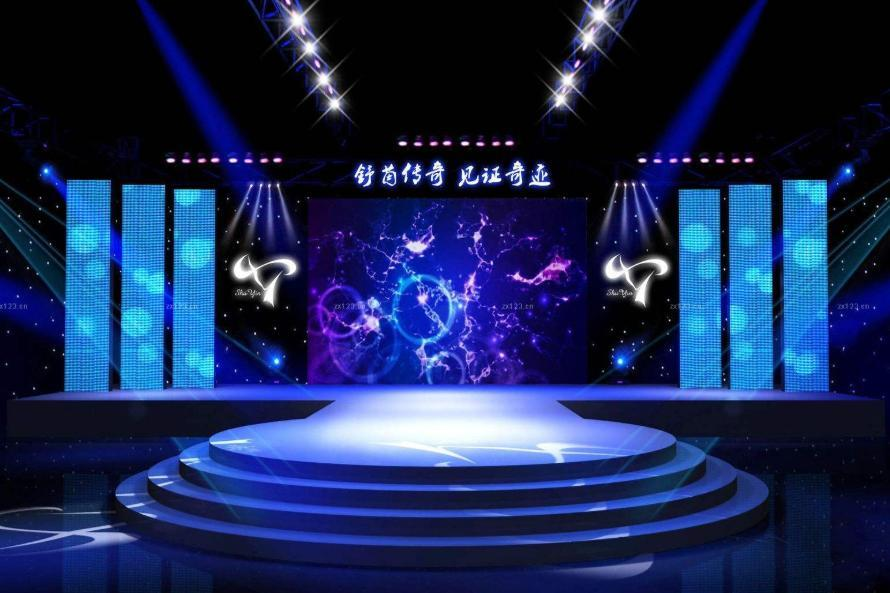
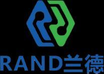
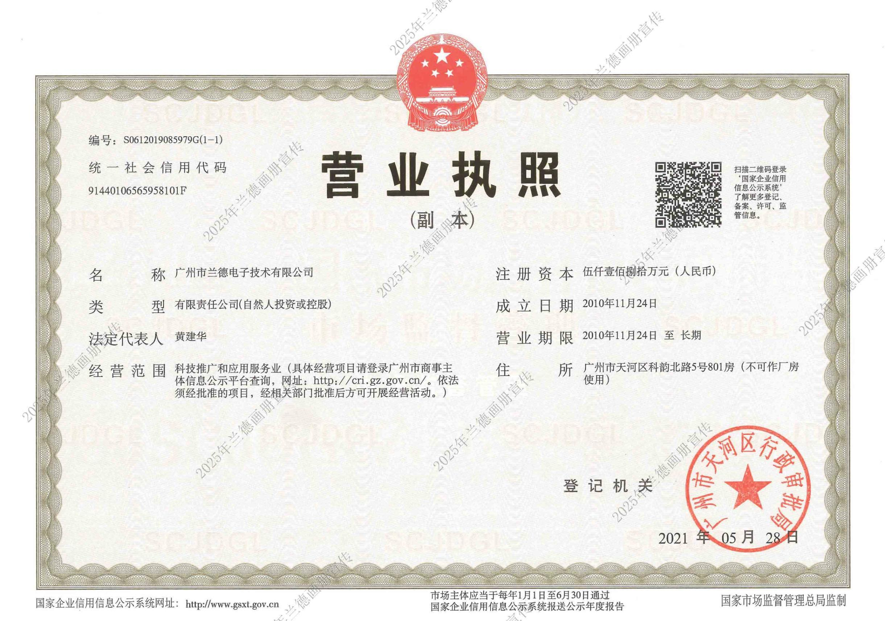
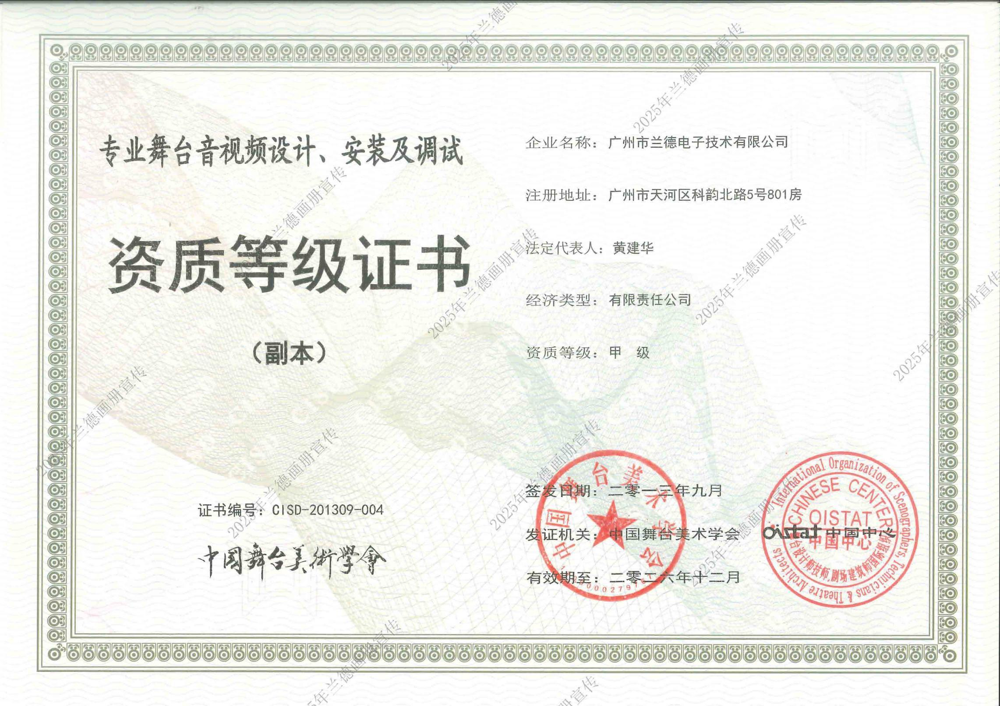
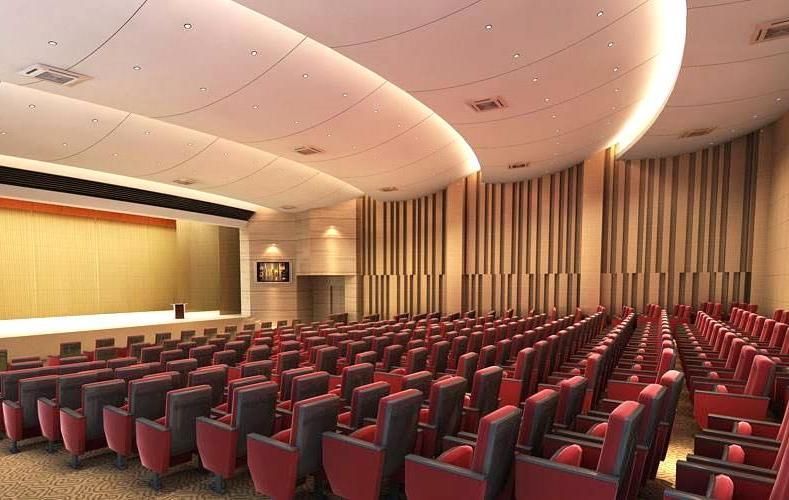
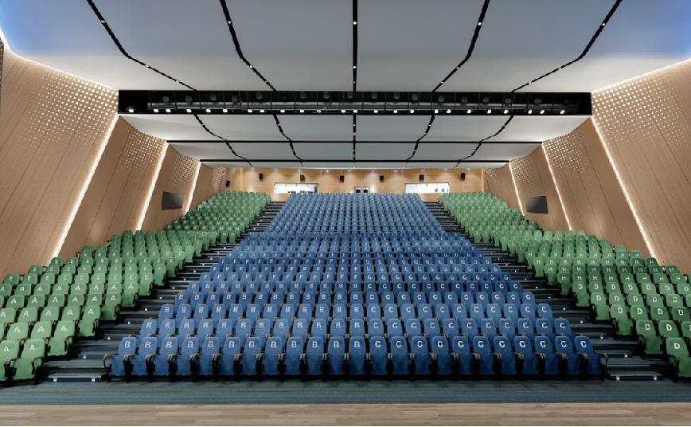
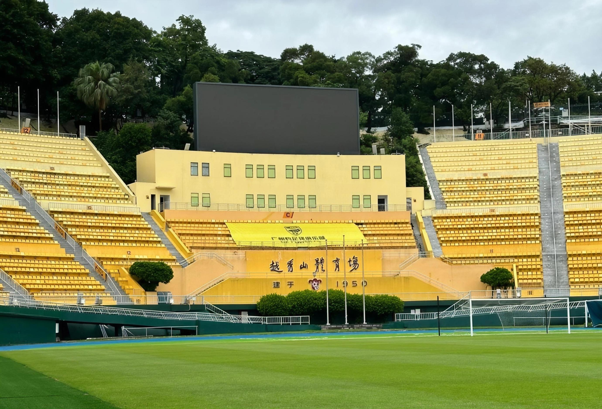

# Supplier Due Diligence White Paper
# Guangzhou Rand Electronic Technology Co., Ltd.

---

| | |
|---|---|
| **Document Type** | Supplier Due Diligence White Paper |
| **Prepared For** | Neal Walters, Head of Production |
| **Client Entity** | Aaron Sansoni Group International Pty Ltd |
| **Project** | TV Studio Build -- 84-88 Montague Street, South Melbourne VIC 3205 |
| **Date** | 11 June 2026 |
| **Prepared By** | Winning Adventure Global |
| **Classification** | Client Confidential |

---

**DISCLAIMER:** This white paper is prepared by Winning Adventure Global based on publicly available information, the Rand 2025 Company Profile (PDF), and independent research across 100+ sources. All information has been verified to the extent possible through cross-referencing multiple independent sources and visual page-by-page verification using machine vision. It is intended as a reference document for the client's supplier evaluation process. Final procurement decisions should be made after on-site inspection and formal commercial negotiation.

---

## Table of Contents

1. [Executive Summary](#1-executive-summary)
2. [Business Registration & Corporate Information](#2-business-registration-corporate-information)
3. [Certifications & Qualifications](#3-certifications-qualifications)
4. [Production & Technical Capability](#4-production-technical-capability)
5. [Project Portfolio](#5-project-portfolio)
6. [Risk & Compliance Review](#6-risk-compliance-review)
7. [Project Fit Analysis](#7-project-fit-analysis)
8. [Cooperation Compatibility](#8-cooperation-compatibility)
9. [Pricing & Value Assessment](#9-pricing-value-assessment)
10. [On-Site Inspection Recommendations](#10-on-site-inspection-recommendations)
    - [Appendix A: Information Provenance](#appendix-a-information-provenance)
    - [Appendix B: Key Contacts & Links](#appendix-b-key-contacts-links)
    - [Appendix C: Name Differentiation Guide](#appendix-c-name-differentiation-guide)

---

## 1. Executive Summary

Guangzhou Rand Electronic Technology Co., Ltd. (brand: Rand / Land Electronics) is a specialized professional AVLC (Audio, Video, Lighting, Control) systems integrator headquartered in Guangzhou's Tianhe CBD. Founded in 2008, with registered capital of RMB 51.8 million, the company holds four Grade-A stage professional qualifications - the highest level in China's entertainment technology industry - and is recognized as both a National High-Tech Enterprise and a SRDI (Specialized, Refined, Differential, Innovative) SME.

Rand specializes in turnkey systems integration for theaters, performing arts venues, stadiums, luxury hotels, and smart buildings. The company has delivered projects for the Shanxi Grand Theatre (RMB 790M total investment), Foshan Cantonese Opera Theatre (35,000 sqm), and the Xingtai Workers' Cultural Palace (RMB 165M total investment). For Neal Walters' TV Studio project, Rand presents strong alignment in stage lighting systems, stage machinery (truss/motors/rigging), drapes, and overall systems integration.

**Key Strengths:** Four Grade-A stage professional qualifications (entire industry scope), clean compliance record, extensive large-venue project portfolio, flexible small-team approach.
**Areas of Note:** Small team size (50-99 employees), limited export experience, limited public-facing transparency, operates as a systems integrator not an equipment manufacturer.

**Figure 1.** *Rand Electronics company cover page showing brand identity and core value proposition.*

---

## 2. Business Registration & Corporate Information

| Item | Detail | Verification Status |
|------|--------|---------------------|
| Company Full Name | Guangzhou Rand Electronic Technology Co., Ltd. | Verified |
| Unified Social Credit Code[^1] | 91440106565958101F | Verified via Tianyancha[^2] / National Enterprise Credit Information Publicity System[^3] |
| Legal Representative[^4] | Huang Jianhua | Verified |
| Registered Capital[^5] | RMB 51.8 million (~USD 7.1M) | Verified |
| Paid-in Capital[^6] | RMB 11.9 million (~USD 1.6M, ~23% of registered) | Verified |
| Date of Establishment | 24 November 2010 (operations began 2008) | Verified |
| Historical Name | Guangzhou Xiwangda Electronic Technology Co., Ltd. | Consistent with PDF company history: "acquired Guangzhou Baiyun Steinway Audio Equipment Factory in 2009" |
| Registered Address | Unit 501, Greenland Center, No. 662 Huangpu Avenue Middle, Tianhe District, Guangzhou | Verified |
| Company Type | Limited liability company (自然人投资或控股)[^7] | Verified |
| Operating Status | Active | Verified |
| Registration Authority | Guangzhou Tianhe District Administration for Market Regulation[^8] | Verified |
| Insured Employees | Fewer than 50 (per recruitment platforms) | PDF states "50+ professional technical personnel" |
| Branch Offices | Shenzhen, Haikou, Ningxia | Per PDF |
| Website | gzrand.com | Verified |

**Corporate History (from PDF):**
- 2008: Company founded, originally named Guangzhou Xiwangda Electronic Technology Co., Ltd.
- 2009: Acquired Guangzhou Baiyun Steinway Audio Equipment Factory
- ~2012: Relocated to Jinan University Science Park, renamed to Guangzhou Rand Electronic Technology Co., Ltd.
- Over time: Established Shenzhen, Haikou, and Ningxia branch offices
- The company's operational history traces back to 2008, consistent across multiple independent sources

**Figure 2.** *Rand Electronics corporate development timeline (2008-2024), showing major milestones and qualification acquisitions.*

---

## 3. Certifications & Qualifications

### 3.1 Stage Professional Qualifications (Core Competency)

Rand holds the highest-level qualifications from the China Entertainment Equipment Technology Association across the full scope of stage technology disciplines:

| Qualification | Grade | Verification |
|---------------|-------|--------------|
| Professional Stage Audio Design, Installation & Commissioning | **Grade A**[^31] | Cross-verified (PDF + industry directories + recruitment platforms) |
| Professional Stage Lighting Design, Installation & Commissioning | **Grade A**[^31] | Cross-verified |
| Professional Stage Video Design, Installation & Commissioning | **Grade A**[^31] | Cross-verified |
| Professional Stage Machinery & Curtain Design, Installation & Commissioning | **Grade A**[^31] | Cross-verified |

**Figure 3.** *Rand Electronics business license, security qualification certificate (Grade IV, Yue GA1181), safety production permit, and CS1 information system integration capability certificate.*

**Industry Context:** Grade A is the highest tier issued by the China Entertainment Equipment Technology Association. Simultaneously holding four Grade-A qualifications across the full stage technology spectrum is relatively uncommon in the industry and indicates comprehensive in-house capability across audio, lighting, video, and mechanical stage systems.

### 3.2 Construction & Engineering Qualifications

| Qualification | Grade | Verification |
|---------------|-------|--------------|
| Building Decoration & Finishing Professional Contracting | **Grade I** (Highest) | PDF + industry directories |
| Electronic & Intelligent Engineering Professional Contracting | Grade II | PDF |
| Construction Engineering General Contracting | Grade II | PDF |
| Urban & Road Lighting Engineering Professional Contracting | Grade II | PDF |
| Safety Production Permit | Active | PDF |

### 3.3 Management System Certifications

| Certification | Status | Verification |
|---------------|--------|--------------|
| ISO 9001 Quality Management[^9] | Confirmed | Recruitment platform enterprise verification badge + PDF |
| ISO 14001 Environmental Management | Confirmed | PDF |
| ISO 45001 Occupational Health & Safety | Confirmed | PDF |
| ISO 27001 Information Security Management | Confirmed | PDF |
| ISO 20000 Information Technology Service Management | Confirmed | PDF |

### 3.4 Enterprise Designations

| Designation | Status | Verification |
|-------------|--------|--------------|
| National High-Tech Enterprise[^20] | Confirmed | Credit Guangdong + recruitment platform certifications |
| SRDI (专精特新) SME[^21] | Confirmed | Credit Guangdong |
| Technology-Based SME[^29] | Confirmed | Recruitment platform certification |
| AAA Credit Rating Enterprise[^30] | Confirmed | PDF + BOSS Zhipin |
| A-Level Taxpayer[^22] | Confirmed (3 consecutive years) | PDF + recruitment platform |
| Contract-Honoring & Credit-Worthy Enterprise[^23] | Confirmed (6 consecutive years) | PDF |

### 3.5 Industry Memberships

- China Entertainment Equipment Technology Association - Council Member
- China Stage Art Association - Council Member / International Stage Art Organization China Center Group Council Member
- Information System Integration - Grade III Qualification
- Security Protection Design/Construction/Maintenance - Grade IV Qualification (Yue GA1181)

---

## 4. Production & Technical Capability

### 4.1 Company Scale

| Metric | Data | Notes |
|--------|------|-------|
| Total Employees | 50-99 | Recruitment platform data. PDF claims "50+ professional technical personnel" |
| Headquarters | Greenland Center, Finance City CBD, Tianhe District, Guangzhou | Grade-A office building, prime CBD location |
| Branch Offices | 3 (Shenzhen, Haikou, Ningxia) | Per PDF |
| Service Stations | Multiple across China | Claims 7x24 response, 15-min response time, 1-hour on-site |

### 4.2 Business Model

Rand is a **systems integrator**, not an equipment manufacturer. The business model comprises:
1. Design: System design based on project requirements (audio, lighting, video, mechanical, acoustic)
2. Procurement: Source equipment from multiple brands, both proprietary (Noguang, ROKCOH) and third-party
3. Integration: On-site installation, commissioning, and system integration
4. After-Sales: Maintenance, training, and warranty service

**Proprietary Brands:**
- Noguang (诺光) - lighting products
- ROKCOH - line array speakers and amplifiers
- EV speakers (distributed brand)

### 4.3 Technical Capability

**Intellectual Property:**
- 33+ patents (including recently granted patents for "Multi-Scene Adaptive Stage Lighting Control Method, System and Medium" - June 2026, and "Stage Lighting Energy Consumption Optimization Control Method Based on Intelligent Algorithms" - May 2026)
- Software copyrights: Smart Campus Integrated Security System, Stage Machinery System Testing & Management Software, and others
- 3 registered trademarks

**Service Model:**
Rand provides full lifecycle services: consultation > design > supervision > system installation > technical implementation > engineering completion > training > after-sales warranty. This "one-stop" model is explicitly positioned as the company's competitive advantage.

**Figure 4.** *Rand Electronics corporate culture: positioning, philosophy, objectives, and mission statement.*

### 4.4 Design Capability

Per the PDF company profile, Rand provides:
- System design drawings and wiring layouts
- EASE acoustic modeling
- Project bidding and budget preparation
- Construction reference and decoration recommendations
- 3D renderings of completed designs (the PDF references "theater audience hall renderings")

---

## 5. Project Portfolio

### 5.1 Theaters & Performing Arts Venues

| Project | Scale | Rand's Scope |
|---------|-------|--------------|
| **Xingtai Workers' Cultural Palace** | Total investment RMB 1.65B, 52,000 sqm | Stage engineering (audio, lighting, video, mechanical systems) + ELV/Intelligent systems (structured cabling, network, guest room control, background music, multimedia conferencing) |

**Figure 5.** *Xingtai Workers' Cultural Palace -- Rand's largest theater project (RMB 1.65B investment, 52,000 sqm), encompassing stage engineering and comprehensive ELV systems.*

| **Foshan Cantonese Opera Theatre** | 35,000 sqm | Stage engineering (audio, lighting, video, mechanical) + cultural exhibition LED displays + ELV/Intelligent systems (CCTV, network, lighting monitoring, server room) + acoustic decoration |
| **Shanxi Grand Theatre** | Total investment RMB 7.9B, 85,600 sqm, 1,628 seats | Stage lighting system and control equipment |

**Figure 6.** *Shanxi Grand Theatre (RMB 7.9B investment, 85,600 sqm, 1,628 seats) -- stage lighting system and control equipment by Rand Electronics.*

| **Zhangjiagang Poly Grand Theatre** | 22,000 sqm, 1,200 seats | Stage audio, lighting, video, intercom/monitoring, mechanical & curtain system renovation + theater interior renovation |
| **Guigang Culture & Arts Center Grand Theatre** | Total investment RMB 7.05B, 115,300 sqm | Stage lighting, audio, video and intercom system installation & commissioning |
| **Chenzhou Song & Dance Troupe Experimental Theatre** | N/A | Stage lighting, mechanical, sound reinforcement systems + interior decoration (floor, wall, ceiling, doors/windows) + steel structure |
| **Zhuhai Xiangzhou District Cultural Center** | Guangdong Province first-batch pilot | Multi-function hall stage audio, lighting, mechanical, recording studio, intercom, monitoring systems |
| **Machong Culture & Arts Center Theatre** | 1,100-seat multi-function theatre | Stage engineering + ELV/Intelligent systems design for theatre, library, and TV studio |
| **Wengyuan County Tourism Hub Theatre** | Total investment RMB 120M+, 15.6m proscenium width | Professional sound reinforcement, stage mechanical, stage lighting, LED display, video monitoring systems |

### 5.2 Luxury Hotels (5-Star)

| Project | Scope |
|---------|-------|
| **Jieyang Marriott Hotel (5-Star)** | ELV/Intelligent systems: structured cabling, security, PBX telephone, wireless intercom, intelligent lighting control, guest room control, wireless coverage, conference room, energy metering, information distribution, server room, UPS, lightning protection, background music |
| **Maoming Guesthouse (5-Star)** | ELV/Intelligent systems: fiber-to-home, CATV, video intercom, CCTV, access control, smart card, information distribution, ELV power distribution, perimeter protection, parking management |
| **Wuhan Shimao Hilton Hotel (5-Star)** | Conference area audio, lighting, video system installation & commissioning (5000+ sqm meeting space, 1818 sqm pillar-less ballroom) |
| **Aoyuan (Yingde) DoubleTree by Hilton (4-Star)** | Banquet hall & conference area AV system installation & commissioning |

### 5.3 Smart Campuses

| Project | Scope |
|---------|-------|
| **Affiliated High School of SCNU Knowledge City Campus** | Administration building lecture hall audio/LED/lighting/stage machinery; Art building concert hall video/audio/lighting/central control; Sports center basketball & swimming facilities audio/LED |
| **Guangzhou College of Commerce** | Youth center, lecture hall, multi-function lecture theater stage audio/lighting/LED systems |
| **Di Yin Public School** | ELV/Intelligent systems installation & commissioning (450 mu campus, 200,000+ sqm, capacity 10,000 students) |
| **Jinan University College of Chinese Language** | Indoor sports court stage lighting, audio, multimedia systems |

### 5.4 Smart Office & Corporate

| Project | Scope |
|---------|-------|
| **Procter & Gamble (China) Ltd.** | Multiple AV/Intelligent projects (Guangzhou GTC, P&G Zhongtai, P&G Asia Innovation Center, P&G AIC renovation) |
| **China Southern Power Grid** | 10+ engineering projects including: command centers, dispatch centers, exhibition halls, LCD screen systems, LED screen systems, server room renovation, structured cabling |
| **Huabang International Investment Center** | AV system + iPad centralized control |
| **JLL (Jones Lang LaSalle)** | Office AV + access control systems |
| **Guangzhou Design Capital - Design Hall** | 26,600 sqm landmark building: audio, wireless conference, video, central control, LED, projection, recording/broadcasting systems |

### 5.5 Public Security & Judiciary

| Project | Scope |
|---------|-------|
| **Guangzhou Intermediate People's Court** | Lighting, audio/video, digital court trial intelligent systems (~1,300 seats in main courtroom) |
| **Guangzhou Railway Transport Intermediate Court** | 9 digital courtrooms (large/medium/small) with "three-sync" recording (audio, video, transcript) |
| **Guangzhou Railway Transport Court** | "Six Specials Four Chambers" court upgrade: informatization, physical security, interior fitout |
| **Guangdong Huazhou People's Court** | Litigation service center informatization: service hall, digital court, integrated security, conference, structured cabling, network |
| **Guangdong Gaozhou People's Court** | Main conference room: 4K display, professional conference sound, distributed visualization, intelligent control, video conference, electronic nameplates, facial recognition sign-in |

### 5.6 Cinemas

| Project | Scope |
|---------|-------|
| **Yida International Cinema (Guangzhou Tianhe)** | 18 screening halls: audio, lighting, projection systems + acoustic decoration (10,000+ sqm, 2,200+ seats) |
| **Guangzhou Zengcheng Wanda Cinema IMAX** | 8 screening halls (including IMAX): audio, projection, seating systems + acoustic decoration |
| **Feiyang Cinema IMAX Laser (Lefeng)** | 9 screening halls (IMAX Laser + Dolby Atmos): AVL systems design, supply & construction |

### 5.7 Cultural Tourism & Landscape Lighting

**Figure 7.** *Cultural tourism and landscape lighting projects: Haishou Port immersive theater and Guidong County Botanical Garden.*

| Project | Scope |
|---------|-------|
| **Haishou Port (Beihai)** | Landscape lighting; performance video & lighting system design/supply/installation/commissioning; immersive theater + 3D cinema |
| **Lijiang Fuhua International Resort** | Outdoor LED, audio, PA, and related ELV systems |
| **Hengshan Ferry (Hunan)** | Street background music; stage sound & lighting; riverside stage sound/lighting/special effects; ship lighting; outdoor landscape lighting; projection systems (fan-shaped water screen, sail projection, holographic projection) |
| **Guidong County Botanical Garden** | Landscape lighting + PA + CCTV + outdoor LED screen systems |

### 5.8 Sports Venues

| Project | Scope |
|---------|-------|
| **Guangzhou Asian Games Town** | Community large-scale performance system (mobile lighting, audio, mechanical) design, installation & commissioning |
| **Guangzhou Yuexiushan Stadium** | Sound reinforcement system design, supply, installation & commissioning (30,000 seats, historic 1950 venue) |
| **SCUT Haili Sports & Culture Center** | Lighting & audio system renovation design, installation & commissioning (5,600 sqm) |
| **Shunde Polytechnic Stadium** | Audio system upgrade & integration design, installation & commissioning |
| **Guangdong Light Industry Polytechnic Stadium** | Sound reinforcement + indoor acoustics design, installation & commissioning |

### 5.9 Project Statistics

**Figure 8.** *Rand Electronics construction quality and safety management: on-site construction details, project management process flowchart, and national standards compliance.*

- 200+ completed cases (company website claim)
- 234+ bidding projects participated (Tianyancha data)
- 50+ professional technical personnel
- 20+ industry qualification certificates

---

## 6. Risk & Compliance Review

### 6.1 Identified Risk Factors

| Risk Item | Severity | Relevance to Neal's Project |
|-----------|----------|----------------------------|
| Small Team Size | Moderate | 50-99 employees executing multiple large-scale projects simultaneously may experience peak-period manpower constraints. The 52,000 sqm Xingtai Workers' Cultural Palace project, for instance, would require significant on-site labor. Needs clarification on how Rand manages project staffing (in-house vs. subcontracted construction teams). |
| Large Projects May Use Subcontracted Labor | Moderate | A team of 50-99 cannot independently execute construction for 50,000+ sqm venues. Understanding Rand's project management model (in-house technical supervision + subcontracted installation crews is the industry norm) is important. |
| Systems Integrator, Not Manufacturer | Low (Requires Awareness) | Equipment comes from third-party brands. After-sales and spare parts availability depend on upstream manufacturers. For Neal, the integrator model may actually be beneficial - single-point accountability for multi-system coordination. |
| Limited Export Experience | Moderate | No international projects identified in case portfolio. No English website. RCM certification awareness needs confirmation. Technical documentation may be Chinese-only. |
| Website Transparency | Low | Detailed case studies require login credentials to access. The PDF company profile provided sufficient case information to compensate. |
| Name Confusion Risk | Low | Multiple Guangzhou companies carry "Rand/Land" in their names. Contract signing must verify Unified Social Credit Code: 91440106565958101F. |
| Paid-in Capital Ratio | Moderate | RMB 11.9M paid-in vs. RMB 51.8M registered (23%). This is within normal range for Chinese private companies but worth noting. |

### 6.2 Issues NOT Found

- No litigation records - Tianyancha, Qichacha, and Credit Guangdong show zero lawsuits against this company
- No administrative penalties - Credit Guangdong[^33] platform shows zero penalty records
- No abnormal business operations - Business registration status is "Active"
- No dishonesty records - Listed as "Trustworthy Incentive Target" not "Dishonest Disciplinary Target"
- No negative news - Web search across multiple platforms found no adverse reports
- Normal annual report filing

### 6.3 Credit Assessment

Comprehensive review of Credit Guangdong and Tianyancha data shows Rand Electronics maintains a **clean compliance record**. Among 234+ bidding participations, no contract breach or dispute records were found. The A-Level Taxpayer designation (3 consecutive years) and Contract-Honoring & Credit-Worthy Enterprise status (6 consecutive years) provide further corroboration of compliant operations.

### 6.4 Name Differentiation Guide

Multiple companies in Guangzhou carry "Rand/Land" in their names. When signing contracts, verify the Unified Social Credit Code:

| Company | Core Business | Location | Match? |
|---------|---------------|----------|--------|
| **Guangzhou Rand Electronic Technology Co., Ltd.** | Stage AVLC systems integration (THIS TARGET) | Tianhe District | YES |
| Guangzhou Rand Vision Technology Co., Ltd. | Video conferencing software | Huangpu District | NO - different company |
| Guangzhou Rand Haoying Computer Technology Co., Ltd. | Document scanning services | - | NO - different company |
| Beijing Landward Electronic Technology Co., Ltd. | Patrol & inspection systems | Beijing | NO - different company |

---

## 7. Project Fit Analysis

### 7.1 Neal's Requirements vs. Rand Capabilities

| Neal's Requirement | Rand Capability | Match | Assessment |
|--------------------|----------------|-------|-------------|
| Lighting / Lighting Desk / LED Strip Lights | Grade-A stage lighting qualification. Large theater lighting projects (Shanxi Grand Theatre, 1,628-seat venue). Moving heads, wash lights, studio lights, effect lights, architectural lights - all via supplier network. | Excellent | **Core match.** Stage lighting is Rand's primary competency. Grade-A qualification with extensive theater portfolio. |
| Truss / Roof Motors | Grade-A stage machinery & curtain qualification. Motor series, electric hoists, rod bodies, tracks, lifting/rotating/retracting machinery. | Excellent | **Core match.** Stage mechanical systems with lifting and rigging directly relevant. The Xingtai Workers' Cultural Palace project included full stage machinery. |
| Drapes | Grade-A stage curtain qualification. Curtain systems, scrims, projection screens. | Excellent | **Core match.** Curtain design and installation is part of Rand's certified core competency. |
| LED Screen | LED display system integration (multiple projects include LED). Not a manufacturer but sources and integrates. | Good | Can provide as part of integrated solution. May not be the most price-competitive channel for direct LED panel procurement - consider ITC for panels, Rand for integration. |
| Stage | Stage engineering is a core business line. Multiple large-venue stage projects with full construction scope. | Excellent | Directly relevant. Stage technology for performance venues is Rand's strongest domain. |
| Cables / Racks / Cases | Structured cabling and server room engineering included in ELV/Intelligent systems scope. | Good | Available as part of integrated solutions through Rand's ELV engineering capability. |
| Wireless DMX | Wireless DMX not explicitly listed in available materials. Rand does work with wireless audio and DMX control systems. | Moderate | To be confirmed during on-site meeting. |
| Conference / Podcast Systems | Conference discussion, paperless, remote video conference systems - included in multiple projects (courts, hotels, corporate). | Good | Proven capability. The Gaozhou People's Court project included comprehensive conference room systems. |
| Tripods / Camera Equipment | Not in Rand's scope. | None | Rand does not supply camera support equipment. |
| Tables & Chairs / Trolleys | Not in Rand's scope. | None | Rand does not supply furniture. |

### 7.2 Overall Match Assessment

Rand is best positioned as the **lighting, mechanical, and drapes integrator** for Neal's project, specifically for:
- Stage/theater lighting system design and specification (primary recommendation)
- Truss, motor, and rigging system design (primary recommendation)
- Drapes and stage curtain specification (primary recommendation)
- Overall systems integration coordination across lighting + mechanical + AV + ELV (primary recommendation)

For LED panels and conference systems, Rand can function as an integration coordinator but dedicated manufacturers (such as ITC) may offer more competitive equipment pricing.

**Strategic Suggestion:** Position Rand as the lighting/mechanical/drapes integrator and overall systems integration coordinator. Source LED panels and AV electronics directly from specialist manufacturers, with Rand providing integration design, installation supervision, and commissioning services.

---

## 8. Cooperation Compatibility

| Dimension | Rating | Assessment |
|-----------|--------|-------------|
| Export Experience | Limited | All documented case studies are domestic China projects. No international project records found. RCM certification awareness needs confirmation. |
| English Capability | Limited | No English website, no overseas case studies. Translation support will be needed. Technical documentation likely Chinese-only. |
| MOQ / Flexibility | Strong | As a small-to-medium integrator, more flexible than large manufacturers. Willing to accommodate custom requirements. |
| Lead Time | Moderate | As an integrator not a manufacturer, lead time depends on upstream suppliers. Project management capability should coordinate multi-vendor timelines. |
| After-Sales Service | Strong (Domestic) | 7x24 hotline, 15-min response, 1-hour on-site (domestic China). For Australia: remote support model needs to be defined. Monthly inspection routine, 3-guarantee policy (repair/replace/refund) during warranty. |
| Technical Documentation | Strong | ELV/Intelligent systems engineering experience. Should provide system drawings, wiring diagrams, installation manuals. |
| Payment Terms | Flexible | SMEs typically more flexible than large manufacturers. Installment payments or letters of credit negotiable. |
| Cooperation Willingness | Very Strong | For an Australian client project, a smaller integrator is likely to value the cooperation opportunity highly, with responsiveness typically exceeding that of large manufacturers. |

---

## 9. Pricing & Value Assessment

*Note: Rand is a systems integrator, not an equipment manufacturer. Quotations will include: equipment procurement + design fees + construction/installation labor + project management. Actual pricing requires formal quotation with confirmed specifications.*

| Component | Assessment | Notes |
|-----------|------------|-------|
| Design Fees | Moderate | Grade-A design qualifications with large-venue experience. Design fees expected to be mid-range for the industry. |
| Equipment Procurement | Competitive | Integrator sourcing from multiple brands provides competitive pricing leverage. |
| Installation Labor | Moderate | Includes installation, commissioning, and training within the one-stop service model. |
| Overall Value | Good | For a TV Studio project requiring multi-system integration (lighting + mechanical + drapes + ELV), a single integrator reduces coordination overhead and interface risk. |

**Integrator vs. Manufacturer Model Comparison:**
- Direct manufacturer procurement: Lower equipment unit prices, but requires self-coordination of multiple vendors and installation teams
- Integrator model: Potentially higher total price, but eliminates multi-party coordination communication cost and management risk
- For Neal's scenario - 3-person team visiting China for 5-6 days, local installation team in Melbourne - the integrator model is likely more efficient: Rand handles lighting/mechanical/drapes design and equipment supply, the Melbourne team handles installation, Rand provides remote technical support and documentation.

---

## 10. On-Site Inspection Recommendations

If Rand is included in the shortlist for the July Guangzhou trip, the following verifications are recommended:

1. **Office Visit:** Greenland Center, Finance City CBD, Tianhe District, Unit 501. Verify team size, work status, and design studio capability (look for active AutoCAD/EASE workstations).
2. **Active Project Site Visit:** If there is a theater/venue project under construction in the Guangzhou area, arrange a site visit to observe construction quality, site safety practices, and project management execution.
3. **Design Capability Review:** Request demonstration of system design drawings, 3D renderings, and EASE acoustic models from past projects. The PDF explicitly references "theater audience hall renderings" - ask to see these.
4. **Supply Chain Understanding:** Understand Rand's upstream supplier relationships for lighting (brands, lead times, warranty terms), stage machinery (manufacturing partners, TUV certification status of supplied components), and drapes (fire-retardant certification).
5. **Export Capability Confirmation:** Confirm whether Rand has any export experience, awareness of Australian RCM requirements, and ability to provide English technical documentation.
6. **Project Staffing Model:** Clarify how Rand staffs large projects - what is the split between in-house technical personnel and subcontracted installation crews? Who would provide on-site supervision for the Melbourne installation?
7. **Reference Check:** Request contact information for 2-3 recent theater/venue project clients for independent reference verification.

---

---

## Terms Glossary

The following footnotes explain China-specific regulatory, business, and certification terms for readers unfamiliar with Chinese systems. Standard terms shared with the ITC white paper are included for standalone readability.

[^1]: **Unified Social Credit Code (统一社会信用代码):** A unique 18-digit identifier assigned to every legally registered entity in China, combining the functions of an ABN, ACN, and tax file number into a single identifier. Verifiable at https://www.gsxt.gov.cn.

[^2]: **Tianyancha (天眼查):** A leading third-party business intelligence platform aggregating public data from government registries, court records, and commercial databases. Equivalent to ASIC Connect + CreditorWatch combined.

[^3]: **National Enterprise Credit Information Publicity System (国家企业信用信息公示系统):** The official government-operated public registry of all registered Chinese enterprises. Equivalent to ASIC's register. Accessible at https://www.gsxt.gov.cn.

[^4]: **Legal Representative (法定代表人):** Under Chinese corporate law, a specific individual bearing personal legal liability for the company's actions -- a significantly heavier responsibility than an Australian company director. The Legal Representative can face personal travel restrictions or penalties if the company breaches laws.

[^5]: **Registered Capital (注册资本):** The total capital declared by shareholders at incorporation. Under China's post-2014 company law, this is a subscribed (committed) amount rather than fully paid capital. Contrast with Australian practice where share capital is typically fully paid at issuance.

[^6]: **Paid-in Capital (实缴资本):** The amount shareholders have actually contributed. A ratio of 23% (paid-in to registered) is within normal range for Chinese private SMEs and does not necessarily indicate financial weakness.

[^7]: **自然人投资或控股:** Company held by individual (natural person) shareholders rather than state entities or institutional investors. Analogous to an Australian Pty Ltd with individual shareholders.

[^8]: **Administration for Market Regulation (市场监督管理局):** Local government body for business registration, market supervision, and consumer protection. Each city/district has its own AMR office.

[^9]: **ISO 9001:** International standard for quality management systems, requiring third-party auditing of quality management processes. Holding this certification indicates systematic quality control, not that every individual product is defect-free.

[^19]: **Construction Qualification Grades (建筑业资质等级):** Tiered construction and engineering qualifications issued by China's Ministry of Housing and Urban-Rural Development. Grade I (一级) is the highest tier, authorizing projects of any scale. Grade II (二级) permits medium-scale projects only. Grade III (三级) permits smaller-scale projects. These qualifications determine legal eligibility to bid for and execute construction projects.

[^20]: **National High-Tech Enterprise (国家高新技术企业):** Government designation with reduced corporate tax rate (15% vs 25%). Requires meeting thresholds for R&D investment, technical staff proportion, and IP ownership. Meaningful government validation of genuine technical capability.

[^21]: **SRDI (专精特新 "Little Giant"):** National-level government designation for SMEs demonstrating Specialization, Refinement, Differentiation, and Innovation. Part of China's industrial policy to cultivate niche industry leaders. Significant competitive marker within a specialized industrial segment.

[^22]: **A-Level Taxpayer (A级纳税人):** Highest tax credit rating (A through D), assessed annually. Indicates sustained tax compliance history. Frequently verified by large corporate and government clients.

[^23]: **Contract-Honoring and Credit-Worthy Enterprise (守合同重信用企业):** Designation from the local AMR for companies with demonstrated contract compliance and clean commercial dispute records. Similar to maintaining a clean Australian credit file.

[^29]: **Technology-Based SME (科技型中小企业):** A government designation for SMEs primarily engaged in technology development and services. Confers eligibility for certain tax benefits and government innovation subsidies. Less rigorous than High-Tech Enterprise status.

[^30]: **AAA Credit Rating Enterprise (AAA级信用企业):** The highest tier in China's enterprise credit rating system, typically issued by government-authorized credit rating agencies. Evaluates financial health, contract performance, and compliance history. AAA is the top tier, indicating strong creditworthiness and low default risk.

[^31]: **Grade A Stage Professional Qualification (舞台专业甲级资质):** The highest tier issued by the China Entertainment Equipment Technology Association (CETA) for stage technology disciplines. Grade A authorizes the holder to design, install, and commission systems for venues of any scale -- from small theaters to national-level performing arts centers. Holding four Grade A qualifications across the full scope (audio, lighting, video, mechanical/curtain) is relatively uncommon and represents comprehensive in-house capability.

[^32]: **Information System Integration Qualification (信息系统集成资质):** A qualification issued by the China System Integration Industry Association, required for companies to bid on government and enterprise IT system integration projects. Grade III permits small-to-medium scale projects. This is distinct from construction qualifications.

[^33]: **Credit Guangdong (信用广东):** The official provincial credit information platform for Guangdong Province, aggregating enterprise credit records, administrative penalties, tax ratings, and compliance data. Part of China's national Social Credit System. Similar to a state-level business credit bureau in Australia. Accessible at https://credit.gd.gov.cn.

---

## Appendix A: Information Provenance

| Information Category | Sources | Reliability |
|----------------------|---------|-------------|
| Business Registration | Tianyancha, National Enterprise Credit Information Publicity System, Credit Guangdong | Highest |
| Certifications & Qualifications | PDF company profile, recruitment platform enterprise verification badges, industry directories | High |
| Patent Information | National Intellectual Property Administration (indirectly via cdtangxun.com) | High |
| Project Cases | PDF company profile (self-reported, not independently verified per case) | Medium |
| Employee Count | Recruitment platforms (BOSS Zhipin, Zhaopin) | Medium |
| Credit Records | Credit Guangdong, Tianyancha | Highest |
| Bidding Records | China Bidding & Procurement Network, Electric Power Bidding Network | High |

## Appendix B: Key Contacts & Links

- Website: gzrand.com
- Tel: 020-85516810 / 020-66833387
- Service Hotline: 020-66833389
- 24h Service Contacts: Mr. Huang 13711606657 / Mr. Luo 13539916646
- Address: Unit 501, Greenland Center, No. 662 Huangpu Avenue Middle, Tianhe District, Guangzhou

---

*This report is prepared by Winning Adventure Global based on publicly available information, the Rand 2025 Company Profile (PDF), and independent research across 100+ sources. It is intended as a reference document for the client's supplier evaluation. Final procurement decisions should be made after on-site inspection and formal commercial negotiation.*
