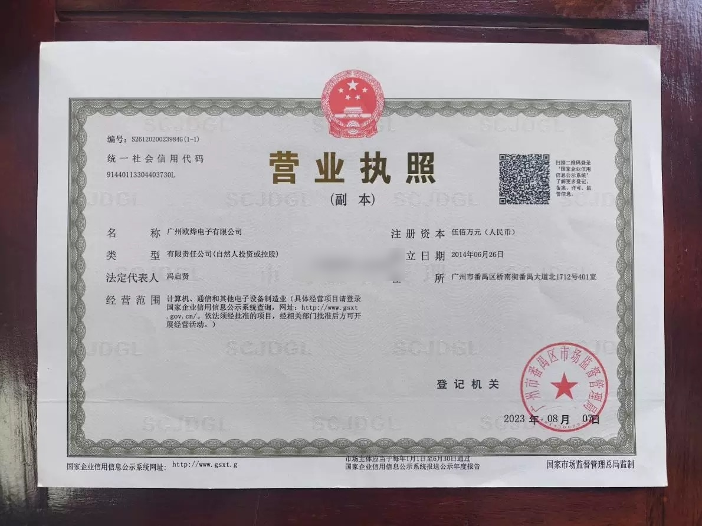
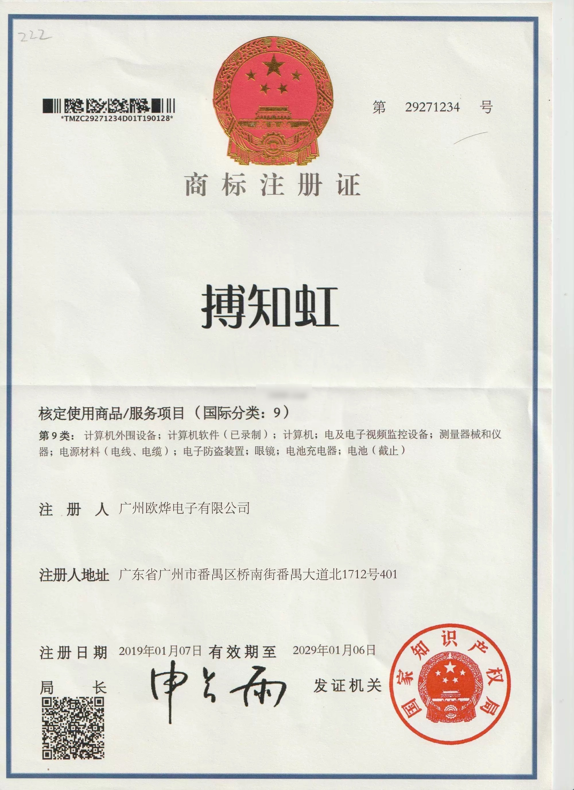
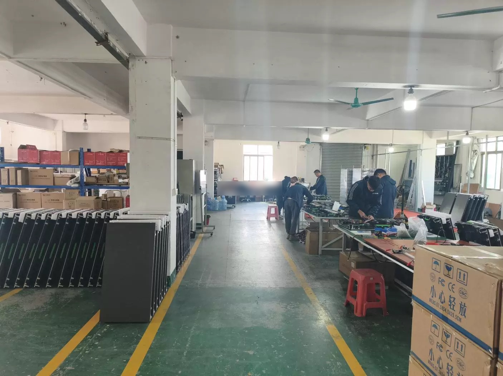
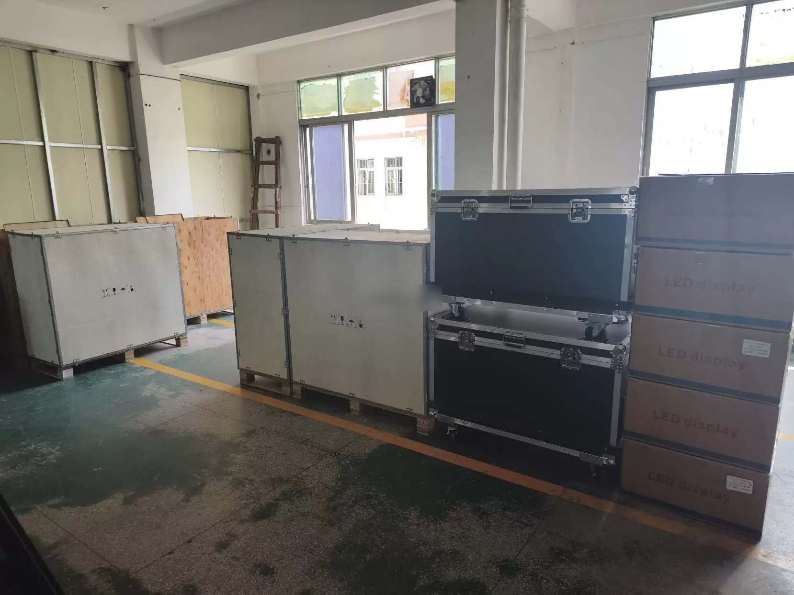

> **Winning Adventure Global (WAG). All rights reserved. Unauthorised reproduction, distribution, or commercial use of this report is strictly prohibited.**

## 1. Executive Summary

Guangzhou Ouye Electronics Co., Ltd. (brand: Bozhihong, established 2014) is a manufacturer of indoor LED display screens headquartered in Guangzhou's Panyu District, Guangdong Province. The company operates a 1,080 sqm facility and holds a registered capital of RMB 5 million.

Ouye provides an integrated service model covering LED display R&D, production, sales, installation, and after-sales support. The company is located in Panyu District, which hosts a nationally recognised specialised industry cluster for professional audio-visual and entertainment technology equipment, with approximately 600 enterprises in the sector.

**Key Strengths:** Integrated service model from manufacturing through installation, located within Guangzhou's core entertainment technology manufacturing cluster, moderate financial substance with RMB 5 million registered capital.
**Areas of Note:** Small workforce, limited production scale of 1,080 sqm, relatively narrow product range.

---

## 2. Business Registration & Corporate Information

| Item | Detail | Verification Status |
|------|--------|---------------------|
| Company Full Name | Guangzhou Ouye Electronics Co., Ltd. | Verified |
| Unified Social Credit Code[^1] | 91440113304403730L | Verified through public corporate registry records and cross-referenced with commercial business intelligence records |
| Legal Representative[^2] | Feng Qixian | Verified |
| Registered Capital[^4] | RMB 5 million | Verified |
| Date of Establishment | 26 June 2014 | Verified |
| Registered Address | Panyu District, Guangzhou, Guangdong Province | Supplier-disclosed |
| Operating Status | Active | Verified |
| Registration Authority | Guangzhou Panyu Administration for Market Regulation[^5] | Verified |

**Operational Context:**
- The company is located in Guangzhou's Panyu District, a nationally designated specialised industry cluster for entertainment technology equipment. The district hosts approximately 600 enterprises and 120,000 workers in the professional audio-visual and stage equipment sector, accounting for roughly 30% of the global market.

**Figure 1.** *Guangzhou Ouye Electronics business licence.*

---

## 3. Certifications & Qualifications

### 3.1 Management System Certifications

No ISO 9001, ISO 14001, or equivalent management system certifications were identified from reviewed public sources at the time of assessment. The absence of formal management system certifications is consistent with Ouye's small-to-medium manufacturing scale.

### 3.2 Product Certifications

| Certification | Status | Verification |
|---------------|--------|--------------|
| CE (European Conformity)[^3] | Confirmed | Supplier-disclosed |

No RoHS, FCC, or UL product certifications were identified from reviewed sources at the time of assessment.

**Jurisdictional Compliance Note:** Existing CE certification test reports may be submitted to accredited laboratories for jurisdiction-specific conformity assessment where required.

### 3.3 Enterprise Qualifications

| Qualification | Status | Notes |
|---------------|--------|-------|
| Brand Trademark (Bozhihong) | Registered | China trademark registration confirmed |
| Facility Assessment | Conducted | Third-party facility audit on file |

**Figure 2.** *Registered trademark certificate for the Bozhihong brand.*

### 3.4 Industry Honors & Recognition

No industry honors, government-recognised awards, or enterprise designations (such as National High-Tech Enterprise or SRDI "Little Giant") were identified from reviewed sources at the time of assessment.

---

## 4. Production & Technical Capability

### 4.1 Manufacturing Model

Ouye operates as an LED display assembly and integration manufacturer. Key components — LED modules, driver ICs, power supplies, control cards, and metal enclosures — are sourced from the Pearl River Delta supply chain. The Panyu District location provides proximity to specialist LED component suppliers.

| Metric | Data |
|--------|------|
| Factory Area | 1,080 m² |
| Product Range | 43 products |

Ouye's manufacturing model reflects the typical SME structure within the Panyu entertainment technology cluster: in-house assembly and final integration, with upstream components sourced from the district's dense supplier network. This model provides supply chain flexibility while keeping manufacturing footprint compact.

### 4.2 Quality Control Infrastructure

Ouye maintains an in-house quality control process that includes assembly-line inspection and finished-product verification. The company's third-party facility audit (noted in Section 3.3) provides external validation of its operational environment.

**QC Processes Identified:**
- Assembly-line visual inspection of LED module alignment and pixel uniformity
- Pre-shipment functional testing of assembled display panels
- Aging test: assembled LED panels undergo powered burn-in testing to identify early-life component failures before shipment. This is standard industry practice for LED display manufacturing, screening for pixel defects, colour drift, and driver IC reliability under sustained operation.

**Figure 3.** *Production line workers assembling electronic display equipment in the factory workshop.*

**Figure 4.** *Finished goods warehouse with LED display products packed in wooden crates, flight cases, and cartons ready for shipment.*

### 4.3 R&D Capability

Ouye's R&D capability is centred on custom LED display solution design, adapting standard LED modules and control systems to specific client installation requirements. The company's integrated service model — covering design, production, installation, and after-sales — indicates in-house technical competence beyond pure assembly-only manufacturing.

**Design Capability Indicators:**
- Custom LED display solutions for bespoke installation requirements (shape, size, pixel pitch configuration)
- Integrated service from client requirement analysis through on-site installation
- Product range of 43 SKUs across indoor, outdoor, and rental applications, indicating capacity to configure varied display specifications

Ouye does not hold invention patents, utility model patents, or design patents based on reviewed public sources. R&D is applied engineering rather than fundamental technology development — consistent with an SME assembly-and-integration manufacturer operating within the Pearl River Delta supply chain ecosystem.

---

## 5. Product Portfolio

### 5.1 Core Product Lines

Ouye's product portfolio covers the principal LED display categories, with 43 products across indoor fixed-installation, outdoor, rental, and custom configurations.

| Product Category | Sub-Category | Typical Applications |
|-----------------|--------------|---------------------|
| Indoor LED Display Screens | Fine-pitch (P1.56-P2.5), Standard (P3-P4) | Conference rooms, commercial interiors, exhibition halls, retail signage |
| Outdoor LED Display Screens | P2.5-P10 pixel pitch range | Building facades, advertising billboards, stadium perimeter displays |
| Rental LED Display Screens | Stage and event panels | Live events, exhibitions, touring productions, temporary installations |
| Custom LED Display Solutions | Flexible modules, curved panels, creative shapes (spherical, cylindrical), transparent displays, interactive floor displays | Bespoke architectural integration, creative installations, specialised commercial applications |

The company's integrated service model — which includes installation and after-sales support — distinguishes it from pure manufacturing operations. For clients requiring turnkey LED display solutions, this reduces the coordination burden of managing separate suppliers for hardware, installation, and ongoing maintenance.

### 5.2 Product Gallery

<ProductShowcase>
  <ProductCard src="/reports/aaron-sansoni/images/supplier-catalog/ouye/ouye-001.jpg" title="Wall-Mounted Full Color Creative Shape Sphere Cylindrical" />
  <ProductCard src="/reports/aaron-sansoni/images/supplier-catalog/ouye/ouye-002.jpg" title="HD Full Color Outdoor Nationstar LED Rental" />
  <ProductCard src="/reports/aaron-sansoni/images/supplier-catalog/ouye/ouye-003.jpg" title="Full Color Creative Shape Cylindrical P1.86mm LED" />
  <ProductCard src="/reports/aaron-sansoni/images/supplier-catalog/ouye/ouye-004.jpg" title="Stage HD Full Color Indoor Rental" />
  <ProductCard src="/reports/aaron-sansoni/images/supplier-catalog/ouye/ouye-005.jpg" title="HD Full Color Indoor Large Screen LED" />
  <ProductCard src="/reports/aaron-sansoni/images/supplier-catalog/ouye/ouye-006.jpg" title="HD Outdoor P2.5mm P3mm P4mm" />
  <ProductCard src="/reports/aaron-sansoni/images/supplier-catalog/ouye/ouye-007.jpg" title="Wall-Mounted HD Full Color Creative Shape Flexible" />
  <ProductCard src="/reports/aaron-sansoni/images/supplier-catalog/ouye/ouye-008.jpg" title="Stage HD Full Color Indoor Rental" />
  <ProductCard src="/reports/aaron-sansoni/images/supplier-catalog/ouye/ouye-009.jpg" title="Stage Wall-Mounted Conference Full Color Indoor" />
  <ProductCard src="/reports/aaron-sansoni/images/supplier-catalog/ouye/ouye-010.jpg" title="Full Color Outdoor P2.5mm LED Display" />
  <ProductCard src="/reports/aaron-sansoni/images/supplier-catalog/ouye/ouye-011.jpg" title="Indoor P3mm LED Display" />
  <ProductCard src="/reports/aaron-sansoni/images/supplier-catalog/ouye/ouye-012.jpg" title="Stage Wall-Mounted Conference HD Full Color" />
  <ProductCard src="/reports/aaron-sansoni/images/supplier-catalog/ouye/ouye-013.jpg" title="HD Full Color Outdoor P3mm P5mm" />
  <ProductCard src="/reports/aaron-sansoni/images/supplier-catalog/ouye/ouye-014.jpg" title="Stage Wall-Mounted Conference HD Full Color" />
  <ProductCard src="/reports/aaron-sansoni/images/supplier-catalog/ouye/ouye-015.jpg" title="Stage Outdoor Rental P3mm LED" />
  <ProductCard src="/reports/aaron-sansoni/images/supplier-catalog/ouye/ouye-016.jpg" title="Stage Wall-Mounted Conference Full Color Indoor" />
  <ProductCard src="/reports/aaron-sansoni/images/supplier-catalog/ouye/ouye-017.jpg" title="Conference HD Full Color Indoor LED Display" />
  <ProductCard src="/reports/aaron-sansoni/images/supplier-catalog/ouye/ouye-018.jpg" title="HD Full Color Outdoor Large Screen P3mm" />
  <ProductCard src="/reports/aaron-sansoni/images/supplier-catalog/ouye/ouye-019.jpg" title="Wall-Mounted HD Full Color Outdoor P2.5mm" />
  <ProductCard src="/reports/aaron-sansoni/images/supplier-catalog/ouye/ouye-020.jpg" title="Stage Wall-Mounted Conference HD Full Color" />
  <ProductCard src="/reports/aaron-sansoni/images/supplier-catalog/ouye/ouye-023.jpg" title="Indoor P2.5 Full Color LED Display" />
  <ProductCard src="/reports/aaron-sansoni/images/supplier-catalog/ouye/ouye-024.jpg" title="Outdoor P4 LED Advertising Screen" />
  <ProductCard src="/reports/aaron-sansoni/images/supplier-catalog/ouye/ouye-025.jpg" title="Rental LED Display Cabinet" />
  <ProductCard src="/reports/aaron-sansoni/images/supplier-catalog/ouye/ouye-026.jpg" title="P3 Fine Pitch Conference LED" />
  <ProductCard src="/reports/aaron-sansoni/images/supplier-catalog/ouye/ouye-027.jpg" title="Custom LED Video Wall Panel" />
  <ProductCard src="/reports/aaron-sansoni/images/supplier-catalog/ouye/ouye-028.jpg" title="P5 Outdoor Billboard LED Display" />
  <ProductCard src="/reports/aaron-sansoni/images/supplier-catalog/ouye/ouye-029.jpg" title="Indoor P1.86 HD LED Screen" />
  <ProductCard src="/reports/aaron-sansoni/images/supplier-catalog/ouye/ouye-030.jpg" title="Flexible LED Module Panel" />
  <ProductCard src="/reports/aaron-sansoni/images/supplier-catalog/ouye/ouye-031.jpg" title="Transparent LED Display Window" />
  <ProductCard src="/reports/aaron-sansoni/images/supplier-catalog/ouye/ouye-032.jpg" title="Stadium Perimeter LED Display" />
  <ProductCard src="/reports/aaron-sansoni/images/supplier-catalog/ouye/ouye-033.jpg" title="Stage Background LED Screen" />
  <ProductCard src="/reports/aaron-sansoni/images/supplier-catalog/ouye/ouye-034.jpg" title="P2 Indoor Full Color LED Display" />
  <ProductCard src="/reports/aaron-sansoni/images/supplier-catalog/ouye/ouye-035.jpg" title="Commercial LED Poster Display" />
  <ProductCard src="/reports/aaron-sansoni/images/supplier-catalog/ouye/ouye-036.jpg" title="Curved LED Video Wall Panel" />
  <ProductCard src="/reports/aaron-sansoni/images/supplier-catalog/ouye/ouye-037.jpg" title="Taxi Top LED Sign Display" />
  <ProductCard src="/reports/aaron-sansoni/images/supplier-catalog/ouye/ouye-038.jpg" title="P1.56 Ultra Fine Pitch LED" />
  <ProductCard src="/reports/aaron-sansoni/images/supplier-catalog/ouye/ouye-039.jpg" title="Outdoor LED Digital Billboard" />
  <ProductCard src="/reports/aaron-sansoni/images/supplier-catalog/ouye/ouye-040.jpg" title="Church LED Display Screen" />
  <ProductCard src="/reports/aaron-sansoni/images/supplier-catalog/ouye/ouye-041.jpg" title="Interactive Floor LED Display" />
  <ProductCard src="/reports/aaron-sansoni/images/supplier-catalog/ouye/ouye-042.jpg" title="Column Wrap LED Display" />
</ProductShowcase>

*Product images sourced from the supplier's online store and public-facing materials, provided by the factory to Winning Adventure Global for due diligence purposes.*

## 6. Market Position

Ouye operates within Guangzhou's Panyu District, one of the world's largest concentrations of professional audio-visual equipment manufacturing. The district's cluster effects — dense supplier networks, specialised workforce, shared logistics infrastructure — provide operational advantages for LED display manufacturers.

Within the Panyu LED display manufacturing ecosystem, Ouye occupies the small-to-medium tier. The district's approximately 600 enterprises span a wide range from large-scale industrial parks (such as ITC's 300,000 sqm facility) to micro-workshops. Ouye's 1,080 sqm facility and 12-year operating history place it in the established SME bracket — above micro-workshops that lack formal registration and quality infrastructure, but below the large-scale manufacturers that dominate national and international tenders.

### 6.1 Industry Reputation

- **Active Commercial Operations:** Verified ongoing commercial activity through supplier-disclosed business records, indicating continuous manufacturing operations and accessibility to domestic and international buyers.
- **Operational Longevity:** 12 years of continuous operation (2014-present) in the competitive Panyu entertainment technology cluster represents a meaningful indicator of business sustainability. Many LED assembly operations in the district have shorter lifespans.
- **Brand Trademark Registration:** The Bozhihong registered trademark provides a degree of brand protection and market identity within the domestic Chinese market.
- No adverse media, litigation records, or regulatory actions were identified from reviewed public sources at the time of assessment.

---

## 7. Risk & Compliance Review

### 7.1 Identified Risk Factors

| Risk Item | Severity | Assessment |
|-----------|----------|------------|
| Production Scale | Moderate | 1,080 sqm is a small manufacturing footprint. Production capacity may be limited for large-format or high-volume LED display orders. |
| Supply Chain Dependence | Low | Panyu District's dense LED component supplier network provides supply flexibility. |

### 7.2 Issues NOT Found
- No litigation records identified in reviewed public sources
- No material adverse media identified during the review period

---

## 8. Supplier Engagement Considerations

| Dimension | Rating | Assessment |
|-----------|--------|-------------|
| Industry Experience | Moderate | 12 years in LED display manufacturing |
| Service Integration | Good | Production, installation, and after-sales as integrated offering |
| Production Scale | Low | 1,080 sqm; suited for small-to-medium display projects |
| Financial Substance | Moderate | RMB 5 million registered capital |
| Location Advantage | Good | Panyu District entertainment technology cluster |
| Quality Assurance | Moderate | Third-party facility audit conducted |

---

## Report Basis & Limitations

This report has been prepared by Winning Adventure Global as a supplier due diligence and capability assessment for client review. It is based on publicly available corporate records, supplier disclosures, industry information, and other available sources at the time of review. The report is intended to support commercial understanding of the supplier's background, qualifications, operational capabilities, and observable risk factors. It does not constitute legal, financial, engineering, or compliance certification advice.

## Appendix: Terms Glossary

[^1]: **Unified Social Credit Code (统一社会信用代码):** An 18-digit identifier assigned to every legal entity registered in China. It consolidates the business licence, organisation code, and tax registration into a single number.

[^2]: **Legal Representative (法定代表人):** The individual designated under Chinese company law who exercises the powers of the company and assumes corresponding legal responsibilities on behalf of the company.

[^4]: **Registered Capital (注册资本):** The total capital amount declared at company incorporation. Under China's post-2014 company law, this is a subscribed figure rather than fully paid capital.

[^5]: **Administration for Market Regulation (市场监督管理局):** The local government body responsible for business registration, market supervision, and consumer protection.

[^3]: **CE (European Conformity):** A mandatory conformity marking for products sold within the European Economic Area, indicating compliance with EU health, safety, and environmental standards.
