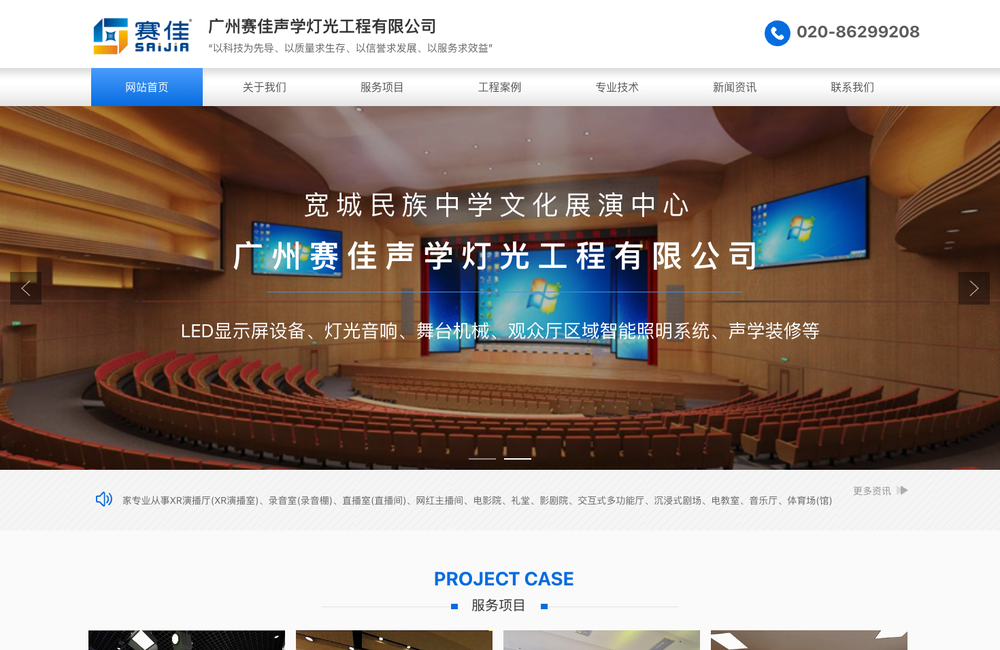
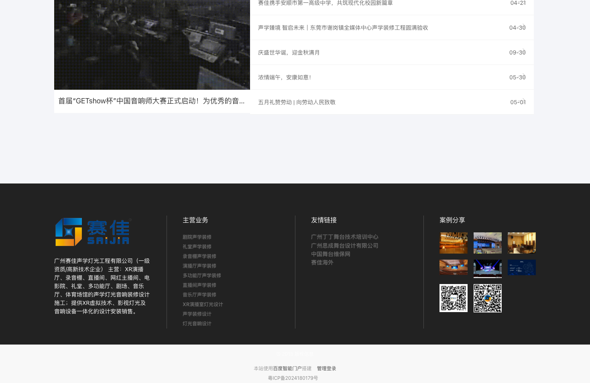
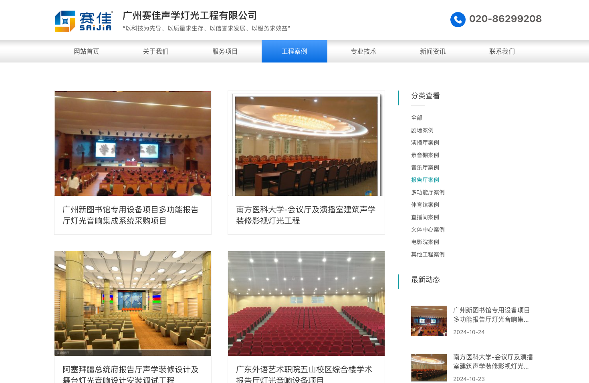
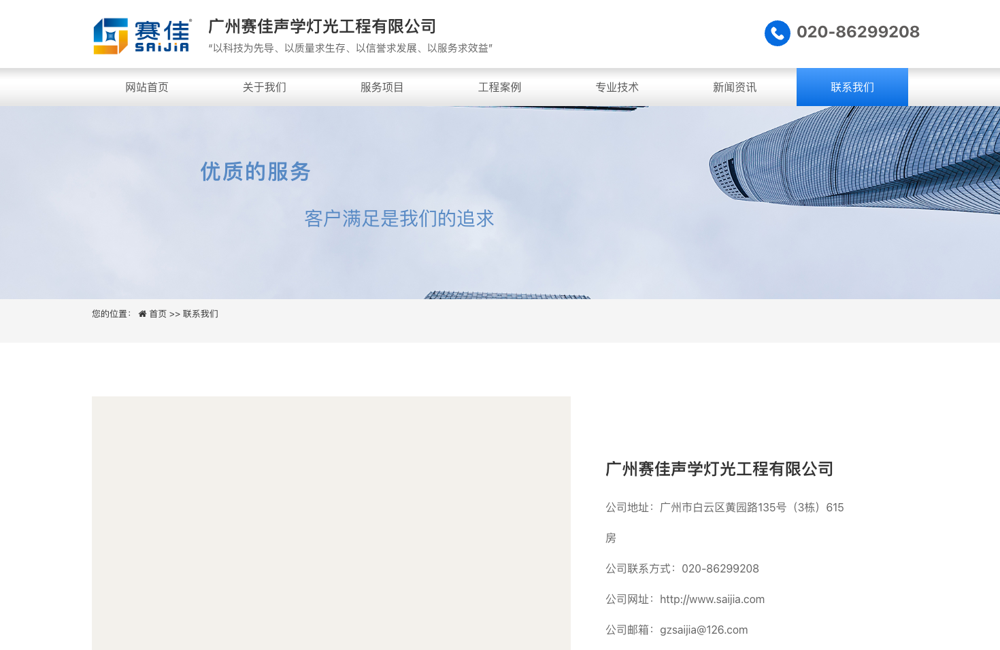

> **Winning Adventure Global (WAG). All rights reserved. Unauthorised reproduction, distribution, or commercial use of this report is strictly prohibited.**

## 1. Executive Summary

Guangzhou Saijia Acoustics & Lighting Engineering Co., Ltd. (brand: SAIJIA / 赛佳) is a specialised engineering service provider offering design-and-build solutions for acoustic treatment, studio construction, and professional lighting systems. Established in April 2000, the company has accumulated over 25 years of operational experience in China's professional audio-visual and acoustic engineering sector.

Saijia holds a Grade I qualification in Electronic & Intelligent Engineering Professional Contracting -- the highest tier under China's construction qualification framework -- and is recognised as a National High-Tech Enterprise. The company's services span XR virtual production studios, recording studios, broadcast rooms, theatres, concert halls, cinemas, auditoriums, sports venues, and commercial AV systems. Its project portfolio includes work for government broadcasting agencies, universities, and cultural institutions across Guangdong and neighbouring provinces.

**Key Strengths:** 25+ year industry track record, Grade I construction qualification enabling large-scale public-sector projects, National High-Tech Enterprise designation with patented acoustic components, consistent corporate identity across website/ICP/registration records.

**Areas of Note:** Engineering service provider (not a product manufacturer), modest registered capital of RMB 6 million, workforce estimated at 50-100 employees, no identified management system certifications (ISO 9001 etc.), no export experience identified, financial data not publicly available.

---

## 2. Business Registration & Corporate Information

| Item | Detail | Verification Status |
|------|--------|---------------------|
| Company Full Name | Guangzhou Saijia Acoustics & Lighting Engineering Co., Ltd. (广州赛佳声学灯光工程有限公司) | Verified |
| Unified Social Credit Code[^1] | 914401017219274551 | Verified through public corporate registry records and cross-referenced with commercial business intelligence records |
| Legal Representative[^2] | Fan Duyong (范笃勇) | Verified |
| Registered Capital[^3] | RMB 6,000,000 | Verified |
| Date of Establishment | 4 April 2000 | Verified |
| Registered Address | Room 615, Building 3, No. 135 Huangyuan Road, Baiyun District, Guangzhou (广州市白云区黄园路135号（3栋）615房) | Verified |
| Historical Address | Room 403, Guojing Technology Business Building, No. 1 Jinlingnan Street, Airport Road, Baiyun District, Guangzhou | Consistent with corporate relocation history |
| Company Type | Private limited liability company (私营有限责任公司) | Verified |
| Operating Status | Active (存续) | Verified |
| Registration Authority | Guangzhou Baiyun District Administration for Market Regulation[^4] | Verified |
| ICP Licence | 粤ICP备2024180179号-1 | Verified -- registered subject name matches company name exactly |
| Historical ICP | 粤ICP备14029177号 (2015) | Consistent with domain operation history |
| Domains | saijia.com, saijia.mobi | Verified |
| Contact Telephone | 020-86299208 | Supplier-disclosed |
| Contact Email | gzsaijia@126.com | Supplier-disclosed |
| Contact Person | Yu Lujun (余陆军) | Supplier-disclosed |
| Employee Count | 50-100 (per China Illuminating Engineering Society directory); <50 (per certain public enterprise profile records) | Approximately 50-100, with some variance across data sources |

**Related Entity:**
- **Wuhan Saijia Acoustics & Lighting Engineering Co., Ltd. (武汉赛佳声学灯光工程有限公司):** A highly probable related entity -- same brand name, same industry, different city (Wuhan). Legal representative: Cai Tao (蔡涛). Status: Active. The nature of the corporate relationship (branch, subsidiary, or independently operated affiliate) has not been independently confirmed.

**Corporate Identity Consistency:** The company's official website (saijia.com), ICP licence registration subject, and Administration for Market Regulation registration records all show the identical company name -- a positive indicator of corporate identity integrity and transparent business operations.

**Figure 1.** *Saijia Acoustics & Lighting official website homepage, displaying brand identity and core service areas including studio acoustics, theatre design, and professional lighting engineering.*

**Figure 2.** *Website footer section showing ICP licence number (粤ICP备2024180179号-1), company name, and contact details -- consistent with public registration records.*

---

## 3. Certifications & Qualifications

### 3.1 Management System Certifications

| Certification | Status | Notes |
|---------------|--------|-------|
| ISO 9001 Quality Management | Not identified | No ISO 9001 certification identified in public records or supplier-disclosed materials. For small-to-medium Chinese engineering service providers, formal management system certification adoption is less common than in manufacturing sectors. |
| ISO 14001 Environmental Management | Not identified | Not identified through public certification records or supplier disclosures. |
| ISO 45001 Occupational Health & Safety | Not identified | Not identified through public certification records or supplier disclosures. |

**Assessment:** The company does not currently hold management system certifications (ISO 9001, ISO 14001, ISO 45001). For projects requiring ISO-compliant quality, environmental, or safety management systems, buyers should discuss certification status and implementation plans with the supplier during commercial engagement.

### 3.2 Product Certifications

| Certification | Status | Compliance Relevance |
|---------------|--------|----------------------|
| Product Certifications | Not applicable | Saijia is an engineering service provider, not a product manufacturer. Product-level certifications (CE, CCC, RoHS, FCC) are not applicable to its core service offering. The company sources equipment and materials from third-party manufacturers for project installation. |

For any equipment specified as part of a Saijia project delivery, buyers should request certification documentation for the specific products being supplied, sourced from the respective manufacturers.

### 3.3 Enterprise Qualifications

| Qualification | Status | Notes |
|---------------|--------|-------|
| Electronic & Intelligent Engineering Professional Contracting -- Grade I[^5] | Confirmed (validity period pending verification) | The highest tier under China's construction qualification framework, authorising the holder to undertake electronic and intelligent engineering projects of any scale. Supplier-disclosed through official website and industry references. Buyers should request current qualification certificate for validity confirmation. |
| National High-Tech Enterprise (国家高新技术企业) | Confirmed (renewal status pending verification) | A government designation jointly issued by the Ministry of Science and Technology, Ministry of Finance, and State Taxation Administration. Confers a reduced corporate income tax rate (15% vs standard 25%). Multi-source references confirm this designation. |
| CETA Member Unit (中国演艺设备技术协会成员单位) | Pending verification | Membership in the China Entertainment Equipment Technology Association, referenced in industry association articles. Membership status and standing have not been independently verified. |

**Intellectual Property:**
- 5 identified patented components: professional acoustic door, electric curtain roller, constant-force hinge, adjustable-angle recessed tri-colour soft light, acoustic modules
- 11 registered trademarks
- No design patents or software copyrights identified in public intellectual property records

**Certification Documentation Status:** Certification images and scanned qualification certificates are not currently available. All qualification information has been sourced from the supplier's official website, industry references, and public records. Buyers should request current copies of all qualification certificates directly from the supplier as part of commercial due diligence.

### 3.4 Industry Recognition

- Consistent corporate identity across all public-facing channels (website, ICP registration, business registration) -- indicating operational transparency
- 25+ year operational history (established 2000) -- one of the longer-established specialist acoustic engineering firms in the Guangzhou region
- Project portfolio includes government broadcasting agencies, public universities, and cultural institutions -- indicating institutional client trust
- Patented acoustic components (acoustic doors, curtain systems, lighting fixtures) -- demonstrating in-house technical development capability beyond standard installation services

---

## 4. Service Delivery & Technical Capability

**Nature of Business:** Saijia is an engineering design-and-build service provider, not an equipment manufacturer. It does not operate production lines, maintain factory facilities, or manufacture standardised products. The company's capability resides in project design, acoustic engineering, systems integration, and construction management.

### 4.1 Service Delivery Infrastructure

| Dimension | Detail |
|-----------|--------|
| Business Model | Design, engineering, procurement, construction, and commissioning of acoustic and lighting systems |
| Headquarters | Room 615, Building 3, No. 135 Huangyuan Road, Baiyun District, Guangzhou |
| Branch Offices | Wuhan (probable related entity), no other branches identified |
| Workforce | Estimated 50-100 employees (combined technical, engineering, and administrative staff) |
| Equipment Sourcing | Procures materials and equipment from third-party manufacturers; installation executed by in-house and subcontracted construction teams |

**Service Coverage:** Saijia provides end-to-end project delivery from initial acoustic design through to final system commissioning. The company sources acoustic materials (absorption panels, diffusers, acoustic doors), lighting equipment, and AV systems from specialist manufacturers, then manages on-site installation and integration.

### 4.2 Project Management & Quality Control

Saijia's quality control approach, as an engineering service provider, centres on project-level delivery rather than manufacturing quality assurance. Key observations:

- **Project Portfolio Consistency:** The company's project list demonstrates consistent delivery across education, government, and cultural sectors over multiple years, suggesting established project management processes.
- **Grade I Qualification Requirement:** Maintaining a Grade I construction qualification requires demonstrated project delivery capability and compliance with regulatory standards, providing an external quality reference point.
- **No Independent Quality Audit:** No third-party project quality audits or client satisfaction surveys were identified during this review.

**Quality Control Limitations:** Without ISO 9001-certified project management processes or independently audited quality metrics, buyers should establish clear quality benchmarks, milestone inspections, and acceptance criteria in project contracts.

### 4.3 Technical Expertise & Patented Solutions

| Metric | Detail |
|--------|--------|
| Patented Components | 5 (acoustic door, electric curtain roller, constant-force hinge, recessed soft light, acoustic modules) |
| Trademarks | 11 registered |
| National High-Tech Enterprise | Confirmed (requires R&D investment and IP thresholds) |
| Core Technical Domains | Architectural acoustics, studio acoustic design, professional lighting system design, AV systems integration |

**Patented Component Assessment:**
The company's five identified patents relate to specialised components used in acoustic and studio construction projects:
- **Professional Acoustic Door:** Sound-insulating door system for recording studios and broadcast rooms
- **Electric Curtain Roller:** Motorised curtain system for stage and studio applications
- **Constant-Force Hinge:** Specialised mounting hardware for acoustic panels and lighting fixtures
- **Adjustable-Angle Recessed Tri-Colour Soft Light:** Built-in studio lighting with adjustable beam angle
- **Acoustic Modules:** Proprietary sound absorption/diffusion elements

These patents suggest in-house development of installation components that differentiate Saijia's project delivery from generic competitors. However, the patent count is modest (5 patents) and no utility model patents, design patents, or software copyrights were identified.

**Figure 3.** *Saijia service offerings page, illustrating the company's range of acoustic and lighting engineering services across studio, theatre, education, and commercial sectors.*

**Figure 4.** *Company contact page displaying registration details, office address, and communication channels.*

---

## 5. Service Portfolio

**Note:** Saijia is an engineering service provider and does not maintain a standardised product catalogue. The following represents the company's service lines (project categories) as disclosed through its website and public project records.

### 5.1 Core Service Lines

| Segment | Service Types | Typical Applications |
|---------|---------------|---------------------|
| Broadcast & Studio | XR virtual production studios, recording studios, broadcast rooms, live-streaming studios | Television stations, radio broadcasters, content creation agencies, online media platforms |
| Cultural & Education | Cinemas, auditoriums, theatres, multi-function halls, e-learning classrooms | Universities, schools, cultural centres, conference facilities |
| Performance Venues | Theatres, immersive theatres, concert halls | Performing arts organisations, municipal cultural venues |
| Sports Facilities | Sports venues, indoor stadiums | Municipal sports centres, university sports complexes |
| Commercial & Hospitality | Conference rooms, AV rooms, private cinemas, hotel AV systems | Corporate offices, luxury hotels, residential projects |

**Patented Components (In-House Developed):**

| Component | Application Context |
|-----------|-------------------|
| Professional Acoustic Door | Sound isolation for recording studios, broadcast rooms, and performance spaces |
| Electric Curtain Roller | Motorised stage and studio curtain systems |
| Constant-Force Hinge | Precision mounting for acoustic panels, lighting rigs, and studio fixtures |
| Adjustable-Angle Recessed Tri-Colour Soft Light | Integrated studio lighting with flexible beam control |
| Acoustic Modules | Custom sound absorption and diffusion for architectural acoustics |

**Service Model:** Saijia operates as a design-build contractor, encompassing:
1. Acoustic design and consulting
2. Engineering drawings and technical specifications
3. Material and equipment procurement (from third-party manufacturers)
4. On-site construction and installation
5. System commissioning and handover

The company does not manufacture standardised products for off-the-shelf purchase. All engagements are project-based, with scope, specifications, and pricing determined per project.

**Product Imagery:** Product catalogue images are not available. As a service provider, Saijia's deliverables are project-specific rather than catalogue items. Buyers should request project case studies, completion photographs, and reference site visits to assess workmanship quality.

---

## 6. Market Position & Project Track Record

### 6.1 Industry Reputation

- **25+ Year Operational History:** Established in April 2000, Saijia is one of the longer-established specialist acoustic engineering firms in Guangzhou. Longevity in China's competitive construction services sector suggests sustained client relationships and repeat business.
- **Institutional Client Base:** The company's project records consistently feature government agencies, public universities, and cultural institutions -- client types that typically require supplier qualification review, competitive bidding, and project performance references.
- **Grade I Construction Qualification:** The highest tier of electronic and intelligent engineering qualification enables bidding on large-scale public projects without consortium requirements, representing a meaningful competitive differentiator.
- **Corporate Identity Integrity:** Website domain (saijia.com), ICP licence registration subject, and business registration records all display identical company information -- a positive indicator of transparent corporate operations.

**Industry Ranking:** No independent industry rankings or third-party market position data were identified for Saijia. The company does not appear in published industry league tables or market share analyses. This is not unusual for a small-to-medium specialist engineering firm operating in a fragmented construction services market.

### 6.2 Key Project References

The following projects have been identified through public procurement records, supplier disclosures, and industry references:

| Project | Client Type | Scope |
|---------|-------------|-------|
| Guangdong Health Education Centre 4K Converged Media Centre | Provincial government | Full studio acoustic and lighting build (awarded 2024, approximately RMB 2.425 million) |
| Guangdong Vocational College of Water Resources & Electric Engineering -- Conference Centre AV System Upgrade | Public university | Acoustic treatment and audio-visual system renovation |
| Guangxi People's Broadcasting Station -- Live Broadcast Room | Provincial media | Acoustic design and construction for broadcast studio |
| Guangdong Institute of Socialism -- Multi-Function Hall | Government institution | Integrated AV, lighting, and acoustic engineering |
| Guangdong University of Foreign Studies -- 300 m² Studio | Public university | Acoustic treatment and television lighting for large-format broadcast studio |
| South China Normal University -- Concert Hall | Public university | Acoustic and electro-acoustic integration for music performance venue |
| Guangdong Prison Administration -- Auditorium | Government agency | Acoustic and stage lighting engineering |
| Guizhou University -- Moot Court | Public university | Acoustic treatment and specialised lighting |
| Kuancheng Ethnic Middle School -- Auditorium | Public education | Integrated acoustic, lighting, and AV systems |

**Project Portfolio Assessment:**
- Projects span education, government, and media sectors with a concentration in Guangdong province
- Project values range from institutional mid-scale to approximately RMB 2.4 million (based on publicly available award data)
- Client types suggest established institutional procurement relationships
- Geographic concentration in Guangdong and neighbouring provinces (Guangxi, Guizhou) -- limited evidence of national-scale project delivery

### 6.3 Geographic & Export Profile

- **Domestic Focus:** All identified projects are within China, predominantly in Guangdong province and neighbouring regions. No export projects, international clients, or overseas project references were identified.
- **Industry Cluster Location:** Baiyun District, Guangzhou, is not a core acoustics industry cluster (unlike Panyu District, which hosts major AV manufacturing concentration). However, Guangzhou's broader position as a commercial and manufacturing hub provides access to construction materials and skilled labour.

---

## 7. Risk & Compliance Review

### 7.1 Identified Risk Factors

| Risk Item | Severity | Assessment |
|-----------|----------|------------|
| Service Provider, Not Manufacturer | Low (contextual) | Saijia does not manufacture equipment. Buyers seeking direct factory procurement of acoustic materials, lighting fixtures, or AV equipment should engage manufacturers directly. Saijia is appropriate for design-build project delivery where engineering integration is the primary value. |
| Limited Scale | Moderate | Workforce estimated at 50-100 with <50 insured employees per certain public records. For large-scale or concurrent multi-site projects, the company's capacity to resource adequately should be assessed. Grade I qualification mitigates bidding eligibility concerns but does not guarantee resource availability. |
| No Management System Certifications | Moderate | Absence of ISO 9001/14001/45001 means project quality, environmental, and safety management processes are not independently audited. Buyers should establish contractual quality benchmarks and inspection protocols. |
| Qualification Validity Unconfirmed | Low-Moderate | Grade I qualification and High-Tech Enterprise designation are referenced in supplier materials but current certificates have not been sighted. Buyers should request current documentation. |
| Financial Transparency | Moderate | As a private unlisted company, Saijia has no public financial disclosure obligation. Registered capital of RMB 6 million is modest for a Grade I construction qualification holder. No audited financial statements are publicly available. |
| Registered Capital vs Project Scale | Moderate | RMB 6 million registered capital may be disproportionate to projects requiring significant performance bonds or advance procurement of materials. For large public-sector projects, consortium bidding or financial capacity demonstration may be required. |
| Limited Geographic Reach | Low | Project portfolio is concentrated in Guangdong and neighbouring provinces. For projects outside this region, the company's ability to manage remote construction operations, local subcontractor networks, and regulatory compliance should be assessed. |
| No Export Experience | Low-Moderate | No international project experience identified. For buyers outside China, communication, contract enforcement, and quality assurance at distance require additional management frameworks. |

### 7.2 Issues NOT Found

- No administrative penalties identified in reviewed public records
- No litigation records identified in reviewed public sources
- No enforcement actions, dishonest executee records, or business operation anomalies identified
- No adverse media coverage identified during the review period
- Annual reports filed with normal status
- No environmental violations or safety incidents identified

### 7.3 Contextual Notes

**Engineering Service vs. Manufacturing Distinction:** Saijia operates as an engineering design-build contractor, not a factory. This distinction is fundamental to understanding the company's capability profile. The company's value lies in acoustic design, project management, systems integration, and construction delivery -- not in the manufacture of equipment or materials. Buyers should evaluate Saijia against engineering service benchmarks rather than manufacturing capability metrics.

**Guangdong Province Concentration:** The company's project portfolio and client base are concentrated in Guangdong and neighbouring southern provinces. For projects in other regions of China, the company's local regulatory knowledge, subcontractor networks, and logistics capability should be verified.

**Registered Capital Context:** Under China's post-2014 company law, registered capital is a subscribed figure rather than fully paid capital. For a service company established in 2000, the RMB 6 million figure reflects the regulatory environment at the time of incorporation and subsequent capital adjustments. However, the modest registered capital relative to the Grade I qualification (which typically correlates with larger enterprises) is a point of note for buyers requiring financial capacity assurance.

---

## 8. Supplier Engagement Considerations

| Dimension | Rating | Assessment |
|-----------|--------|-------------|
| Industry Experience | Strong | 25+ year operational history with consistent institutional client base across education, government, and media sectors. |
| Technical Qualification | Strong | Grade I Electronic & Intelligent Engineering qualification enables large-scale project bidding; National High-Tech Enterprise with in-house patented components. |
| Project Track Record | Strong | Demonstrated delivery across 9+ referenced institutional projects, including government broadcasting and university studio builds. |
| Service Scope | Strong | End-to-end design-build capability covering acoustics, lighting, AV integration, and construction -- reducing multi-vendor coordination burden. |
| Quality Assurance | Moderate | No ISO-certified management systems. Quality depends on project-level management rather than independently audited processes. Buyers should establish contractual quality milestones. |
| Scale & Capacity | Moderate | 50-100 employees; suitable for individual projects but may be constrained for concurrent large-scale or multi-site programmes. |
| Export Readiness | Low | No export experience, English-language capability not evidenced, no international project references. Engagement from outside China requires additional communication and management frameworks. |
| Financial Capacity | Low-Moderate | Private unlisted company with no public financial disclosure. RMB 6 million registered capital. Buyers should assess financial capacity for projects requiring significant advance procurement or performance guarantees. |
| Documentation & Transparency | Moderate | Corporate records are consistent across platforms. However, qualification certificates and project completion documentation require direct supplier request -- not currently available from public sources. |

**Recommended Engagement Model:**
- Saijia is best suited as a **design-build contractor** for acoustic and lighting projects where engineering integration is the primary requirement
- For equipment-only procurement, engaging specialist manufacturers directly is more appropriate
- Projects should include clear technical specifications, milestone inspection points, and acceptance testing protocols in the contract
- Buyers should request current qualification certificates, project case studies with client references, and (where possible) site visits to completed projects

---

## Report Basis & Limitations

This report has been prepared by Winning Adventure Global as a supplier due diligence and capability assessment for client review. It is based on publicly available corporate records, supplier disclosures (official website, industry directory listings), public procurement award data, industry references, and other available sources at the time of review. The report is intended to support commercial understanding of the supplier's background, qualifications, operational capabilities, and observable risk factors. It does not constitute legal, financial, engineering, or compliance certification advice.

**Specific Limitations:**
- Qualification certificates and patent registration documents were not available for direct inspection at the time of review. All qualification claims are based on supplier disclosures and industry references pending independent document verification.
- Financial data and audited accounts are not publicly available for this private unlisted company.
- Employee count figures vary across data sources (fewer than 50 in some public records, 50-100 in industry directories). The exact workforce composition has not been independently verified.
- Project values are based on publicly available procurement award data where disclosed; most project values are not publicly available.
- The nature of the relationship with Wuhan Saijia Acoustics & Lighting Engineering Co., Ltd. has not been independently confirmed.

## Appendix: Terms Glossary

[^1]: **Unified Social Credit Code (统一社会信用代码):** An 18-digit identifier assigned to every legal entity registered in China, consolidating the business licence, organisation code, and tax registration into a single number. Verifiable at the National Enterprise Credit Information Publicity System (https://www.gsxt.gov.cn).

[^2]: **Legal Representative (法定代表人):** The individual designated under Chinese company law who exercises the powers of the company and assumes corresponding legal responsibilities. Under Chinese corporate law, the Legal Representative is personally accountable for regulatory violations and can face travel restrictions or personal penalties if the company breaches laws.

[^3]: **Registered Capital (注册资本):** The total capital amount declared by shareholders at company incorporation. Under China's post-2014 company law, this is a subscribed figure -- shareholders commit to contributing this amount but actual payment (paid-in capital) may occur over time. Contrast with Australian practice where share capital is typically fully paid at issuance.

[^4]: **Administration for Market Regulation (市场监督管理局):** The local government body responsible for business registration, market supervision, and consumer protection. Each city/district has its own AMR office with jurisdiction over companies registered at that address. Equivalent to ASIC's registration function plus state-level fair trading bodies combined.

[^5]: **Electronic & Intelligent Engineering Professional Contracting Qualification (电子与智能化工程专业承包资质):** A tiered construction qualification issued by China's Ministry of Housing and Urban-Rural Development. Grade I (一级) is the highest tier, authorising the holder to undertake electronic and intelligent engineering projects of any scale without project value or size restrictions. This qualification covers building automation, communications systems, computer networking, security systems, and audio-visual systems integration in construction projects.
