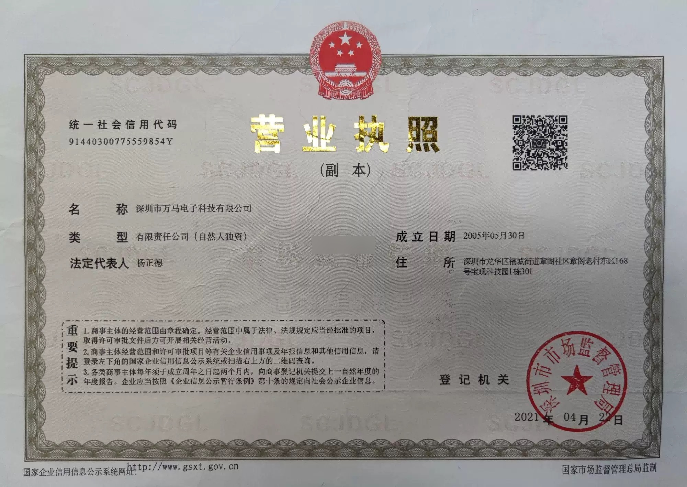
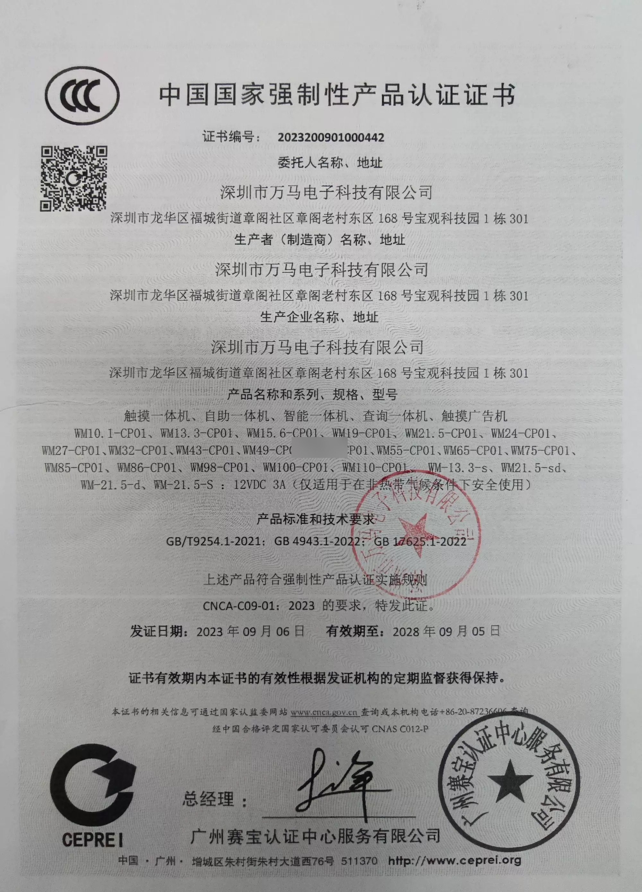
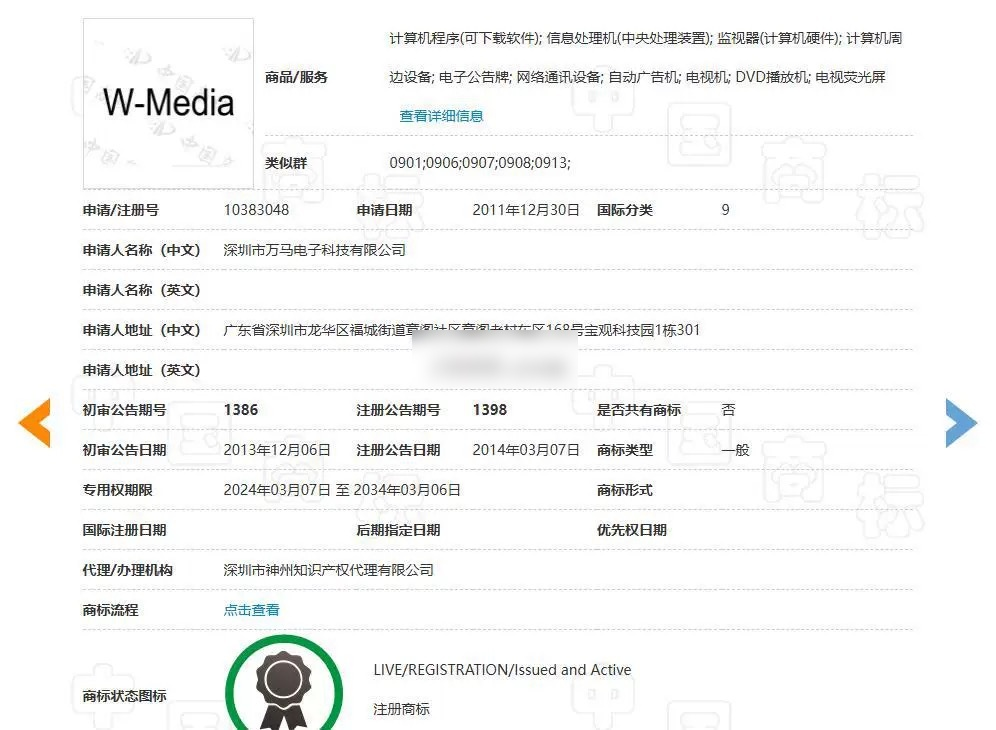
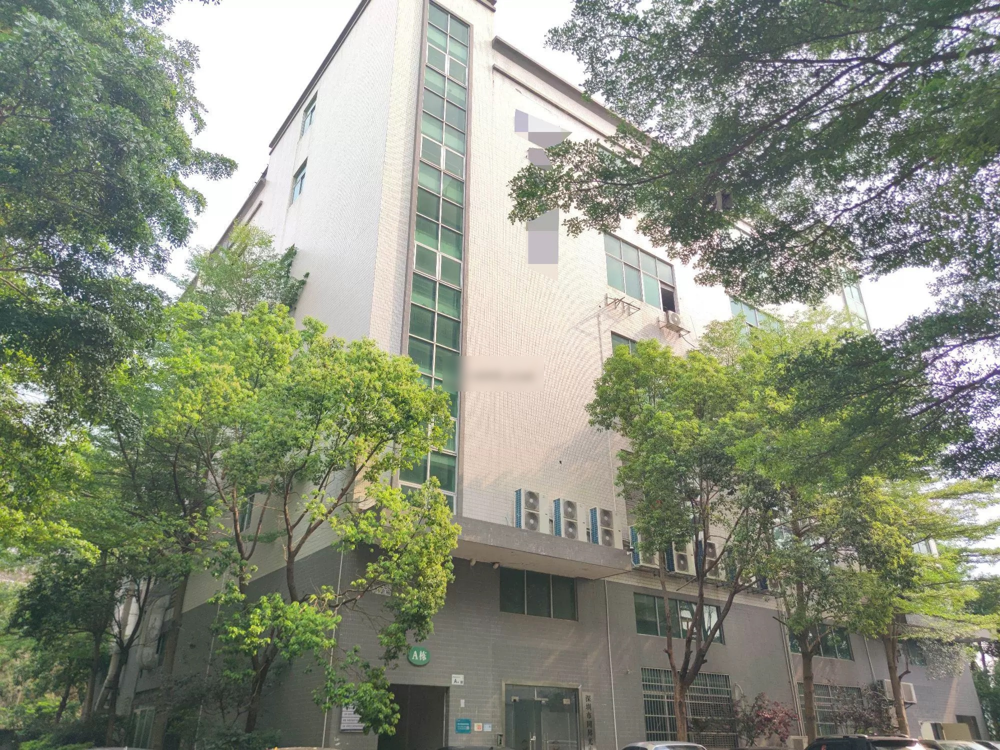
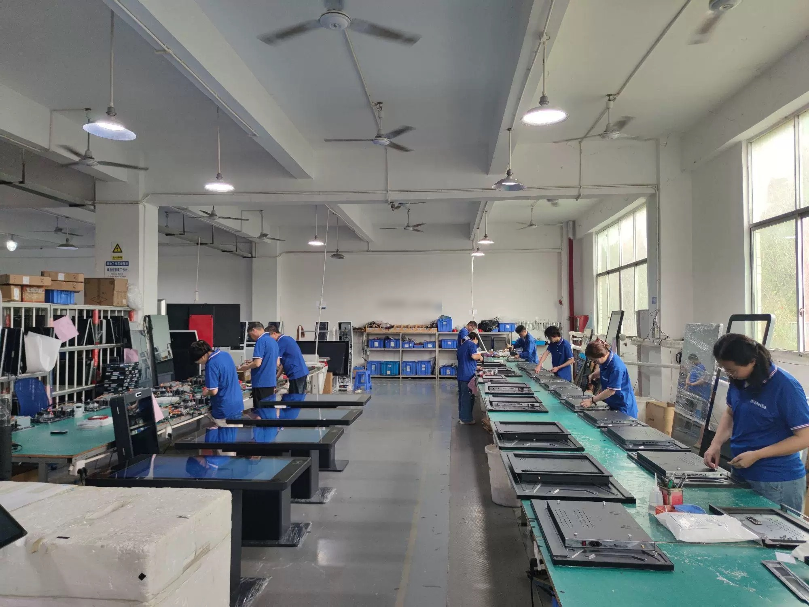
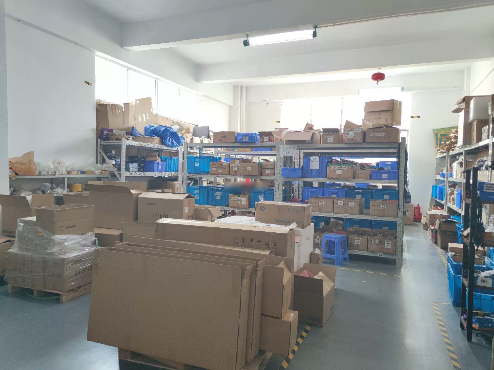
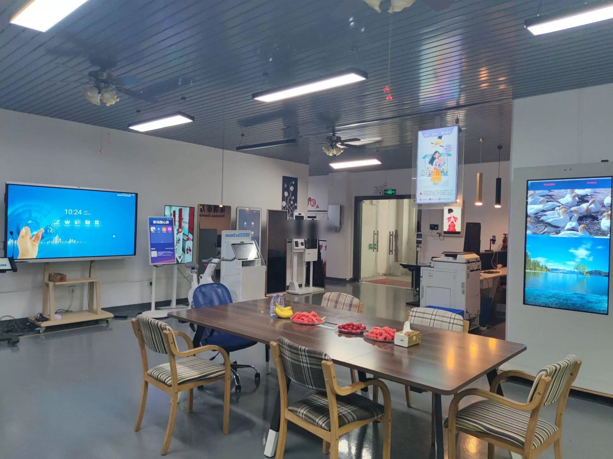

> **Winning Adventure Global (WAG). All rights reserved. Unauthorised reproduction, distribution, or commercial use of this report is strictly prohibited.**

## 1. Executive Summary

Shenzhen Wanma Electronic Technology Co., Ltd. (brand: W-Media, established 2013) is a manufacturer of LCD-based touch displays, digital signage, advertising kiosks, and interactive self-service terminals headquartered in Shenzhen, Guangdong Province. The company operates a 3,500 sqm facility and holds a registered capital of RMB 5 million.

With 21 years of operational history in Shenzhen's electronics manufacturing ecosystem, Wanma has developed a product portfolio exceeding 500 items across multiple display product categories. The company serves commercial, retail, educational, and institutional clients requiring customised display solutions.

**Key Strengths:** 21 years of operational history, broad product portfolio of 500+ items, in-house R&D capability across multiple display form factors.
**Areas of Note:** Lean workforce of 40 employees for product breadth, limited publicly available certification detail.

---

## 2. Business Registration & Corporate Information

| Item | Detail | Verification Status |
|------|--------|---------------------|
| Company Full Name | Shenzhen Wanma Electronic Technology Co., Ltd. | Verified |
| Unified Social Credit Code[^1] | 91440300085703580A | Verified through public corporate registry records and cross-referenced with commercial business intelligence records |
| Legal Representative[^2] | Yu Shan | Verified |
| Registered Capital[^3] | RMB 5 million | Verified |
| Date of Establishment | 21 October 2013 | Verified |
| Registered Address | Shenzhen, Guangdong Province | Supplier-disclosed |
| Operating Status | Active | Verified |
| Registration Authority | Shenzhen Administration for Market Regulation[^4] | Verified |

**Operational Context:**
- Located in Shenzhen, part of the Pearl River Delta electronics manufacturing cluster with comprehensive LCD panel, touch component, and controller board supply chains
- Company materials describe the business as a high-technology enterprise focused on LCD display R&D and manufacturing

**Figure 1.** *Shenzhen Wanma Electronic Technology business licence.*

---

## 3. Certifications & Qualifications

### 3.1 Management System Certifications

| Certification | Status | Notes |
|---------------|--------|-------|
| ISO 9001 Quality Management | Supplier-disclosed | Formal verification status pending independent audit confirmation |
| Third-Party Facility Audit | Completed | Facility assessment conducted by independent third party |

Wanma's management system certifications are disclosed in supplier-provided materials. Independent verification of ISO 9001 certification status through public certification databases is recommended as part of pre-engagement due diligence.

### 3.2 Product Certifications

| Certification | Status | Compliance Relevance |
|---------------|--------|----------------------|
| CCC (China Compulsory Certification)[^5] | Confirmed | Required for products manufactured in China; certificate image on file |
| CE (European Conformity)[^6] | Confirmed | International compliance reference for European and related markets |

**Figure 2.** *China Compulsory Product Certification (CCC) certificate for Wanma display products.*

**Jurisdictional Compliance Note:** Products carry CCC and CE certifications, which serve as recognised reference baselines for compliance assessment in many jurisdictions. For destination markets requiring additional certifications (e.g., RCM for Australia), existing test reports may be submitted to accredited laboratories for jurisdiction-specific conformity assessment where required.

### 3.3 Enterprise Qualifications

| Qualification | Status |
|---------------|--------|
| National High-Tech Enterprise | Supplier-disclosed — company materials describe the business as a high-technology enterprise focused on LCD display R&D and manufacturing |
| W-Media Trademark Registration | Confirmed — trademark registration certificate on file |

**Figure 3.** *W-Media trademark registration certificate.*

### 3.4 Industry Honors & Recognition

Wanma's profile as a Shenzhen-based display manufacturer places it within one of the world's most concentrated electronics manufacturing clusters. The company's 21-year operational history in this competitive ecosystem is itself a market signal of sustained business capability. Specific industry awards or association memberships beyond those referenced above were not identified in publicly available sources at the time of review.

---

## 4. Production & Technical Capability

### 4.1 Manufacturing Model

Wanma operates as an LCD display assembly and integration manufacturer within Shenzhen's electronics cluster. Core components — LCD panels, touch overlays, controller boards, and enclosures — are sourced from the Pearl River Delta supply chain. The factory performs final assembly, firmware configuration, quality testing, and customisation.

| Metric | Data |
|--------|------|
| Factory Area | 3,500 m² |
| Employees | 40 |
| Product Range | 500+ products |

**Figure 4.** *Wanma Electronics factory building exterior in Shenzhen.*

**Figure 5.** *Production workshop — workers assembling digital display and interactive kiosk equipment.*

**Figure 6.** *Finished goods warehouse with packaged display equipment and electronic products ready for shipment.*

### 4.2 Quality Control Infrastructure

Wanma's quality control framework is structured around the display assembly and integration workflow. Based on supplier disclosures and the third-party facility audit conducted, the QC system encompasses the following stages:

**Incoming Component Inspection:**
- LCD panel visual inspection and pixel defect screening
- Touch overlay sensitivity and accuracy verification
- Controller board functional pre-testing
- Enclosure and structural component quality check

**In-Process Quality Gates:**
- Assembly alignment and fit verification at each integration stage
- Firmware configuration and compatibility testing
- Touch calibration check points during assembly

**Final Product Testing:**
- Full-system functional testing (display output, touch response, interface ports)
- Extended power-on burn-in testing for product reliability validation
- Visual inspection of finished product appearance and packaging

**Quality Documentation:**
- Quality inspection records maintained per production batch
- Supplier material incoming inspection reports
- Final product test data archived for traceability

The third-party facility audit referenced in Section 3.1 provides an independent assessment of Wanma's quality management practices. Clients requiring specific quality metrics (e.g., first-pass yield rates, defect rates per product category) should request these directly from the supplier as part of commercial engagement.

### 4.3 R&D Capability

Wanma maintains in-house research and development capability supporting its multi-category display product portfolio. The R&D function is responsible for product design, customisation engineering, and technology adaptation across the company's product lines.

**R&D Focus Areas:**
- **Display Integration:** Matching LCD panels with appropriate touch technologies (infrared, capacitive, resistive) for specific application requirements
- **Industrial Design:** Enclosure design and form factor engineering for floor-standing, wall-mounted, and desktop configurations
- **Firmware Development:** Controller firmware configuration and interface protocol adaptation
- **Customisation Engineering:** Client-specific modifications to standard products including branding integration, interface customisation, and special-purpose configurations

**Product Development Capability:**
The company's 500-product portfolio is evidence of sustained product development activity. Wanma's ability to serve multiple display categories — from interactive whiteboards and self-service kiosks to studio monitors and digital signage — indicates cross-category engineering competence rather than single-product specialisation.

**Customisation Services:**
Customisation services support client-specific requirements for branding, form factor, and interface integration. The company's position within the Shenzhen electronics cluster provides access to a broad component supply base, enabling flexible configuration of display sizes, touch technologies, and enclosure designs.

---

## 5. Product Portfolio

### 5.1 Core Product Lines

Wanma's product portfolio spans five principal categories, covering commercial, institutional, and educational display applications:

| Product Category | Applications | Key Specifications |
|-----------------|--------------|-------------------|
| Touch Displays | Retail kiosks, self-service terminals, wayfinding, information points | Infrared and capacitive touch; sizes from 21.5" to 98"; floor-standing, wall-mounted, and desktop configurations |
| Digital Signage | Wall-mounted and free-standing commercial displays, outdoor signage, LED lightbox displays | HD resolution; indoor and outdoor-rated enclosures; single-sided and double-sided configurations |
| Interactive Kiosks | Banking, hospitality, government service counters, self-service POS terminals | Integrated touch display with thermal printer, card reader, and scanner options; customisable enclosure |
| Education Panels | Classroom interactive whiteboards, training room display systems, education lecterns | 4K resolution on larger panels; multi-touch infrared; compatibility with education software platforms |
| Studio Monitors | Broadcast monitoring, production control displays, video wall panels | High colour accuracy; 24/7 operation rated; video wall拼接 panels with narrow bezel (3.5mm) |

**Additional Product Lines:**
- **LCD Video Wall Systems:** Splicing panels for monitoring centres, control rooms, and digital display walls
- **Mirror Displays:** Wall-mounted LCD mirror displays for retail and hospitality applications
- **Transparent Displays:** Double-sided transparent LCD displays for showcase and exhibition use
- **Object Recognition Tables:** Touch tables with object recognition for virtual exhibition and interactive experiences

The company's 500-product portfolio suggests flexible manufacturing capability across multiple display sizes, touch technologies, and enclosure configurations. Customisation services support client-specific requirements for branding, form factor, and interface integration.

**Figure 7.** *Digital display equipment showroom featuring interactive displays and self-service kiosk terminals.*

---

### 5.2 Product Gallery

<ProductShowcase>
  <ProductCard src="/reports/aaron-sansoni/images/supplier-catalog/wanma/wanma-001.jpg" title="Touch All-in-One Touch All-in-One HD Smart" />
  <ProductCard src="/reports/aaron-sansoni/images/supplier-catalog/wanma/wanma-002.jpg" title="All-in-One Smart Self-Service POS Terminal" />
  <ProductCard src="/reports/aaron-sansoni/images/supplier-catalog/wanma/wanma-003.jpg" title="Touch All-in-One Touch All-in-One Digital Signage Floor Standing" />
  <ProductCard src="/reports/aaron-sansoni/images/supplier-catalog/wanma/wanma-004.jpg" title="Digital Signage Wall-Mounted Floor Standing Digital Signboard LED Lightbox" />
  <ProductCard src="/reports/aaron-sansoni/images/supplier-catalog/wanma/wanma-005.jpg" title="Touch All-in-One Touch All-in-One LCD Wall-Mounted" />
  <ProductCard src="/reports/aaron-sansoni/images/supplier-catalog/wanma/wanma-006.jpg" title="Interactive Digital Board for Classroom" />
  <ProductCard src="/reports/aaron-sansoni/images/supplier-catalog/wanma/wanma-007.jpg" title="Digital Signage Smart" />
  <ProductCard src="/reports/aaron-sansoni/images/supplier-catalog/wanma/wanma-008.jpg" title="Touch LCD Desktop Smart Multimedia" />
  <ProductCard src="/reports/aaron-sansoni/images/supplier-catalog/wanma/wanma-009.jpg" title="Touch All-in-One Touch All-in-One Digital Signage Display Monitor" />
  <ProductCard src="/reports/aaron-sansoni/images/supplier-catalog/wanma/wanma-010.jpg" title="46 inch LCD Video Wall Panel 3.5mm" />
  <ProductCard src="/reports/aaron-sansoni/images/supplier-catalog/wanma/wanma-011.jpg" title="All-in-One Digital Signage Wall-Mounted HD" />
  <ProductCard src="/reports/aaron-sansoni/images/supplier-catalog/wanma/wanma-012.jpg" title="Digital Signage Wall-Mounted Smart" />
  <ProductCard src="/reports/aaron-sansoni/images/supplier-catalog/wanma/wanma-013.jpg" title="Touch All-in-One Touch All-in-One LCD Floor Standing" />
  <ProductCard src="/reports/aaron-sansoni/images/supplier-catalog/wanma/wanma-014.jpg" title="Touch All-in-One Touch All-in-One LCD Capacitive" />
  <ProductCard src="/reports/aaron-sansoni/images/supplier-catalog/wanma/wanma-015.jpg" title="Digital Signage Floor Standing Outdoor" />
  <ProductCard src="/reports/aaron-sansoni/images/supplier-catalog/wanma/wanma-016.jpg" title="Floor Standing" />
  <ProductCard src="/reports/aaron-sansoni/images/supplier-catalog/wanma/wanma-017.jpg" title="Touch All-in-One Floor Standing Smart" />
  <ProductCard src="/reports/aaron-sansoni/images/supplier-catalog/wanma/wanma-018.jpg" title="Touch All-in-One Touch All-in-One Digital Signage LCD" />
  <ProductCard src="/reports/aaron-sansoni/images/supplier-catalog/wanma/wanma-019.jpg" title="Touch All-in-One Capacitive" />
  <ProductCard src="/reports/aaron-sansoni/images/supplier-catalog/wanma/wanma-020.jpg" title="Digital Signage LCD Wall-Mounted Mirror Display" />
  <ProductCard src="/reports/aaron-sansoni/images/supplier-catalog/wanma/wanma-021.jpg" title="Touch All-in-One Touch All-in-One Digital Signage LCD" />
  <ProductCard src="/reports/aaron-sansoni/images/supplier-catalog/wanma/wanma-022.jpg" title="24 inch Object Recognition Touch Table" />
  <ProductCard src="/reports/aaron-sansoni/images/supplier-catalog/wanma/wanma-023.jpg" title="Touch All-in-One Touch All-in-One Information Kiosk LCD" />
  <ProductCard src="/reports/aaron-sansoni/images/supplier-catalog/wanma/wanma-024.jpg" title="Digital Signage LCD Floor Standing" />
  <ProductCard src="/reports/aaron-sansoni/images/supplier-catalog/wanma/wanma-025.jpg" title="All-in-One Information Kiosk LCD Floor Standing Double-Sided" />
  <ProductCard src="/reports/aaron-sansoni/images/supplier-catalog/wanma/wanma-026.jpg" title="Touch All-in-One Touch All-in-One LCD Smart" />
  <ProductCard src="/reports/aaron-sansoni/images/supplier-catalog/wanma/wanma-027.jpg" title="Touch All-in-One Touch All-in-One Digital Signage LCD" />
  <ProductCard src="/reports/aaron-sansoni/images/supplier-catalog/wanma/wanma-028.jpg" title="LCD Education Lectern Multimedia" />
  <ProductCard src="/reports/aaron-sansoni/images/supplier-catalog/wanma/wanma-029.jpg" title="Digital Signage LCD Wall-Mounted Mirror Display Smart" />
  <ProductCard src="/reports/aaron-sansoni/images/supplier-catalog/wanma/wanma-030.jpg" title="Smart Capacitive" />
  <ProductCard src="/reports/aaron-sansoni/images/supplier-catalog/wanma/wanma-031.jpg" title="Touch All-in-One Touch All-in-One LCD Floor Standing" />
  <ProductCard src="/reports/aaron-sansoni/images/supplier-catalog/wanma/wanma-032.jpg" title="Touch All-in-One Touch All-in-One Digital Signage Interactive Whiteboard" />
  <ProductCard src="/reports/aaron-sansoni/images/supplier-catalog/wanma/wanma-033.jpg" title="Touch LCD Education Conference Smart" />
  <ProductCard src="/reports/aaron-sansoni/images/supplier-catalog/wanma/wanma-034.jpg" title="Touch All-in-One Touch All-in-One Digital Signage LCD" />
  <ProductCard src="/reports/aaron-sansoni/images/supplier-catalog/wanma/wanma-035.jpg" title="LCD Floor Standing Capacitive" />
  <ProductCard src="/reports/aaron-sansoni/images/supplier-catalog/wanma/wanma-036.jpg" title="Touch All-in-One Touch All-in-One LCD Education" />
  <ProductCard src="/reports/aaron-sansoni/images/supplier-catalog/wanma/wanma-037.jpg" title="75 inch 4K Interactive Whiteboard" />
  <ProductCard src="/reports/aaron-sansoni/images/supplier-catalog/wanma/wanma-038.jpg" title="Digital Signage LCD Outdoor Multimedia" />
  <ProductCard src="/reports/aaron-sansoni/images/supplier-catalog/wanma/wanma-039.jpg" title="Touch All-in-One Touch All-in-One LCD Capacitive" />
  <ProductCard src="/reports/aaron-sansoni/images/supplier-catalog/wanma/wanma-040.jpg" title="Touch All-in-One Touch All-in-One LCD Floor Standing" />
  <ProductCard src="/reports/aaron-sansoni/images/supplier-catalog/wanma/wanma-041.jpg" title="Digital Signage LCD Floor Standing Smart" />
  <ProductCard src="/reports/aaron-sansoni/images/supplier-catalog/wanma/wanma-042.jpg" title="LCD Video Wall Video Wall LCD Floor Standing Monitoring Center" />
  <ProductCard src="/reports/aaron-sansoni/images/supplier-catalog/wanma/wanma-043.jpg" title="Digital Signage Floor Standing Multimedia" />
  <ProductCard src="/reports/aaron-sansoni/images/supplier-catalog/wanma/wanma-044.jpg" title="All-in-One Display Monitor LCD Smart" />
  <ProductCard src="/reports/aaron-sansoni/images/supplier-catalog/wanma/wanma-045.jpg" title="Touch All-in-One Touch All-in-One LCD Capacitive" />
  <ProductCard src="/reports/aaron-sansoni/images/supplier-catalog/wanma/wanma-046.jpg" title="Digital Signage LCD Floor Standing" />
  <ProductCard src="/reports/aaron-sansoni/images/supplier-catalog/wanma/wanma-048.jpg" title="Touch All-in-One Smart" />
  <ProductCard src="/reports/aaron-sansoni/images/supplier-catalog/wanma/wanma-049.jpg" title="Touch All-in-One Touch All-in-One LCD" />
  <ProductCard src="/reports/aaron-sansoni/images/supplier-catalog/wanma/wanma-050.jpg" title="LCD Video Wall Video Wall LCD" />
  <ProductCard src="/reports/aaron-sansoni/images/supplier-catalog/wanma/wanma-051.jpg" title="Touch All-in-One Touch All-in-One Capacitive" />
  <ProductCard src="/reports/aaron-sansoni/images/supplier-catalog/wanma/wanma-052.jpg" title="Floor Standing Conference" />
  <ProductCard src="/reports/aaron-sansoni/images/supplier-catalog/wanma/wanma-053.jpg" title="Capacitive" />
  <ProductCard src="/reports/aaron-sansoni/images/supplier-catalog/wanma/wanma-054.jpg" title="LCD Education Capacitive" />
  <ProductCard src="/reports/aaron-sansoni/images/supplier-catalog/wanma/wanma-055.jpg" title="Touch All-in-One Touch All-in-One LCD Education" />
  <ProductCard src="/reports/aaron-sansoni/images/supplier-catalog/wanma/wanma-056.jpg" title="Touch All-in-One Touch All-in-One Information Kiosk LCD" />
  <ProductCard src="/reports/aaron-sansoni/images/supplier-catalog/wanma/wanma-057.jpg" title="Digital Signage LCD Double-Sided Transparent" />
  <ProductCard src="/reports/aaron-sansoni/images/supplier-catalog/wanma/wanma-058.jpg" title="Touch All-in-One Touch All-in-One Display Monitor LCD" />
  <ProductCard src="/reports/aaron-sansoni/images/supplier-catalog/wanma/wanma-059.jpg" title="All-in-One Floor Standing" />
  <ProductCard src="/reports/aaron-sansoni/images/supplier-catalog/wanma/wanma-060.jpg" title="HD" />
  <ProductCard src="/reports/aaron-sansoni/images/supplier-catalog/wanma/wanma-061.jpg" title="Touch All-in-One Touch All-in-One Conference Panel LCD" />
  <ProductCard src="/reports/aaron-sansoni/images/supplier-catalog/wanma/wanma-062.jpg" title="All-in-One LCD Capacitive" />
  <ProductCard src="/reports/aaron-sansoni/images/supplier-catalog/wanma/wanma-063.jpg" title="All-in-One Digital Signage Floor Standing Outdoor" />
  <ProductCard src="/reports/aaron-sansoni/images/supplier-catalog/wanma/wanma-064.jpg" title="All-in-One Information Kiosk LCD Capacitive" />
  <ProductCard src="/reports/aaron-sansoni/images/supplier-catalog/wanma/wanma-065.jpg" title="LCD Smart Capacitive" />
  <ProductCard src="/reports/aaron-sansoni/images/supplier-catalog/wanma/wanma-066.jpg" title="Touch All-in-One Touch All-in-One LCD Education" />
  <ProductCard src="/reports/aaron-sansoni/images/supplier-catalog/wanma/wanma-067.jpg" title="Touch All-in-One Touch All-in-One LCD Floor Standing" />
  <ProductCard src="/reports/aaron-sansoni/images/supplier-catalog/wanma/wanma-068.jpg" title="Touch Smart Illuminated" />
  <ProductCard src="/reports/aaron-sansoni/images/supplier-catalog/wanma/wanma-069.jpg" title="55 inch 24/7 LCD Video Wall Panel" />
  <ProductCard src="/reports/aaron-sansoni/images/supplier-catalog/wanma/wanma-070.jpg" title="All-in-One Digital Signage Floor Standing Outdoor" />
  <ProductCard src="/reports/aaron-sansoni/images/supplier-catalog/wanma/wanma-071.jpg" title="Touch All-in-One Touch All-in-One Digital Signage LCD" />
  <ProductCard src="/reports/aaron-sansoni/images/supplier-catalog/wanma/wanma-072.jpg" title="LCD Desktop" />
  <ProductCard src="/reports/aaron-sansoni/images/supplier-catalog/wanma/wanma-073.jpg" title="Floor Standing" />
  <ProductCard src="/reports/aaron-sansoni/images/supplier-catalog/wanma/wanma-074.jpg" title="Digital Signage LCD HD" />
  <ProductCard src="/reports/aaron-sansoni/images/supplier-catalog/wanma/wanma-075.jpg" title="Wall-Mounted Mirror Display Smart" />
  <ProductCard src="/reports/aaron-sansoni/images/supplier-catalog/wanma/wanma-076.jpg" title="LCD Video Wall Video Wall LCD" />
  <ProductCard src="/reports/aaron-sansoni/images/supplier-catalog/wanma/wanma-077.jpg" title="Touch All-in-One Touch All-in-One LCD Floor Standing" />
  <ProductCard src="/reports/aaron-sansoni/images/supplier-catalog/wanma/wanma-078.jpg" title="Touch All-in-One Display Monitor Wall-Mounted Education" />
  <ProductCard src="/reports/aaron-sansoni/images/supplier-catalog/wanma/wanma-079.jpg" title="Digital Signage LCD Floor Standing HD Smart" />
  <ProductCard src="/reports/aaron-sansoni/images/supplier-catalog/wanma/wanma-080.jpg" title="Digital Signage Wall-Mounted LED Lightbox" />
  <ProductCard src="/reports/aaron-sansoni/images/supplier-catalog/wanma/wanma-081.jpg" title="LCD Video Wall Video Wall LCD Smart Monitor Wall" />
  <ProductCard src="/reports/aaron-sansoni/images/supplier-catalog/wanma/wanma-082.jpg" title="Digital Signage Video Wall" />
  <ProductCard src="/reports/aaron-sansoni/images/supplier-catalog/wanma/wanma-083.jpg" title="Digital Signage Floor Standing HD" />
  <ProductCard src="/reports/aaron-sansoni/images/supplier-catalog/wanma/wanma-084.jpg" title="Touch All-in-One Touch All-in-One Information Kiosk Floor Standing" />
  <ProductCard src="/reports/aaron-sansoni/images/supplier-catalog/wanma/wanma-085.jpg" title="49 inch Digital Signage Display" />
  <ProductCard src="/reports/aaron-sansoni/images/supplier-catalog/wanma/wanma-086.jpg" title="Video Wall LCD HD" />
  <ProductCard src="/reports/aaron-sansoni/images/supplier-catalog/wanma/wanma-087.jpg" title="All-in-One Display Monitor Wall-Mounted Capacitive" />
  <ProductCard src="/reports/aaron-sansoni/images/supplier-catalog/wanma/wanma-088.jpg" title="All-in-One LCD Smart Capacitive" />
  <ProductCard src="/reports/aaron-sansoni/images/supplier-catalog/wanma/wanma-089.jpg" title="Touch All-in-One Touch All-in-One Digital Signage LCD" />
  <ProductCard src="/reports/aaron-sansoni/images/supplier-catalog/wanma/wanma-090.jpg" title="Bracket All-in-One Digital Signage Floor Standing Education" />
  <ProductCard src="/reports/aaron-sansoni/images/supplier-catalog/wanma/wanma-091.jpg" title="Touch LCD Education Capacitive" />
  <ProductCard src="/reports/aaron-sansoni/images/supplier-catalog/wanma/wanma-092.jpg" title="Touch HD Smart Capacitive" />
  <ProductCard src="/reports/aaron-sansoni/images/supplier-catalog/wanma/wanma-093.jpg" title="Touch All-in-One Touch All-in-One LCD Floor Standing" />
  <ProductCard src="/reports/aaron-sansoni/images/supplier-catalog/wanma/wanma-094.jpg" title="All-in-One LCD Desktop Multimedia" />
  <ProductCard src="/reports/aaron-sansoni/images/supplier-catalog/wanma/wanma-095.jpg" title="Touch All-in-One Touch All-in-One Digital Signage LCD" />
  <ProductCard src="/reports/aaron-sansoni/images/supplier-catalog/wanma/wanma-096.jpg" title="LCD Capacitive" />
  <ProductCard src="/reports/aaron-sansoni/images/supplier-catalog/wanma/wanma-097.jpg" title="Touch All-in-One Touch All-in-One LCD" />
  <ProductCard src="/reports/aaron-sansoni/images/supplier-catalog/wanma/wanma-098.jpg" title="Touch All-in-One Touch All-in-One LCD" />
  <ProductCard src="/reports/aaron-sansoni/images/supplier-catalog/wanma/wanma-099.jpg" title="All-in-One LCD Floor Standing Capacitive" />
  <ProductCard src="/reports/aaron-sansoni/images/supplier-catalog/wanma/wanma-100.jpg" title="65 inch Interactive Touch Panel" />
  <ProductCard src="/reports/aaron-sansoni/images/supplier-catalog/wanma/wanma-101.jpg" title="Digital Signage LCD Floor Standing Capacitive" />
  <ProductCard src="/reports/aaron-sansoni/images/supplier-catalog/wanma/wanma-102.jpg" title="Digital Signage Floor Standing Smart" />
  <ProductCard src="/reports/aaron-sansoni/images/supplier-catalog/wanma/wanma-103.jpg" title="Touch All-in-One Touch All-in-One Interactive Whiteboard LCD" />
  <ProductCard src="/reports/aaron-sansoni/images/supplier-catalog/wanma/wanma-104.jpg" title="All-in-One LCD Floor Standing" />
  <ProductCard src="/reports/aaron-sansoni/images/supplier-catalog/wanma/wanma-105.jpg" title="Touch All-in-One Touch All-in-One LCD Conference" />
  <ProductCard src="/reports/aaron-sansoni/images/supplier-catalog/wanma/wanma-106.jpg" title="Touch All-in-One LCD Smart Capacitive" />
  <ProductCard src="/reports/aaron-sansoni/images/supplier-catalog/wanma/wanma-107.jpg" title="LCD Capacitive" />
  <ProductCard src="/reports/aaron-sansoni/images/supplier-catalog/wanma/wanma-108.jpg" title="Touch All-in-One Touch All-in-One LCD Floor Standing" />
  <ProductCard src="/reports/aaron-sansoni/images/supplier-catalog/wanma/wanma-109.jpg" title="Bracket Touch All-in-One Touch All-in-One LCD" />
  <ProductCard src="/reports/aaron-sansoni/images/supplier-catalog/wanma/wanma-110.jpg" title="All-in-One Floor Standing" />
  <ProductCard src="/reports/aaron-sansoni/images/supplier-catalog/wanma/wanma-111.jpg" title="Touch All-in-One Touch All-in-One Digital Signage Display Monitor" />
  <ProductCard src="/reports/aaron-sansoni/images/supplier-catalog/wanma/wanma-112.jpg" title="Touch All-in-One Touch All-in-One Digital Signage Display Monitor" />
  <ProductCard src="/reports/aaron-sansoni/images/supplier-catalog/wanma/wanma-113.jpg" title="Touch All-in-One Touch All-in-One LCD Floor Standing" />
  <ProductCard src="/reports/aaron-sansoni/images/supplier-catalog/wanma/wanma-114.jpg" title="All-in-One Smart Capacitive" />
  <ProductCard src="/reports/aaron-sansoni/images/supplier-catalog/wanma/wanma-115.jpg" title="Touch All-in-One Touch All-in-One LCD HD" />
  <ProductCard src="/reports/aaron-sansoni/images/supplier-catalog/wanma/wanma-116.jpg" title="21.5 inch Dual-Screen Self-Service Kiosk" />
  <ProductCard src="/reports/aaron-sansoni/images/supplier-catalog/wanma/wanma-117.jpg" title="Touch All-in-One Touch All-in-One Digital Signage LCD" />
  <ProductCard src="/reports/aaron-sansoni/images/supplier-catalog/wanma/wanma-118.jpg" title="Touch All-in-One Touch All-in-One Digital Signage Floor Standing" />
  <ProductCard src="/reports/aaron-sansoni/images/supplier-catalog/wanma/wanma-119.jpg" title="Touch All-in-One Touch All-in-One LCD Education" />
  <ProductCard src="/reports/aaron-sansoni/images/supplier-catalog/wanma/wanma-120.jpg" title="All-in-One Capacitive" />
  <ProductCard src="/reports/aaron-sansoni/images/supplier-catalog/wanma/wanma-121.jpg" title="Smart" />
  <ProductCard src="/reports/aaron-sansoni/images/supplier-catalog/wanma/wanma-122.jpg" title="Touch All-in-One Touch All-in-One LCD Education" />
  <ProductCard src="/reports/aaron-sansoni/images/supplier-catalog/wanma/wanma-123.jpg" title="Bracket All-in-One LCD Floor Standing Smart" />
  <ProductCard src="/reports/aaron-sansoni/images/supplier-catalog/wanma/wanma-124.jpg" title="Touch All-in-One Touch All-in-One LCD" />
  <ProductCard src="/reports/aaron-sansoni/images/supplier-catalog/wanma/wanma-125.jpg" title="Touch All-in-One Touch All-in-One LCD Education" />
  <ProductCard src="/reports/aaron-sansoni/images/supplier-catalog/wanma/wanma-126.jpg" title="Information Kiosk LCD Floor Standing Capacitive Self-Service" />
  <ProductCard src="/reports/aaron-sansoni/images/supplier-catalog/wanma/wanma-127.jpg" title="All-in-One LCD Desktop Capacitive" />
  <ProductCard src="/reports/aaron-sansoni/images/supplier-catalog/wanma/wanma-128.jpg" title="LCD" />
  <ProductCard src="/reports/aaron-sansoni/images/supplier-catalog/wanma/wanma-129.jpg" title="All-in-One LCD Floor Standing Capacitive" />
  <ProductCard src="/reports/aaron-sansoni/images/supplier-catalog/wanma/wanma-130.jpg" title="LCD Capacitive" />
  <ProductCard src="/reports/aaron-sansoni/images/supplier-catalog/wanma/wanma-131.jpg" title="All-in-One LCD Education Conference Smart" />
  <ProductCard src="/reports/aaron-sansoni/images/supplier-catalog/wanma/wanma-132.jpg" title="All-in-One LCD Floor Standing Multimedia" />
  <ProductCard src="/reports/aaron-sansoni/images/supplier-catalog/wanma/wanma-133.jpg" title="Touch All-in-One Touch All-in-One LCD Floor Standing" />
  <ProductCard src="/reports/aaron-sansoni/images/supplier-catalog/wanma/wanma-134.jpg" title="Touch LCD Desktop Smart Multimedia" />
  <ProductCard src="/reports/aaron-sansoni/images/supplier-catalog/wanma/wanma-135.jpg" title="LCD Capacitive" />
  <ProductCard src="/reports/aaron-sansoni/images/supplier-catalog/wanma/wanma-136.jpg" title="LCD Floor Standing Digital Signboard" />
  <ProductCard src="/reports/aaron-sansoni/images/supplier-catalog/wanma/wanma-137.jpg" title="All-in-One LCD Desktop Multimedia" />
  <ProductCard src="/reports/aaron-sansoni/images/supplier-catalog/wanma/wanma-138.jpg" title="98 inch Interactive LED Panel" />
  <ProductCard src="/reports/aaron-sansoni/images/supplier-catalog/wanma/wanma-139.jpg" title="Touch All-in-One Education Capacitive" />
  <ProductCard src="/reports/aaron-sansoni/images/supplier-catalog/wanma/wanma-140.jpg" title="LCD Floor Standing" />
  <ProductCard src="/reports/aaron-sansoni/images/supplier-catalog/wanma/wanma-141.jpg" title="Touch All-in-One Touch All-in-One Conference Panel LCD" />
  <ProductCard src="/reports/aaron-sansoni/images/supplier-catalog/wanma/wanma-142.jpg" title="Touch All-in-One Touch All-in-One Digital Signage LCD" />
  <ProductCard src="/reports/aaron-sansoni/images/supplier-catalog/wanma/wanma-143.jpg" title="Touch All-in-One Touch All-in-One LCD Smart" />
  <ProductCard src="/reports/aaron-sansoni/images/supplier-catalog/wanma/wanma-144.jpg" title="Touch All-in-One Touch All-in-One LCD" />
  <ProductCard src="/reports/aaron-sansoni/images/supplier-catalog/wanma/wanma-145.jpg" title="All-in-One LCD Desktop" />
  <ProductCard src="/reports/aaron-sansoni/images/supplier-catalog/wanma/wanma-146.jpg" title="All-in-One LCD Conference Capacitive" />
  <ProductCard src="/reports/aaron-sansoni/images/supplier-catalog/wanma/wanma-147.jpg" title="All-in-One Smart" />
  <ProductCard src="/reports/aaron-sansoni/images/supplier-catalog/wanma/wanma-148.jpg" title="Touch All-in-One Touch All-in-One LCD" />
  <ProductCard src="/reports/aaron-sansoni/images/supplier-catalog/wanma/wanma-149.jpg" title="Touch All-in-One Digital Signage Information Kiosk Wall-Mounted" />
  <ProductCard src="/reports/aaron-sansoni/images/supplier-catalog/wanma/wanma-150.jpg" title="Touch All-in-One Touch All-in-One LCD" />
  <ProductCard src="/reports/aaron-sansoni/images/supplier-catalog/wanma/wanma-151.jpg" title="LCD Floor Standing Smart Indoor" />
  <ProductCard src="/reports/aaron-sansoni/images/supplier-catalog/wanma/wanma-152.jpg" title="Touch All-in-One Touch All-in-One LCD HD" />
  <ProductCard src="/reports/aaron-sansoni/images/supplier-catalog/wanma/wanma-153.jpg" title="Aluminum All-in-One LCD Wall-Mounted Conference" />
  <ProductCard src="/reports/aaron-sansoni/images/supplier-catalog/wanma/wanma-154.jpg" title="Touch All-in-One Digital Signage LCD Floor Standing" />
  <ProductCard src="/reports/aaron-sansoni/images/supplier-catalog/wanma/wanma-155.jpg" title="Touch LCD Desktop Smart Multimedia" />
  <ProductCard src="/reports/aaron-sansoni/images/supplier-catalog/wanma/wanma-156.jpg" title="Touch All-in-One Touch All-in-One LCD Desktop" />
  <ProductCard src="/reports/aaron-sansoni/images/supplier-catalog/wanma/wanma-157.jpg" title="Digital Signage Information Kiosk LCD Floor Standing" />
  <ProductCard src="/reports/aaron-sansoni/images/supplier-catalog/wanma/wanma-158.jpg" title="LCD Desktop" />
  <ProductCard src="/reports/aaron-sansoni/images/supplier-catalog/wanma/wanma-159.jpg" title="Touch All-in-One Touch All-in-One LCD Education" />
  <ProductCard src="/reports/aaron-sansoni/images/supplier-catalog/wanma/wanma-160.jpg" title="Digital Signage LCD Floor Standing HD LED" />
  <ProductCard src="/reports/aaron-sansoni/images/supplier-catalog/wanma/wanma-161.jpg" title="Touch All-in-One Touch All-in-One LCD Floor Standing" />
  <ProductCard src="/reports/aaron-sansoni/images/supplier-catalog/wanma/wanma-162.jpg" title="LCD" />
  <ProductCard src="/reports/aaron-sansoni/images/supplier-catalog/wanma/wanma-163.jpg" title="Touch All-in-One Touch All-in-One Information Kiosk LCD" />
  <ProductCard src="/reports/aaron-sansoni/images/supplier-catalog/wanma/wanma-164.jpg" title="Touch All-in-One LCD Desktop Smart" />
  <ProductCard src="/reports/aaron-sansoni/images/supplier-catalog/wanma/wanma-165.jpg" title="LCD Capacitive" />
  <ProductCard src="/reports/aaron-sansoni/images/supplier-catalog/wanma/wanma-166.jpg" title="43 inch Capacitive Touch Display" />
  <ProductCard src="/reports/aaron-sansoni/images/supplier-catalog/wanma/wanma-167.jpg" title="LCD Desktop" />
  <ProductCard src="/reports/aaron-sansoni/images/supplier-catalog/wanma/wanma-168.jpg" title="Touch All-in-One Digital Signage LCD Floor Standing" />
</ProductShowcase>

*Product images sourced from the supplier's online store and public-facing materials, provided by the factory to Winning Adventure Global for due diligence purposes.*

## 6. Market Position

Wanma operates in the mid-market segment of China's LCD display manufacturing industry. Shenzhen's position as the global centre for electronics manufacturing provides Wanma with access to the full LCD supply chain — from panel procurement through touch sensor integration and controller firmware development.

The company's competitive positioning is built on flexible customisation capability and multi-category product coverage rather than scale-driven cost leadership. With 500+ products spanning touch displays, digital signage, interactive kiosks, education panels, and studio monitors, Wanma competes as a versatile mid-market manufacturer serving clients who require customised solutions across multiple display form factors rather than off-the-shelf commodity products.

### 6.1 Industry Reputation

**Market Presence:**
- 21 years of operational history in Shenzhen's competitive electronics manufacturing sector
- Product portfolio exceeding 500 items across five principal categories, demonstrating sustained market engagement
- W-Media brand registered and active in the domestic Chinese market

**Cluster Position:**
Shenzhen's Pearl River Delta electronics cluster is the world's most concentrated LCD supply chain, housing panel manufacturers, touch component suppliers, controller board designers, and assembly integrators in geographic proximity. Wanma's location within this cluster provides structural advantages in component access, technical talent availability, and logistics efficiency.

**Trade Show & Industry Engagement:**
Information regarding Wanma's participation in domestic or international trade exhibitions (such as ISE, Infocomm, or Canton Fair) was not identified in publicly available sources at the time of review. Trade show presence is a useful indicator of market visibility and international engagement for manufacturers in this sector. Clients may wish to inquire about the supplier's exhibition calendar and market development activities as part of commercial discussions.

**Client References:**
Client references and project case studies were not available in public sources. Prospective buyers should request project portfolios and client references directly from the supplier, particularly for projects matching the intended application category and destination market.

---

## 7. Risk & Compliance Review

### 7.1 Identified Risk Factors

| Risk Item | Severity | Assessment |
|-----------|----------|------------|
| Workforce Scale vs Product Breadth | Moderate | 40 employees managing 500+ products is lean. Production capacity for very large orders should be confirmed. |
| LCD Panel Supply | Low | Panel availability subject to global supply dynamics, mitigated by Shenzhen's component density. |

### 7.2 Issues NOT Found
- No litigation records identified in reviewed public sources
- No material adverse media identified during the review period

---

## 8. Supplier Engagement Considerations

| Dimension | Rating | Assessment |
|-----------|--------|-------------|
| Product Breadth | Good | 500+ products across touch, signage, kiosk, and educational displays |
| Industry Experience | Good | 21 years in LCD display manufacturing |
| Customisation | Good | In-house R&D supporting custom display solutions |
| Production Scale | Moderate | 40 employees; suitable for small-to-medium volume orders |
| Export Readiness | Moderate | CE certified; export documentation should be verified per destination market |

---

## Report Basis & Limitations

This report has been prepared by Winning Adventure Global as a supplier due diligence and capability assessment for client review. It is based on publicly available corporate records, supplier disclosures, industry information, and other available sources at the time of review. The report is intended to support commercial understanding of the supplier's background, qualifications, operational capabilities, and observable risk factors. It does not constitute legal, financial, engineering, or compliance certification advice.

## Appendix: Terms Glossary

[^1]: **Unified Social Credit Code (统一社会信用代码):** A unique 18-digit identifier assigned to every legally registered entity in China. Analogous to an Australian Business Number (ABN) combined with an Australian Company Number (ACN), but functioning as a single universal identifier used across tax, customs, social insurance, and all government registrations. Verifiable at https://www.gsxt.gov.cn.

[^2]: **Legal Representative (法定代表人):** Under Chinese corporate law, a specific individual designated as the company's legal representative who bears personal legal liability for the company's actions. This is distinct from a company director in Australian law -- the Legal Representative is personally accountable for regulatory violations and can face travel restrictions or personal penalties if the company breaches laws.

[^3]: **Registered Capital (注册资本):** The total capital amount declared by shareholders at company incorporation. In China's current company law (post-2014 reform), this is a subscribed figure -- shareholders commit to contributing this amount but actual payment (paid-in capital) may occur over time.

[^4]: **Administration for Market Regulation (市场监督管理局):** The local government body responsible for business registration, market supervision, and consumer protection. Equivalent to ASIC's registration function plus state-level fair trading bodies combined. Each city/district has its own AMR office with jurisdiction over companies registered at that address.

[^5]: **CCC (China Compulsory Certification / 3C认证):** Mandatory safety certification required for products sold in the Chinese market. Covers electrical safety, electromagnetic compatibility, and other safety criteria. While CCC is a China-specific requirement and does not substitute for Australian RCM, it demonstrates that products have passed rigorous safety testing.

[^6]: **CE Marking (Conformite Europeenne):** Indicates conformity with health, safety, and environmental protection standards for products sold within the European Economic Area. While not directly valid in Australia, CE testing data is often accepted as a reference by NATA-accredited laboratories when assessing products for RCM certification.
